# TÀI LIỆU MÔ TẢ THIẾT KẾ PHẦN MỀM
## (Software Design Description – SDD)

**Dự án:** Phần mềm quản lý thu phí chung cư **BlueMoon**
**Phiên bản tài liệu:** v1.4
**Môn học:** Nhập môn Công nghệ phần mềm
**Cơ sở đề bài:** Chương 1 – Bộ bài tập "Nhập môn Công nghệ phần mềm" (ĐHBK Hà Nội, 6/2023)

---

## MỤC LỤC

1. [Tổng quan](#1-tổng-quan)
2. [Định nghĩa và thuật ngữ](#2-định-nghĩa-và-thuật-ngữ)
3. [Phân tích yêu cầu](#3-phân-tích-yêu-cầu)
4. [Use case](#4-use-case)
5. [Thiết kế kiến trúc](#5-thiết-kế-kiến-trúc)
6. [Thiết kế lớp](#6-thiết-kế-lớp)
7. [Thiết kế cơ sở dữ liệu](#7-thiết-kế-cơ-sở-dữ-liệu)
8. [Thiết kế giao diện](#8-thiết-kế-giao-diện)
9. [Activity diagram](#9-activity-diagram)
10. [Sequence diagram](#10-sequence-diagram)
11. [Thiết kế bảo mật](#11-thiết-kế-bảo-mật)
12. [Kết luận](#12-kết-luận)

---

## 1. TỔNG QUAN

### 1.1 Phạm vi hệ thống

Phần mềm **Quản lý thu phí chung cư BlueMoon** là hệ thống web nội bộ phục vụ Ban quản trị chung cư BlueMoon (ngã tư Văn Phú, 30 tầng: 1 kiot, 4 tầng đế, 24 tầng nhà ở, 1 penthouse). Hệ thống thay thế phương thức quản lý thủ công bằng giấy tờ/Excel.

Phạm vi chức năng:

- Quản lý tài khoản và đăng nhập (Admin, Cư dân).
- Quản lý căn hộ, thông tin hộ dân/hộ khẩu trong từng căn hộ, nhân khẩu và trạng thái cư trú như tạm trú/tạm vắng.
- Quản lý các khoản thu (phí dịch vụ, phí quản lý, đóng góp tự nguyện) và đợt thu phí.
- Ghi nhận thu phí, tra cứu lịch sử nộp.
- Quản lý phí gửi xe (xe máy, ô tô) và cho thuê chỗ gửi xe thừa.
- Quản lý phí sinh hoạt: điện, nước, internet.
- Quản lý khiếu nại của cư dân.
- Gửi thông báo cho cư dân.
- Tra cứu, thống kê, xuất báo cáo file Excel/PDF.
- **Gửi mã OTP qua email để xác thực đăng ký tài khoản và quên mật khẩu.**
- **Cư dân thanh toán online các khoản phí của hộ mình qua VNPay Sandbox.**
- **Hệ thống tạo URL thanh toán VNPay Sandbox cho khoản phí cư dân chọn.**
- **Hệ thống ghi nhận giao dịch thanh toán online và cập nhật trạng thái thanh toán sau khi nhận kết quả (return URL / IPN) từ VNPay Sandbox.**

**Ngoài phạm vi:**
- Quản lý lương nhân viên Ban quản trị, mua bán/cho thuê căn hộ, hệ thống IoT.
- **Không hỗ trợ cổng thanh toán khác ngoài VNPay Sandbox.**
- **Không lưu thông tin thẻ ngân hàng của cư dân.**
- **Không tự xử lý tiền trực tiếp trong hệ thống, chỉ nhận kết quả giao dịch từ VNPay Sandbox.**
- **Không hỗ trợ hoàn tiền tự động ở phiên bản hiện tại.**

### 1.2 Mục đích tài liệu

Tài liệu SDD mô tả thiết kế kỹ thuật của phần mềm, dùng làm:

- Cơ sở chuyển giao giữa pha phân tích yêu cầu (SRS) và pha lập trình.
- Hướng dẫn cho lập trình viên, kiểm thử viên về kiến trúc, lớp, CSDL và giao diện.
- Tài liệu rà soát thiết kế (design review) trong nhóm dự án.

### 1.3 Đối tượng sử dụng tài liệu

| Đối tượng | Cách dùng |
|---|---|
| Quản lý dự án | Đối chiếu thiết kế với SRS |
| Lập trình viên backend | Triển khai package, lớp, REST API |
| Lập trình viên frontend | Cài đặt màn hình React |
| Người thiết kế CSDL | Tạo schema MySQL |
| Kiểm thử viên | Viết test case theo use case |

### 1.4 Các bên liên quan

- **Ban quản trị BlueMoon:** chủ sở hữu hệ thống và sử dụng tài khoản Admin để quản lý toàn bộ dữ liệu (bao gồm cả các nhiệm vụ nội bộ trước đây thuộc Kế toán và Tổ trưởng/Tổ phó).
- **Cư dân:** xem thông báo, gửi khiếu nại, xem khoản phí của hộ mình, **thanh toán online qua VNPay Sandbox**.
- **Đội ngũ phát triển:** xây dựng và bảo trì hệ thống.

### 1.5 Công nghệ sử dụng

Hệ thống được xây dựng theo kiến trúc **web client-server**:

| Tầng | Công nghệ                                                                                     |
|---|-----------------------------------------------------------------------------------------------|
| Frontend | **React 18** + React Router + Axios                                                           |
| Backend | **Java 21 + Spring Boot 4.0.5 (Spring Web, Spring Security, Spring Data JPA, **Spring Mail**) |
| Giao tiếp | **REST API** (JSON over HTTP)                                                                 |
| CSDL | **MySQL 8.4.9**                                                                               |
| Bảo mật | **JWT** + **BCrypt** + phân quyền theo role (RBAC)                                            |
| Gửi email OTP | **Spring Mail / JavaMailSender** qua SMTP                                                     |
| Thanh toán online | **VNPay Sandbox** (Return URL + IPN URL)                                                      |
| Xuất file | Apache POI (Excel), iText hoặc OpenPDF (PDF)                                                  |
| Quản lý mã nguồn | Git + GitHub                                                                                  |
| Build | Maven 3.9.16(backend), npm/Vite (frontend)                                                    |

Toàn bộ luồng nghiệp vụ, các khoản phí, định mức và actor được giữ theo đúng đề bài chương 1 của Bộ bài tập, có bổ sung thêm các chức năng khiếu nại, thông báo, cho thuê chỗ gửi xe thừa, xuất báo cáo, **xác thực OTP qua email** và **thanh toán online qua VNPay Sandbox** theo yêu cầu mở rộng của Ban quản trị BlueMoon.

---

## 2. ĐỊNH NGHĨA VÀ THUẬT NGỮ

### 2.1 Thuật ngữ nghiệp vụ

| Thuật ngữ | Định nghĩa |
|---|---|
| **Ban quản trị (BQT)** | Cơ quan do cư dân BlueMoon bầu ra, phụ trách vận hành chung cư |
| **Hộ khẩu (Household)** | Thông tin hộ gia đình/hộ dân đang sinh sống trong một căn hộ; một căn hộ tại một thời điểm chỉ có một hộ dân/hộ khẩu đang hoạt động |
| **Căn hộ (Apartment)** | Đơn vị nhà ở **cố định** trong chung cư BlueMoon, có số căn hộ, tầng, diện tích (m²), trạng thái sử dụng (AVAILABLE/OCCUPIED/MAINTENANCE) |
| **Nhân khẩu (Resident)** | Một cá nhân đăng ký cư trú trong một hộ dân; một hộ dân có thể có nhiều nhân khẩu |
| **Chủ hộ** | Nhân khẩu đứng tên hộ khẩu |
| **Cập nhật nhân khẩu** | Thêm/chuyển nhân khẩu, cập nhật trạng thái thường trú, tạm trú, tạm vắng |
| **Khoản thu (Fee)** | Một loại tiền cần thu: phí bắt buộc hoặc đóng góp tự nguyện |
| **Đợt thu phí (Fee Period)** | Một lần phát động thu một khoản thu cụ thể trong khoảng thời gian |
| **Phiếu nộp (Payment)** | Bản ghi xác nhận hộ đã nộp tiền cho một khoản thu |
| **Phí dịch vụ** | Phí bắt buộc, theo m²/tháng (2.500 – 16.500đ/m²/tháng) |
| **Phí quản lý** | Phí bắt buộc, tại BlueMoon là 7.000đ/m²/tháng |
| **Khoản đóng góp** | Phí tự nguyện: quỹ vì người nghèo, biển đảo, từ thiện… |
| **Phí gửi xe** | 70.000đ/xe máy/tháng, 1.200.000đ/ô tô/tháng |
| **Chỗ gửi xe thừa** | Chỗ trong bãi xe chung cư còn trống, có thể cho thuê |
| **Phí sinh hoạt** | Phí điện, nước, internet do BQT thu hộ |
| **Khiếu nại (Complaint)** | Phản ánh của cư dân gửi BQT về dịch vụ, phí, an ninh… |
| **Thông báo (Notification)** | Tin nhắn BQT gửi đến cư dân (toàn chung cư hoặc nhóm) |
| **OTP (One-Time Password)** | Mã xác thực dùng một lần, gửi qua email cho cư dân |
| **Giao dịch thanh toán online (Payment Transaction)** | Bản ghi theo dõi một lần cư dân thanh toán online qua VNPay Sandbox cho một khoản phí/hoá đơn |
| **VNPay Sandbox** | Môi trường thử nghiệm của cổng thanh toán VNPay, dùng để mô phỏng giao dịch thực |
| **Return URL** | URL mà VNPay chuyển hướng cư dân quay lại sau khi thanh toán xong (đi qua trình duyệt) |
| **IPN URL** | URL mà VNPay gọi từ server đến server để thông báo kết quả giao dịch (không phụ thuộc trình duyệt) |

### 2.2 Thuật ngữ kỹ thuật

| Thuật ngữ | Định nghĩa |
|---|---|
| **SPA** | Single Page Application – ứng dụng web một trang |
| **REST API** | Giao diện lập trình theo phong cách REST, dùng HTTP + JSON |
| **Endpoint** | Một URL của backend (vd: `POST /api/auth/login`) |
| **Controller** | Lớp Spring (`@RestController`) tiếp nhận HTTP request |
| **Service** | Lớp chứa logic nghiệp vụ (`@Service`) |
| **Repository** | Lớp truy xuất CSDL (`@Repository`, Spring Data JPA) |
| **Entity** | Lớp Java (`@Entity`) ánh xạ với bảng trong CSDL |
| **DTO** | Data Transfer Object – đối tượng truyền dữ liệu giữa FE và BE |
| **JPA / Hibernate** | Lớp ORM ánh xạ Entity sang bảng MySQL |
| **SMTP** | Giao thức gửi email |
| **JavaMailSender** | Lớp gửi email của Spring Mail |

### 2.3 Thuật ngữ bảo mật

| Thuật ngữ | Định nghĩa |
|---|---|
| **JWT** | JSON Web Token – token chứa thông tin user + role, dùng xác thực |
| **BCrypt** | Hàm băm mật khẩu/OTP có salt, dùng lưu trong CSDL |
| **RBAC** | Role-Based Access Control – phân quyền theo vai trò |
| **Role** | Vai trò của tài khoản: ADMIN, RESIDENT |
| **Secure Hash (VNPay)** | Chữ ký HMAC-SHA512 do VNPay tính trên các tham số trả về, dùng để xác thực phản hồi không bị giả mạo |

---

## 3. PHÂN TÍCH YÊU CẦU

### 3.1 Actor của hệ thống

Hệ thống có **2 actor** chính:

| Actor | Mô tả | Quyền hạn chính |
|---|---|---|
| **Admin** | Người quản trị hệ thống, đại diện Ban quản trị chung cư | Quản lý toàn bộ hệ thống: tài khoản, căn hộ, hộ dân/hộ khẩu, nhân khẩu, khoản thu, thu phí, phí gửi xe, điện/nước/internet, khiếu nại, thông báo, thống kê và xuất file; tra cứu giao dịch thanh toán online |
| **Cư dân (Resident)** | Người sống tại chung cư và có tài khoản trong hệ thống | Xem thông báo, gửi khiếu nại, xem khoản phí và lịch sử nộp của hộ mình; thanh toán online qua VNPay Sandbox; xem lịch sử giao dịch online của hộ mình |

Ngoài ra hệ thống tương tác với **Guest** (khách chưa đăng nhập) cho các luồng đăng ký tài khoản, gửi OTP đăng ký, yêu cầu quên mật khẩu bằng OTP.

### 3.2 Danh sách module chức năng

Hệ thống được chia thành **10 module**:

```
F. Phần mềm quản lý thu phí chung cư BlueMoon
├── M1. Quản lý tài khoản và đăng nhập
│   ├── F1.1 Cư dân đăng ký tài khoản
│   ├── F1.2 Admin tạo tài khoản nội bộ
│   ├── F1.3 Đăng nhập / Đăng xuất
│   ├── F1.4 Đổi mật khẩu
│   ├── F1.5 Quản lý thông tin cá nhân
│   ├── F1.6 Admin quản lý danh sách tài khoản
│   ├── F1.7 Admin khoá/mở khoá tài khoản
│   ├── F1.8 Admin duyệt tài khoản cư dân đăng ký (gán hộ + kích hoạt)
│   ├── F1.9 Gửi OTP xác thực email khi cư dân đăng ký tài khoản
│   ├── F1.10 Xác thực OTP để hoàn tất đăng ký
│   ├── F1.11 Gửi OTP khi quên mật khẩu
│   └── F1.12 Đặt lại mật khẩu sau khi OTP hợp lệ
├── M2. Quản lý căn hộ
│   ├── F2.1 Xem danh sách căn hộ
│   ├── F2.2 Tìm kiếm căn hộ theo số căn hộ, tầng, trạng thái, tên chủ hộ
│   ├── F2.3 Xem chi tiết căn hộ
│   ├── F2.4 Chỉnh sửa thông tin căn hộ
│   ├── F2.5 Xem thông tin hộ dân/hộ khẩu đang ở trong căn hộ
│   ├── F2.6 Cập nhật thông tin hộ dân/hộ khẩu trong căn hộ
│   ├── F2.7 Gán hộ dân vào căn hộ đang trống
│   └── F2.8 Chuyển hộ dân ra khỏi căn hộ
│   (Lưu ý: số căn hộ trong chung cư BlueMoon là cố định
│    – KHÔNG có chức năng thêm/xoá căn hộ; căn hộ được tạo sẵn ban đầu)
├── M3. Quản lý nhân khẩu
│   ├── F3.1 Thêm nhân khẩu vào hộ dân của một căn hộ
│   ├── F3.2 Sửa thông tin nhân khẩu
│   ├── F3.3 Chuyển nhân khẩu khỏi hộ (cập nhật status = MOVED_OUT, không xoá vật lý)
│   ├── F3.4 Đăng ký tạm trú
│   ├── F3.5 Đăng ký tạm vắng
│   └── F3.6 Tra cứu nhân khẩu theo căn hộ/hộ dân
├── M4. Quản lý khoản thu
│   ├── F4.1 Tạo khoản thu (bắt buộc / đóng góp)
│   ├── F4.2 Sửa khoản thu
│   ├── F4.3 Xoá/ngừng sử dụng khoản thu
│   ├── F4.4 Lập đợt thu phí
│   └── F4.5 Tra cứu khoản thu
├── M5. Thu phí
│   ├── F5.1 Xác nhận hộ đã nộp đủ tiền mặt (Admin tích đã nộp)
│   ├── F5.2 Tra cứu lịch sử nộp của hộ
│   ├── F5.3 Danh sách hộ chưa nộp
│   ├── F5.4 Cư dân chọn khoản phí/hoá đơn cần thanh toán online
│   ├── F5.5 Hệ thống tạo yêu cầu thanh toán online qua VNPay Sandbox
│   ├── F5.6 Hệ thống tạo URL thanh toán VNPay Sandbox
│   ├── F5.7 Frontend chuyển hướng cư dân sang trang thanh toán VNPay Sandbox
│   ├── F5.8 Backend nhận kết quả trả về (return / IPN) từ VNPay Sandbox
│   ├── F5.9 Backend kiểm tra chữ ký phản hồi từ VNPay
│   ├── F5.10 Backend cập nhật trạng thái giao dịch và khoản phải thu tương ứng
│   ├── F5.11 Cư dân xem lịch sử giao dịch online của hộ mình
│   └── F5.12 Admin tra cứu toàn bộ giao dịch thanh toán online
├── M6. Quản lý phí gửi xe
│   ├── F6.1 Đăng ký gửi xe (xe máy/ô tô) cho hộ
│   ├── F6.2 Cập nhật / huỷ đăng ký gửi xe
│   ├── F6.3 Tra cứu danh sách xe theo hộ
│   ├── F6.4 Quản lý chỗ gửi xe (số chỗ tổng / đã dùng / còn trống)
│   └── F6.5 Cho thuê chỗ gửi xe thừa (cho người ngoài hộ)
├── M7. Quản lý phí điện, nước, internet
│   ├── F7.1 Nhập hoá đơn điện/nước/internet theo hộ và theo tháng
│   ├── F7.2 Sửa / xoá hoá đơn
│   ├── F7.3 Ghi nhận hộ đã nộp tiền hoá đơn
│   └── F7.4 Tra cứu hoá đơn theo hộ
├── M8. Quản lý khiếu nại
│   ├── F8.1 Cư dân gửi khiếu nại
│   ├── F8.2 Admin xem danh sách khiếu nại
│   ├── F8.3 Admin phản hồi khiếu nại
│   └── F8.4 Đánh dấu khiếu nại đã xử lý
├── M9. Quản lý thông báo
│   ├── F9.1 Admin soạn và gửi thông báo
│   ├── F9.2 Chọn người nhận: toàn chung cư / theo tầng / theo hộ
│   ├── F9.3 Cư dân xem thông báo
│   └── F9.4 Đánh dấu thông báo đã đọc
└── M10. Tra cứu, thống kê và xuất file
    ├── F10.1 Thống kê tình trạng đợt thu (đã nộp / chưa nộp / tổng tiền)
    ├── F10.2 Thống kê khoản đóng góp theo đợt
    ├── F10.3 Thống kê theo hộ gia đình
    ├── F10.4 Thống kê dân cư (số hộ, số nhân khẩu, tạm trú/tạm vắng)
    ├── F10.5 Xuất báo cáo Excel
    └── F10.6 Xuất báo cáo PDF
```

### 3.3 Yêu cầu chức năng (Functional Requirements)

| Mã | Yêu cầu | Module |
|---|---|---|
| FR-01 | Hệ thống cho phép cư dân tự đăng ký tài khoản; Admin có thể tạo, sửa, khoá tài khoản nội bộ với role ADMIN hoặc RESIDENT | M1 |
| FR-02 | Hệ thống cho phép đăng nhập bằng username + mật khẩu, trả về JWT khi thành công | M1 |
| FR-03 | Hệ thống cho phép người dùng đổi mật khẩu của chính mình | M1 |
| FR-04 | Admin có thể xem danh sách căn hộ, tìm căn hộ, chỉnh sửa thông tin căn hộ và quản lý hộ dân/hộ khẩu bên trong căn hộ; KHÔNG có chức năng thêm/xoá căn hộ vì số căn hộ cố định | M2 |
| FR-05 | Admin có thể quản lý nhân khẩu thuộc hộ dân, bao gồm thêm, sửa, chuyển khỏi hộ (đặt `status = MOVED_OUT`, không xoá vật lý), cập nhật trạng thái thường trú/tạm trú/tạm vắng | M3 |
| FR-06 | Admin tạo khoản thu (bắt buộc / đóng góp), sửa khoản thu và xoá/ngừng sử dụng khoản thu. Chỉ được xoá vật lý khi khoản thu chưa phát sinh đợt thu/phiếu nộp; nếu đã phát sinh dữ liệu thì chỉ đặt `active = FALSE` | M4 |
| FR-07 | Admin xác nhận hộ đã nộp đủ tiền mặt cho một đợt thu; hệ thống tự cập nhật số tiền đã nộp bằng số tiền phải nộp | M5 |
| FR-08 | Hệ thống tự sinh danh sách phải thu cho mỗi hộ khi lập đợt thu phí bắt buộc | M4, M5 |
| FR-09 | Admin quản lý đăng ký gửi xe của hộ và phí gửi xe theo tháng | M6 |
| FR-10 | Admin cho thuê chỗ gửi xe thừa khi bãi còn trống | M6 |
| FR-11 | Admin nhập hoá đơn điện/nước/internet theo từng hộ, từng tháng | M7 |
| FR-12 | Cư dân gửi khiếu nại có tiêu đề và nội dung | M8 |
| FR-13 | Admin phản hồi và đóng khiếu nại | M8 |
| FR-14 | Admin soạn thông báo và chọn nhóm người nhận | M9 |
| FR-15 | Cư dân xem được danh sách thông báo gửi đến mình và đánh dấu đã đọc | M9 |
| FR-16 | Hệ thống cung cấp thống kê tình trạng thu phí, dân cư | M10 |
| FR-17 | Hệ thống xuất báo cáo dưới dạng Excel hoặc PDF | M10 |
| FR-18 | Cư dân chỉ xem được dữ liệu (khoản phí, hoá đơn, khiếu nại, giao dịch online) của hộ mình | M5, M7, M8 |
| **FR-19** | **Hệ thống gửi OTP qua email khi cư dân đăng ký tài khoản** | **M1** |
| **FR-20** | **Hệ thống cho phép xác thực OTP để hoàn tất đăng ký hoặc đặt lại mật khẩu** | **M1** |
| **FR-21** | **Hệ thống cho phép cư dân thanh toán online các khoản phí của hộ mình qua VNPay Sandbox** | **M5** |
| **FR-22** | **Hệ thống tạo giao dịch thanh toán online và chuyển hướng sang trang thanh toán VNPay Sandbox** | **M5** |
| **FR-23** | **Hệ thống nhận kết quả thanh toán từ VNPay Sandbox (return URL / IPN), kiểm tra chữ ký và cập nhật trạng thái giao dịch** | **M5** |
| **FR-24** | **Hệ thống cho phép Admin tra cứu danh sách giao dịch thanh toán online** | **M5, M10** |
| **FR-25** | **Hệ thống cho phép cư dân xem lịch sử thanh toán online của hộ mình** | **M5** |

### 3.4 Yêu cầu phi chức năng (Non-Functional Requirements)

| Mã | Yêu cầu |
|---|---|
| NFR-01 | Giao diện tiếng Việt, font Unicode UTF-8 |
| NFR-02 | Thời gian phản hồi API < 2 giây với thao tác thông thường |
| NFR-03 | Mật khẩu phải mã hoá BCrypt, không lưu plain text |
| NFR-04 | JWT có thời gian sống tối đa 24 giờ |
| NFR-05 | Hệ thống ghi audit log vào CSDL cho các thao tác đăng nhập, tạo/sửa/xoá/ngừng sử dụng khoản thu, thu phí và giao dịch thanh toán online; đồng thời có thể ghi log kỹ thuật ra file Spring Boot |
| NFR-06 | Hỗ trợ trình duyệt Chrome, Edge, Firefox (bản mới) |
| NFR-07 | Số lượng người dùng đồng thời ước tính: 50 |
| NFR-08 | Dữ liệu được sao lưu định kỳ (do quản trị viên CSDL thực hiện) |
| **NFR-09** | **OTP có thời gian hiệu lực tối đa 5 phút** |
| **NFR-10** | **OTP không được lưu plain text, chỉ lưu dạng hash BCrypt** |
| **NFR-11** | **Mỗi email chỉ được yêu cầu gửi OTP tối đa 5 lần trong 15 phút** |
| **NFR-12** | **OTP nhập sai quá 5 lần thì khoá OTP đó, người dùng phải yêu cầu mã mới** |
| **NFR-13** | **Email gửi OTP phải có nội dung ngắn gọn, rõ ràng, không chứa mật khẩu của người dùng** |
| **NFR-14** | **Giao dịch thanh toán online phải có mã giao dịch (transaction_code) duy nhất** |
| **NFR-15** | **Hệ thống phải kiểm tra chữ ký (secure hash) phản hồi từ VNPay trước khi cập nhật trạng thái thanh toán** |
| **NFR-16** | **Hệ thống không lưu thông tin thẻ ngân hàng hoặc thông tin nhạy cảm của người thanh toán** |
| **NFR-17** | **Các trường tiền tệ phải sử dụng kiểu DECIMAL(15,2) trong CSDL và BigDecimal trong Java để tránh sai số dấu phẩy động** |

### 3.5 Bảng phân quyền

| Chức năng | Admin | Cư dân | Guest |
|---|:---:|:---:|:---:|
| Đăng ký tài khoản | | | ✔ |
| Gửi OTP đăng ký / yêu cầu OTP quên mật khẩu | | | ✔ |
| Xác thực OTP / Đặt lại mật khẩu bằng OTP | | | ✔ |
| Quản lý tài khoản | ✔ | | |
| Đăng nhập / đổi mật khẩu | ✔ | ✔ | |
| Quản lý căn hộ và hộ dân trong căn hộ | ✔ | | |
| Quản lý nhân khẩu | ✔ | | |
| Quản lý khoản thu | ✔ | | |
| Xác nhận đã nộp tiền mặt | ✔ | | |
| Quản lý phí gửi xe + cho thuê | ✔ | | |
| Quản lý phí điện/nước/internet | ✔ | | |
| Xem khoản phí của hộ | ✔ | ✔ (hộ mình) | |
| Thanh toán online qua VNPay Sandbox | | ✔ (hộ mình) | |
| Xem lịch sử giao dịch online | ✔ (toàn bộ) | ✔ (hộ mình) | |
| Gửi khiếu nại | | ✔ | |
| Xem trạng thái khiếu nại của mình | | ✔ | |
| Xử lý khiếu nại | ✔ | | |
| Gửi thông báo | ✔ | | |
| Xem thông báo | ✔ | ✔ | |
| Thống kê, xuất file | ✔ | | |

---


## 4. USE CASE

### 4.1 Sơ đồ use case tổng quan

Hệ thống có **24 use case chính** (UC1 – UC24).

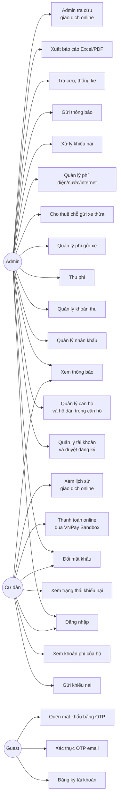
```mermaid
graph LR
    Admin((Admin))
    Resident((Cư dân))
    Guest((Guest))

    UC1[Quản lý tài khoản<br/>và duyệt đăng ký]
    UC2[Đăng nhập]
    UC3[Đổi mật khẩu]
    UC4[Quản lý căn hộ<br/>và hộ dân trong căn hộ]
    UC5[Quản lý nhân khẩu]
    UC6[Quản lý khoản thu]
    UC7[Thu phí]
    UC8[Quản lý phí gửi xe]
    UC9[Cho thuê chỗ gửi xe thừa]
    UC10[Quản lý phí điện/nước/internet]
    UC11[Gửi khiếu nại]
    UC12[Xử lý khiếu nại]
    UC13[Gửi thông báo]
    UC14[Xem thông báo]
    UC15[Tra cứu, thống kê]
    UC16[Xuất báo cáo Excel/PDF]
    UC17[Xem khoản phí của hộ]
    UC18[Xem trạng thái khiếu nại]
    UC19[Đăng ký tài khoản]
    UC20[Xác thực OTP email]
    UC21[Quên mật khẩu bằng OTP]
    UC22[Thanh toán online<br/>qua VNPay Sandbox]
    UC23[Xem lịch sử<br/>giao dịch online]
    UC24[Admin tra cứu<br/>giao dịch online]

    Admin --> UC1
    Admin --> UC2
    Admin --> UC3
    Admin --> UC4
    Admin --> UC5
    Admin --> UC6
    Admin --> UC7
    Admin --> UC8
    Admin --> UC9
    Admin --> UC10
    Admin --> UC12
    Admin --> UC13
    Admin --> UC14
    Admin --> UC15
    Admin --> UC16
    Admin --> UC24

    Resident --> UC2
    Resident --> UC3
    Resident --> UC11
    Resident --> UC14
    Resident --> UC17
    Resident --> UC18
    Resident --> UC22
    Resident --> UC23

    Guest --> UC19
    Guest --> UC20
    Guest --> UC21
```

**Phân quyền sơ đồ use case:**
- **Guest (chưa đăng nhập):** UC19 (đăng ký tài khoản), UC20 (xác thực OTP đăng ký), UC21 (yêu cầu quên mật khẩu bằng OTP).
- **Resident:** UC2, UC3, UC11, UC14, UC17, UC18, UC20 (khi xác nhận thao tác cần OTP), UC22 (thanh toán online qua VNPay Sandbox), UC23 (xem lịch sử giao dịch online của hộ mình).
- **Admin:** UC1–UC16, UC24 (tra cứu toàn bộ giao dịch online).

### 4.2 Phân rã use case theo module

**M1 – Quản lý tài khoản và đăng nhập (kèm OTP)**

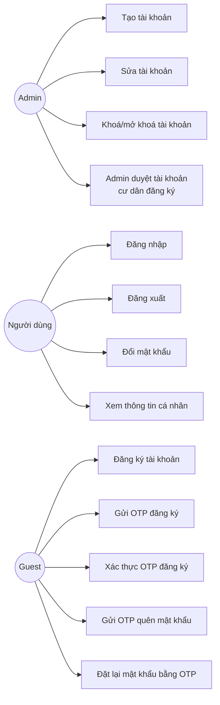
```mermaid
graph LR
    Admin((Admin))
    User((Người dùng))
    Guest((Guest))

    A1[Tạo tài khoản]
    A2[Sửa tài khoản]
    A3[Khoá/mở khoá tài khoản]
    A4[Đăng nhập]
    A5[Đăng xuất]
    A6[Đổi mật khẩu]
    A7[Xem thông tin cá nhân]
    A8[Đăng ký tài khoản]
    A9[Gửi OTP đăng ký]
    A10[Xác thực OTP đăng ký]
    A11[Gửi OTP quên mật khẩu]
    A12[Đặt lại mật khẩu bằng OTP]
    A13[Admin duyệt tài khoản<br/>cư dân đăng ký]

    Admin --> A1
    Admin --> A2
    Admin --> A3
    Admin --> A13
    User --> A4
    User --> A5
    User --> A6
    User --> A7
    Guest --> A8
    Guest --> A9
    Guest --> A10
    Guest --> A11
    Guest --> A12
```

**M2 + M3 – Quản lý căn hộ, hộ dân và nhân khẩu**

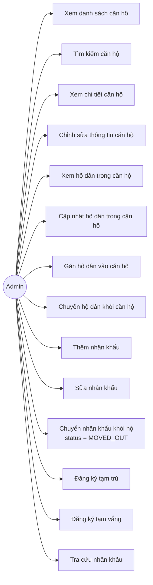
```mermaid
graph LR
    Admin((Admin))

    B1[Xem danh sách căn hộ]
    B2[Tìm kiếm căn hộ]
    B3[Xem chi tiết căn hộ]
    B4[Chỉnh sửa thông tin căn hộ]
    B5[Xem hộ dân trong căn hộ]
    B6[Cập nhật hộ dân trong căn hộ]
    B7[Gán hộ dân vào căn hộ]
    B8[Chuyển hộ dân khỏi căn hộ]
    B9[Thêm nhân khẩu]
    B10[Sửa nhân khẩu]
    B11[Chuyển nhân khẩu khỏi hộ<br/>status = MOVED_OUT]
    B12[Đăng ký tạm trú]
    B13[Đăng ký tạm vắng]
    B14[Tra cứu nhân khẩu]

    Admin --> B1
    Admin --> B2
    Admin --> B3
    Admin --> B4
    Admin --> B5
    Admin --> B6
    Admin --> B7
    Admin --> B8
    Admin --> B9
    Admin --> B10
    Admin --> B11
    Admin --> B12
    Admin --> B13
    Admin --> B14
```

**M4 + M5 – Quản lý khoản thu, thu phí và thanh toán online**

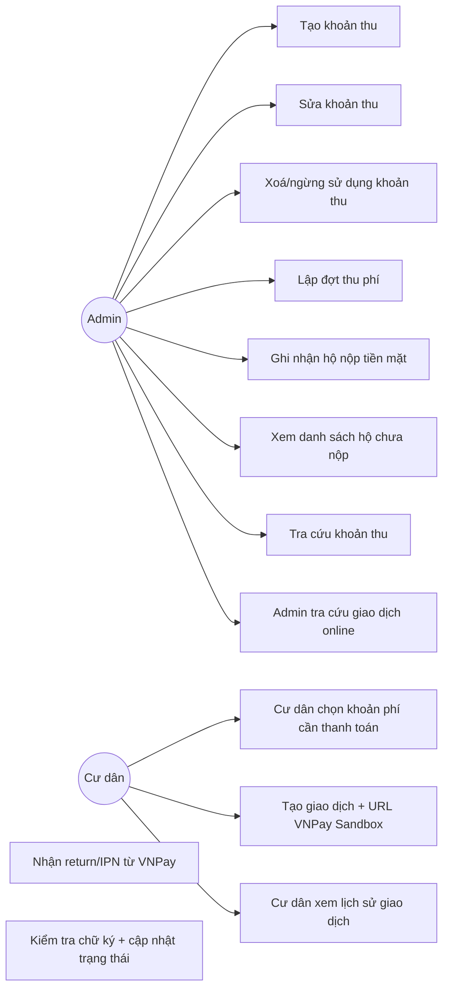
```mermaid
graph LR
    Admin((Admin))
    Resident((Cư dân))

    C1[Tạo khoản thu]
    C2[Sửa khoản thu]
    C3[Xoá/ngừng sử dụng khoản thu]
    C4[Lập đợt thu phí]
    C5[Ghi nhận hộ nộp tiền mặt]
    C6[Xem danh sách hộ chưa nộp]
    C7[Tra cứu khoản thu]
    C8[Cư dân chọn khoản phí cần thanh toán]
    C9[Tạo giao dịch + URL VNPay Sandbox]
    C10[Nhận return/IPN từ VNPay]
    C11[Kiểm tra chữ ký + cập nhật trạng thái]
    C12[Cư dân xem lịch sử giao dịch]
    C13[Admin tra cứu giao dịch online]

    Admin --> C1
    Admin --> C2
    Admin --> C3
    Admin --> C4
    Admin --> C5
    Admin --> C6
    Admin --> C7
    Admin --> C13
    Resident --> C8
    Resident --> C9
    Resident --> C12
```

**M6 – Quản lý phí gửi xe**

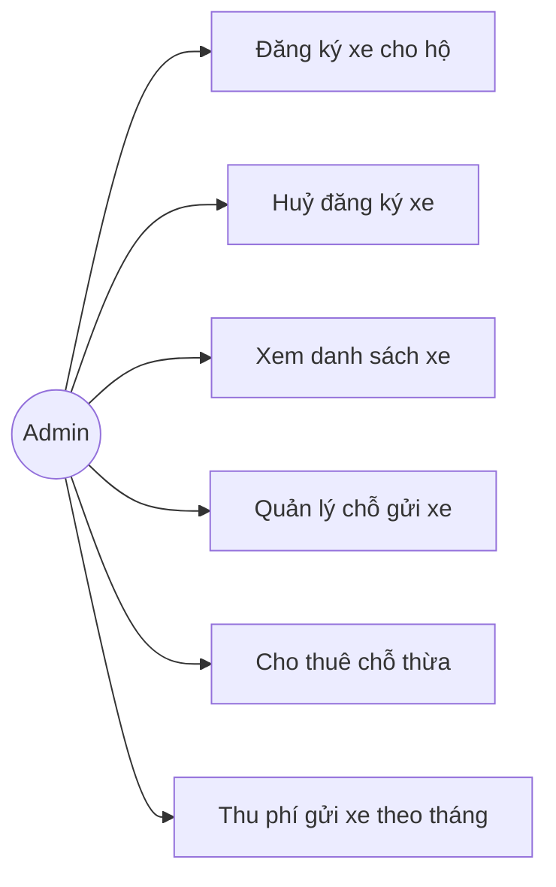
```mermaid
graph LR
    Admin((Admin))

    D1[Đăng ký xe cho hộ]
    D2[Huỷ đăng ký xe]
    D3[Xem danh sách xe]
    D4[Quản lý chỗ gửi xe]
    D5[Cho thuê chỗ thừa]
    D6[Thu phí gửi xe theo tháng]

    Admin --> D1
    Admin --> D2
    Admin --> D3
    Admin --> D4
    Admin --> D5
    Admin --> D6
```

**M7 – Quản lý phí điện, nước, internet**

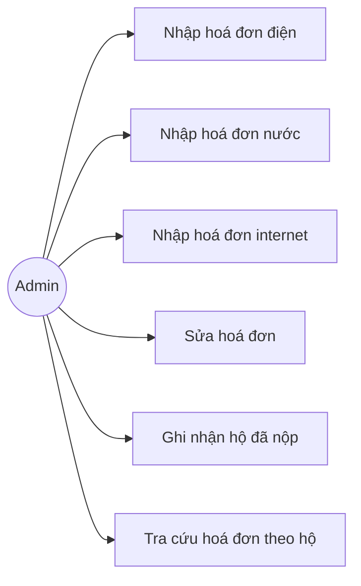
```mermaid
graph LR
    Admin((Admin))

    E1[Nhập hoá đơn điện]
    E2[Nhập hoá đơn nước]
    E3[Nhập hoá đơn internet]
    E4[Sửa hoá đơn]
    E5[Ghi nhận hộ đã nộp]
    E6[Tra cứu hoá đơn theo hộ]

    Admin --> E1
    Admin --> E2
    Admin --> E3
    Admin --> E4
    Admin --> E5
    Admin --> E6
```

**M8 + M9 – Khiếu nại và thông báo**

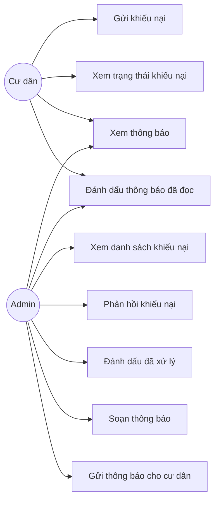
```mermaid
graph LR
    Resident((Cư dân))
    Admin((Admin))

    F1[Gửi khiếu nại]
    F2[Xem trạng thái khiếu nại]
    F3[Xem danh sách khiếu nại]
    F4[Phản hồi khiếu nại]
    F5[Đánh dấu đã xử lý]
    F6[Soạn thông báo]
    F7[Gửi thông báo cho cư dân]
    F8[Xem thông báo]
    F9[Đánh dấu thông báo đã đọc]

    Resident --> F1
    Resident --> F2
    Resident --> F8
    Resident --> F9
    Admin --> F3
    Admin --> F4
    Admin --> F5
    Admin --> F6
    Admin --> F7
    Admin --> F8
    Admin --> F9
```

**M10 – Tra cứu, thống kê và xuất file**

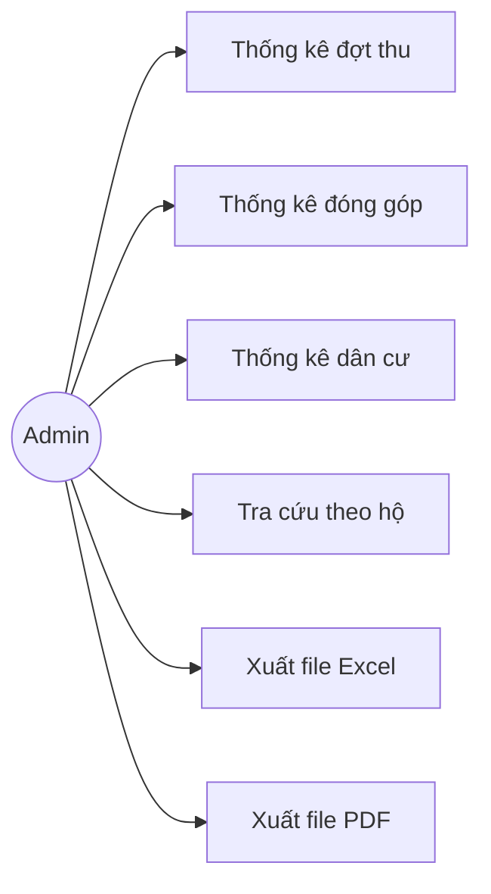
```mermaid
graph LR
    Admin((Admin))

    G1[Thống kê đợt thu]
    G2[Thống kê đóng góp]
    G3[Thống kê dân cư]
    G4[Tra cứu theo hộ]
    G5[Xuất file Excel]
    G6[Xuất file PDF]

    Admin --> G1
    Admin --> G2
    Admin --> G3
    Admin --> G4
    Admin --> G5
    Admin --> G6
```

### 4.3 Đặc tả chi tiết các use case quan trọng

#### UC-LOGIN: Đăng nhập

| Mục | Nội dung |
|---|---|
| **Tên use case** | Đăng nhập hệ thống |
| **Actor** | Admin, Cư dân |
| **Mục đích** | Xác thực người dùng và cấp JWT |
| **Tiền điều kiện** | Người dùng đã có tài khoản, tài khoản chưa bị khoá và đã được duyệt (`active = TRUE`) |
| **Hậu điều kiện** | Người dùng nhận được JWT và vào trang chính |
| **Luồng chính** | 1. Người dùng nhập username + mật khẩu<br>2. Hệ thống kiểm tra username trong CSDL<br>3. Hệ thống so sánh mật khẩu băm BCrypt<br>4. Hệ thống sinh JWT chứa userId + role<br>5. Hệ thống trả JWT cho frontend<br>6. Frontend lưu JWT và chuyển sang trang chính theo role |
| **Luồng phụ** | Sai mật khẩu lần 5 trong 10 phút → khoá tạm 15 phút |
| **Ngoại lệ** | Username không tồn tại → "Tài khoản không tồn tại"<br>Mật khẩu sai → "Mật khẩu không đúng"<br>Tài khoản bị khoá → "Tài khoản đã bị khoá"<br>`active = FALSE` → "Tài khoản chưa được duyệt" |

#### UC-REGISTER: Cư dân tự đăng ký tài khoản

| Mục | Nội dung |
|---|---|
| **Tên use case** | Cư dân tự đăng ký tài khoản (có xác thực OTP email) |
| **Actor** | Guest (khách chưa có tài khoản) |
| **Mục đích** | Cho phép cư dân tự tạo tài khoản RESIDENT, xác thực email bằng OTP, sau đó chờ Admin duyệt |
| **Tiền điều kiện** | Người dùng chưa có tài khoản trong hệ thống |
| **Hậu điều kiện** | Tài khoản mới được tạo với role `RESIDENT`, email được xác thực, trạng thái chờ Admin duyệt (`active = FALSE`, `household_id = NULL`); sau khi Admin gán hộ và kích hoạt thì cư dân mới đăng nhập được |
| **Luồng chính** | 1. Khách truy cập trang Đăng ký<br>2. Nhập: username, mật khẩu, xác nhận mật khẩu, họ tên, email, số điện thoại, mã căn hộ (`requested_apartment_code`)<br>3. Bấm "Gửi OTP"<br>4. Hệ thống kiểm tra dữ liệu hợp lệ, sinh OTP, hash OTP bằng BCrypt và gửi qua email (xem UC-VERIFY-OTP)<br>5. Cư dân nhập OTP nhận được<br>6. Hệ thống xác thực OTP<br>7. Hệ thống băm mật khẩu bằng BCrypt<br>8. Hệ thống lưu tài khoản với `role = RESIDENT`, `active = FALSE`, `household_id = NULL`, `requested_apartment_code = <mã căn hộ cư dân nhập>`<br>9. Hệ thống hiển thị: "Đăng ký thành công, vui lòng chờ Ban quản trị duyệt"<br>10. Admin vào màn hình Quản lý tài khoản, xem các tài khoản chờ duyệt, gán `household_id` phù hợp và bật `active = TRUE` |
| **Luồng phụ** | Bấm "Huỷ" → không tạo tài khoản, quay về trang Đăng nhập |
| **Ngoại lệ** | Username đã tồn tại; Mật khẩu và xác nhận không khớp; Mã căn hộ không tồn tại; OTP sai/hết hạn (xem UC-VERIFY-OTP) |

#### UC-VERIFY-OTP: Xác thực OTP email

| Mục | Nội dung |
|---|---|
| **Tên use case** | Xác thực email bằng mã OTP |
| **Actor** | Cư dân hoặc người dùng chưa đăng nhập (Guest) |
| **Mục đích** | Xác thực email người dùng bằng mã OTP gửi qua email |
| **Tiền điều kiện** | Người dùng đã yêu cầu gửi OTP (đăng ký, quên mật khẩu hoặc xác nhận thao tác) |
| **Hậu điều kiện** | OTP hợp lệ thì email được xác thực hoặc người dùng được phép tiếp tục thao tác (đặt lại mật khẩu) |
| **Luồng chính** | 1. Người dùng nhập email<br>2. Hệ thống sinh OTP ngẫu nhiên (6 chữ số)<br>3. Hệ thống hash OTP bằng BCrypt và lưu vào CSDL (`email_otps`) với `purpose`, `expired_at = now + 5 phút`, `used = FALSE`, `failed_attempts = 0`<br>4. Hệ thống gửi OTP về email qua `JavaMailSender`<br>5. Người dùng nhập OTP nhận được<br>6. Hệ thống kiểm tra OTP bằng `BCrypt.matches(inputOtp, otpHashFromDB)`, đồng thời kiểm tra OTP chưa hết hạn, chưa dùng, `failed_attempts < 5`<br>7. Nếu hợp lệ → đặt `used = TRUE`, xác thực email hoặc cho phép đặt lại mật khẩu<br>8. Nếu sai → tăng `failed_attempts`, báo lỗi |
| **Ngoại lệ** | OTP sai → "Mã OTP không đúng"<br>OTP hết hạn → "Mã OTP đã hết hạn"<br>OTP đã được sử dụng → "Mã OTP đã dùng, vui lòng yêu cầu mã mới"<br>Nhập sai quá số lần cho phép (5 lần) → khoá OTP, yêu cầu xin mã mới<br>Số lần gửi OTP vượt giới hạn (5 lần/15 phút/email) → "Vui lòng thử lại sau" |

#### UC-FORGOT-PASSWORD: Quên mật khẩu bằng OTP

| Mục | Nội dung |
|---|---|
| **Tên use case** | Quên mật khẩu – đặt lại bằng OTP gửi qua email |
| **Actor** | Guest (chưa đăng nhập) |
| **Mục đích** | Cho phép người dùng đặt lại mật khẩu khi quên mật khẩu cũ |
| **Tiền điều kiện** | Người dùng có tài khoản với email đã đăng ký trong hệ thống |
| **Hậu điều kiện** | Mật khẩu được thay bằng mật khẩu mới đã băm BCrypt |
| **Luồng chính** | 1. Người dùng mở trang "Quên mật khẩu"<br>2. Nhập email<br>3. Hệ thống tìm tài khoản theo email; nếu có → sinh OTP, hash bằng BCrypt, lưu vào `email_otps` với `purpose = FORGOT_PASSWORD`, gửi qua email<br>4. Người dùng nhập OTP + mật khẩu mới + xác nhận mật khẩu mới<br>5. Hệ thống kiểm tra OTP (xem UC-VERIFY-OTP)<br>6. Hệ thống băm mật khẩu mới bằng BCrypt và cập nhật vào bảng `users`<br>7. Hệ thống đặt OTP `used = TRUE`<br>8. Hiển thị "Đặt lại mật khẩu thành công" |
| **Ngoại lệ** | Email không tồn tại → vì lý do bảo mật, hệ thống vẫn trả "Nếu email tồn tại, OTP đã được gửi"<br>OTP sai/hết hạn (xem UC-VERIFY-OTP)<br>Mật khẩu mới không khớp xác nhận |

#### UC-CREATE-FEE: Tạo khoản thu

| Mục | Nội dung |
|---|---|
| **Tên use case** | Tạo khoản thu |
| **Actor** | Admin |
| **Mục đích** | Đăng ký một khoản thu mới vào hệ thống |
| **Tiền điều kiện** | Admin đã đăng nhập |
| **Hậu điều kiện** | Khoản thu mới được lưu vào CSDL |
| **Luồng chính** | 1. Admin mở màn hình "Quản lý khoản thu"<br>2. Chọn "Tạo khoản thu mới"<br>3. Nhập: tên khoản thu, loại (bắt buộc/đóng góp), đơn giá (nếu có), đơn vị tính, ghi chú<br>4. Bấm "Lưu"<br>5. Hệ thống kiểm tra dữ liệu hợp lệ<br>6. Hệ thống lưu khoản thu và hiển thị thông báo thành công |
| **Luồng phụ** | Bấm "Huỷ" → đóng form, không lưu |
| **Ngoại lệ** | Thiếu trường bắt buộc; Tên khoản thu trùng |

#### UC-COLLECT-FEE: Xác nhận đã nộp tiền mặt

| Mục | Nội dung |
|---|---|
| **Tên use case** | Xác nhận hộ đã nộp đủ tiền mặt |
| **Actor** | Admin |
| **Mục đích** | Cho phép Admin xác nhận một phiếu nộp đã được cư dân nộp đủ bằng tiền mặt, không nhập  |
| **Tiền điều kiện** | Admin đã đăng nhập; có đợt thu phí đang mở; phiếu nộp thuộc hộ cần xác nhận và đang ở trạng thái `UNPAID` |
| **Hậu điều kiện** | Phiếu nộp (`payments`) được cập nhật: `amount_paid = amount_due`, `status = PAID`, `payment_method = CASH`, `paid_date` và `paid_at` được ghi nhận, `collected_by` lưu Admin xác nhận |
| **Luồng chính** | 1. Admin mở màn hình "Lập đợt thu / Thu phí"<br>2. Admin chọn đợt thu phí hoặc tìm kiếm hộ cần xác nhận<br>3. Hệ thống hiển thị số tiền phải nộp của phiếu nộp<br>4. Admin tích chọn hoặc bấm nút "Đã nộp tiền mặt"<br>5. Hệ thống hiển thị hộp xác nhận: "Xác nhận hộ này đã nộp đủ tiền mặt?"<br>6. Admin bấm "Xác nhận"<br>7. Hệ thống tự động đặt `amount_paid = amount_due`, `status = PAID`, `payment_method = CASH`, `paid_date = ngày hiện tại`, `paid_at = thời điểm hiện tại`, `collected_by = Admin hiện tại`<br>8. Hệ thống hiển thị thông báo "Xác nhận nộp tiền mặt thành công" |
| **Luồng phụ** | Admin bấm "Huỷ" ở hộp xác nhận → hệ thống không thay đổi dữ liệu |
| **Ngoại lệ** | Phiếu nộp đã `PAID` → không cho xác nhận lại<br>Phiếu nộp không tồn tại → báo lỗi<br>Admin không có quyền → 403 Forbidden |
| **Ghi chú thiết kế** | Phiên bản hiện tại không hỗ trợ nộp thiếu hoặc nộp một phần. Với thanh toán tiền mặt, hệ thống mặc định số tiền cư dân nộp luôn đúng và đủ, nên Admin chỉ xác nhận trạng thái đã nộp. |

#### UC-VNPAY-PAYMENT: Thanh toán online qua VNPay Sandbox

| Mục | Nội dung |
|---|---|
| **Tên use case** | Thanh toán online khoản phí/hoá đơn của hộ qua VNPay Sandbox |
| **Actor** | Cư dân |
| **Mục đích** | Cho phép cư dân thanh toán online một khoản phí/hoá đơn của hộ mình thông qua cổng VNPay Sandbox |
| **Tiền điều kiện** | Cư dân đã đăng nhập; tài khoản đã được gán với một household (`household_id` không NULL, `active = TRUE`); có khoản phí/hoá đơn chưa thanh toán thuộc về household đó |
| **Hậu điều kiện** | - Giao dịch thành công → `payment_transactions.status = SUCCESS`, khoản phí/hoá đơn tương ứng được cập nhật đã thanh toán<br>- Giao dịch thất bại/huỷ → `payment_transactions.status = FAILED` hoặc `CANCELLED`, trạng thái khoản phí/hoá đơn không đổi |
| **Luồng chính** | 1. Cư dân xem danh sách khoản phải nộp gồm phiếu nộp theo đợt thu và hoá đơn điện/nước/internet chưa thanh toán của hộ mình<br>2. Cư dân chọn khoản cần thanh toán → bấm "Thanh toán online"<br>3. Backend kiểm tra khoản phí thuộc household của cư dân; sinh `transaction_code` duy nhất; tạo bản ghi `payment_transactions` với `status = PENDING`, `target_type`, `target_id`, `amount`<br>4. Backend gọi `VnpayService` để tạo URL thanh toán VNPay Sandbox (ký HMAC-SHA512 trên tham số)<br>5. Backend trả `paymentUrl` về frontend<br>6. Frontend chuyển hướng cư dân sang trang thanh toán VNPay Sandbox<br>7. Cư dân thực hiện thanh toán trên VNPay Sandbox (chọn ngân hàng, nhập thông tin giả lập)<br>8. VNPay gọi IPN URL (`GET /api/payments/vnpay/ipn`) đến backend để xác nhận giao dịch; đồng thời trình duyệt cư dân được redirect về Return URL của backend (`GET /api/payments/vnpay/return`)<br>9. Backend kiểm tra chữ ký phản hồi (`vnp_SecureHash`) ở cả IPN và Return; IPN là nguồn cập nhật trạng thái chính<br>10. Backend kiểm tra `transaction_code`, số tiền, và `response_code`<br>11. Nếu IPN hợp lệ và `vnp_ResponseCode = "00"` → cập nhật `payment_transactions.status = SUCCESS`, lưu `vnpay_transaction_no`, `vnpay_bank_code`, `vnpay_pay_date`; cập nhật bản ghi khoản phí/hoá đơn tương ứng là đã thanh toán<br>12. Backend Return URL redirect cư dân về trang kết quả thanh toán của frontend, frontend đọc trạng thái giao dịch đã lưu để hiển thị kết quả |
| **Luồng phụ** | Cư dân huỷ thanh toán trên VNPay → VNPay trả `vnp_ResponseCode = "24"` → cập nhật `status = CANCELLED` |
| **Ngoại lệ** | - Thanh toán thất bại (`vnp_ResponseCode ≠ "00"` và ≠ `"24"`) → `status = FAILED`<br>- Phản hồi sai chữ ký → từ chối, ghi log cảnh báo, không cập nhật<br>- Giao dịch đã được xử lý trước đó (idempotency) → bỏ qua, trả kết quả lần đầu<br>- Khoản phí/hoá đơn đã có giao dịch `PENDING` → trả lại `paymentUrl` cũ hoặc yêu cầu cư dân chờ/hủy giao dịch cũ, không tạo thêm giao dịch song song<br>- Số tiền phản hồi không khớp với `amount` hệ thống tạo → từ chối, ghi log cảnh báo<br>- `transaction_code` không tồn tại trong hệ thống → từ chối<br>- Cư dân thử thanh toán khoản phí không thuộc household của mình → 403 Forbidden |

Ghi chú: Trong phiên bản hiện tại, thanh toán VNPay chỉ áp dụng cho `FEE_PAYMENT` và `UTILITY_BILL`. Không thêm `PARKING_FEE` làm `target_type` riêng: phí gửi xe hằng tháng được tổng hợp thành một đợt thu trong `fee_periods/payments` với khoản thu loại phí gửi xe (`unit = PER_VEHICLE` hoặc `FIXED`). Vì vậy nếu cư dân thanh toán phí gửi xe online thì hệ thống vẫn xử lý qua `target_type = FEE_PAYMENT`.

#### UC-VIEW-MY-PAYMENT-HISTORY: Cư dân xem lịch sử giao dịch online

| Mục | Nội dung |
|---|---|
| **Tên use case** | Cư dân xem lịch sử giao dịch thanh toán online của hộ mình |
| **Actor** | Cư dân |
| **Tiền điều kiện** | Cư dân đã đăng nhập, có `household_id` |
| **Hậu điều kiện** | Cư dân thấy danh sách giao dịch online của household mình |
| **Luồng chính** | 1. Cư dân vào màn hình "Lịch sử giao dịch online"<br>2. Frontend gọi `GET /api/payments/vnpay/my-history` (kèm JWT)<br>3. Backend lấy `household_id` từ JWT, truy vấn `payment_transactions WHERE household_id = ?`<br>4. Frontend hiển thị bảng: mã giao dịch, khoản phí, số tiền, ngày, trạng thái |
| **Ngoại lệ** | Chưa có giao dịch nào → hiển thị danh sách trống |

#### UC-ADMIN-PAYMENT-LOOKUP: Admin tra cứu giao dịch online

| Mục | Nội dung |
|---|---|
| **Tên use case** | Admin tra cứu danh sách giao dịch thanh toán online |
| **Actor** | Admin |
| **Tiền điều kiện** | Admin đã đăng nhập |
| **Hậu điều kiện** | Admin xem được danh sách giao dịch online toàn hệ thống, có thể lọc theo trạng thái, hộ, khoảng thời gian |
| **Luồng chính** | 1. Admin vào màn hình "Giao dịch thanh toán online"<br>2. Lọc theo trạng thái (PENDING/SUCCESS/FAILED/CANCELLED), hộ, ngày, `target_type`<br>3. Frontend gọi `GET /api/admin/payment-transactions?status=…&householdId=…&fromDate=…&toDate=…`<br>4. Backend trả danh sách `payment_transactions` tương ứng (có phân trang)<br>5. Admin có thể xem chi tiết từng giao dịch |
| **Ngoại lệ** | – |

#### UC-COMPLAINT: Gửi khiếu nại

| Mục | Nội dung |
|---|---|
| **Tên use case** | Cư dân gửi khiếu nại |
| **Actor** | Cư dân |
| **Tiền điều kiện** | Cư dân đã đăng nhập |
| **Hậu điều kiện** | Khiếu nại được lưu với trạng thái "NEW" |
| **Luồng chính** | 1. Cư dân vào màn hình "Khiếu nại của tôi"<br>2. Bấm "Gửi khiếu nại mới"<br>3. Nhập tiêu đề, chọn loại (FEE/SECURITY/CLEANING/OTHER), nội dung<br>4. Bấm "Gửi"<br>5. Hệ thống lưu khiếu nại và trả về mã khiếu nại<br>6. Hệ thống hiển thị thông báo "Đã gửi thành công" |
| **Ngoại lệ** | Tiêu đề hoặc nội dung trống → báo lỗi |

#### UC-HANDLE-COMPLAINT: Xử lý khiếu nại

| Mục | Nội dung |
|---|---|
| **Tên use case** | Phản hồi và đóng khiếu nại |
| **Actor** | Admin |
| **Tiền điều kiện** | Khiếu nại có trạng thái "NEW" hoặc "IN_PROGRESS" |
| **Hậu điều kiện** | Khiếu nại có phản hồi, trạng thái cập nhật |
| **Luồng chính** | 1. Admin mở danh sách khiếu nại<br>2. Chọn khiếu nại cần xử lý<br>3. Nhập nội dung phản hồi<br>4. Đổi trạng thái sang "IN_PROGRESS" hoặc "RESOLVED"<br>5. Bấm "Lưu"<br>6. Hệ thống cập nhật khiếu nại và hiển thị phản hồi cho cư dân |

#### UC-NOTIFY: Gửi thông báo

| Mục | Nội dung |
|---|---|
| **Tên use case** | Gửi thông báo cho cư dân |
| **Actor** | Admin |
| **Tiền điều kiện** | Admin đã đăng nhập |
| **Hậu điều kiện** | Thông báo được lưu và hiển thị cho người nhận |
| **Luồng chính** | 1. Admin vào màn hình "Thông báo"<br>2. Bấm "Soạn thông báo mới"<br>3. Nhập tiêu đề, nội dung<br>4. Chọn phạm vi: ALL / BY_FLOOR / BY_HOUSEHOLD<br>5. Bấm "Gửi"<br>6. Hệ thống tạo bản ghi notification và các bản ghi notification_recipients tương ứng |
| **Ngoại lệ** | Không chọn người nhận → báo lỗi |

#### UC-EXPORT: Xuất báo cáo

| Mục | Nội dung |
|---|---|
| **Tên use case** | Xuất báo cáo Excel hoặc PDF |
| **Actor** | Admin |
| **Tiền điều kiện** | Đã chọn loại báo cáo và phạm vi dữ liệu |
| **Hậu điều kiện** | File Excel/PDF được tải về máy người dùng |
| **Luồng chính** | 1. Admin vào màn hình "Thống kê và xuất file"<br>2. Chọn loại báo cáo (đợt thu, dân cư, đóng góp, giao dịch online…)<br>3. Chọn khoảng thời gian / phạm vi<br>4. Chọn định dạng Excel hoặc PDF<br>5. Bấm "Xuất file"<br>6. Backend sinh file, trả về frontend, trình duyệt tải về |

---

## 5. THIẾT KẾ KIẾN TRÚC

### 5.1 Kiến trúc tổng quan

Hệ thống thiết kế theo **kiến trúc 3 tầng (3-tier)** cho ứng dụng web, có tích hợp với hai dịch vụ ngoài: **SMTP server** (gửi email OTP) và **VNPay Sandbox** (cổng thanh toán):

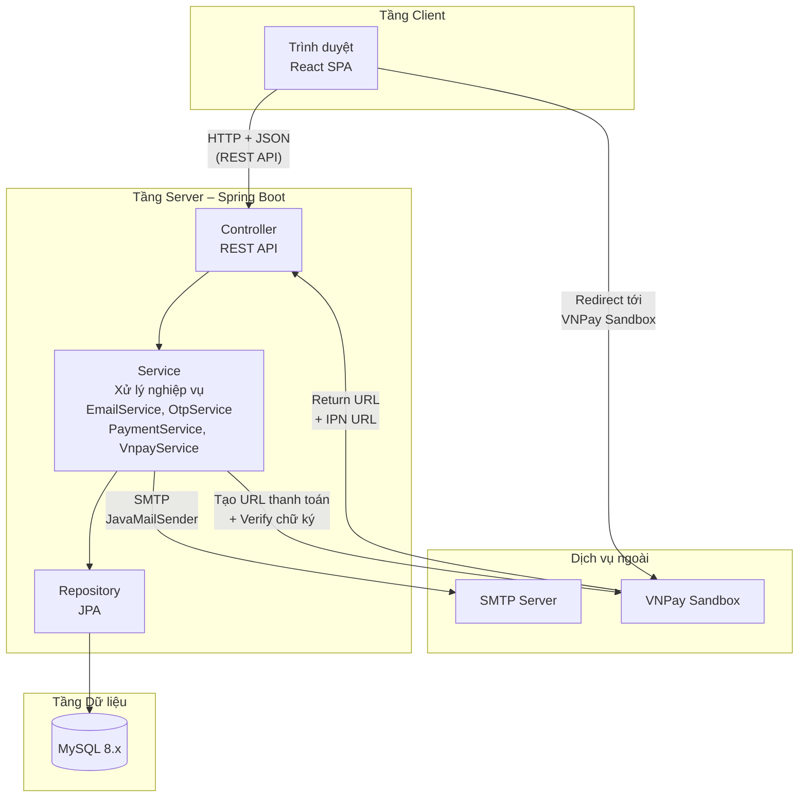
```mermaid
graph TB
    subgraph Client[Tầng Client]
        Browser[Trình duyệt<br/>React SPA]
    end

    subgraph Server[Tầng Server – Spring Boot]
        Controller[Controller<br/>REST API]
        Service[Service<br/>Xử lý nghiệp vụ<br/>EmailService, OtpService<br/>PaymentService, VnpayService]
        Repository[Repository<br/>JPA]
    end

    subgraph DB[Tầng Dữ liệu]
        MySQL[(MySQL 8.x)]
    end

    subgraph External[Dịch vụ ngoài]
        SMTP[SMTP Server]
        VNPay[VNPay Sandbox]
    end

    Browser -- "HTTP + JSON<br/>(REST API)" --> Controller
    Controller --> Service
    Service --> Repository
    Repository --> MySQL
    Service -- "SMTP<br/>JavaMailSender" --> SMTP
    Service -- "Tạo URL thanh toán<br/>+ Verify chữ ký" --> VNPay
    VNPay -- "Return URL<br/>+ IPN URL" --> Controller
    Browser -- "Redirect tới<br/>VNPay Sandbox" --> VNPay
```

- **Tầng Client (React):** giao diện người dùng, gọi REST API. Khi thanh toán online, frontend chuyển hướng (redirect) cư dân sang trang thanh toán VNPay Sandbox.
- **Tầng Server (Spring Boot):** xử lý nghiệp vụ, phân quyền, truy xuất CSDL; gửi email OTP qua SMTP; tạo URL thanh toán VNPay Sandbox; nhận return/IPN từ VNPay và kiểm tra chữ ký.
- **Tầng Dữ liệu (MySQL):** lưu trữ dữ liệu lâu dài, bao gồm OTP đã hash và giao dịch thanh toán online.
- **Dịch vụ ngoài:**
    - **SMTP Server**: gửi email OTP (Gmail SMTP hoặc tương đương).
    - **VNPay Sandbox**: cổng thanh toán; nhận yêu cầu thanh toán, trả kết quả qua return URL và IPN URL.

### 5.2 Luồng kiến trúc cho 2 chức năng mới

**Luồng gửi/xác thực OTP qua email:**
1. Frontend gọi `POST /api/auth/send-otp` (hoặc `/forgot-password/send-otp`).
2. `OtpService` sinh OTP ngẫu nhiên 6 chữ số, hash bằng BCrypt, lưu vào `email_otps`.
3. `EmailService` gọi `JavaMailSender` để gửi email OTP qua SMTP.
4. Frontend hiển thị form nhập OTP; gọi `POST /api/auth/verify-otp`.
5. `OtpService` so khớp hash, kiểm tra `expired_at`, `used`, `failed_attempts`.
6. Nếu hợp lệ → đánh dấu `used = TRUE`, hoàn tất xác thực; ngược lại tăng `failed_attempts` và báo lỗi.

**Luồng thanh toán online qua VNPay Sandbox:**
1. Frontend gọi `POST /api/payments/vnpay/create` với `target_type`, `target_id`.
2. `PaymentService` kiểm tra khoản phí thuộc household của cư dân (lấy từ JWT), sinh `transaction_code` duy nhất, lưu `payment_transactions` với `status = PENDING`.
3. `VnpayService` xây tham số `vnp_*`, ký HMAC-SHA512 bằng secret key VNPay → trả về `paymentUrl`.
4. Frontend nhận `paymentUrl`, chuyển hướng cư dân sang VNPay Sandbox.
5. Cư dân thanh toán; VNPay gọi `GET /api/payments/vnpay/ipn` từ server đến server để xác nhận chính thức, đồng thời redirect trình duyệt cư dân về `GET /api/payments/vnpay/return` trên backend.
6. `VnpayService` kiểm tra `vnp_SecureHash`, đối chiếu `transaction_code`, `amount`, `vnp_ResponseCode`.
7. Nếu hợp lệ và thành công → `PaymentService` cập nhật `payment_transactions.status = SUCCESS`, cập nhật khoản phí/hoá đơn tương ứng (`payments.status = PAID` với `payment_method = ONLINE`, hoặc `utility_bills.status = PAID`, `payment_method = ONLINE`).
8. Backend Return URL redirect cư dân về trang kết quả của frontend; frontend chỉ hiển thị trạng thái đã lưu, không tự quyết định giao dịch thành công/thất bại.
9. Đảm bảo idempotency: một giao dịch chỉ được cập nhật một lần.

### 5.3 Kiến trúc backend – cấu trúc package

Backend áp dụng **kiến trúc phân lớp (Layered Architecture)** với các package:

```
com.bluemoon.feemanagement
├── controller     // REST controller, xử lý HTTP request
├── service        // Logic nghiệp vụ
├── repository     // Truy xuất CSDL (Spring Data JPA)
├── entity         // Lớp ánh xạ bảng CSDL
├── dto            // Đối tượng truyền dữ liệu giữa FE và BE
├── security       // JWT, BCrypt, cấu hình Spring Security
├── email          // EmailService, cấu hình SMTP, template email
├── payment        // VnpayService, VnpayConfig, helper ký HMAC-SHA512
├── audit          // AuditLogService, ghi nhật ký thao tác vào CSDL
├── exception      // Xử lý ngoại lệ tập trung
└── config         // Cấu hình ứng dụng (CORS, Swagger, ...)
```

Sơ đồ package:

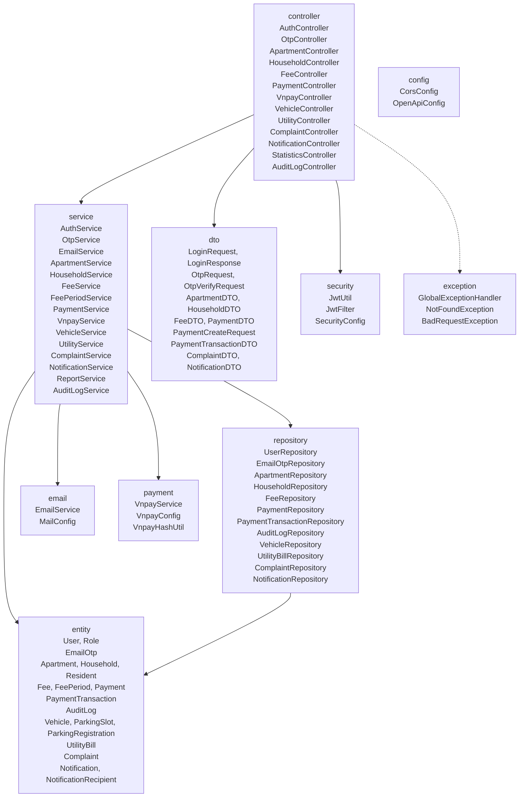
```mermaid
graph TB
    Controller[controller<br/>AuthController<br/>OtpController<br/>ApartmentController<br/>HouseholdController<br/>FeeController<br/>PaymentController<br/>VnpayController<br/>VehicleController<br/>UtilityController<br/>ComplaintController<br/>NotificationController<br/>StatisticsController<br/>AuditLogController]
    Service[service<br/>AuthService<br/>OtpService<br/>EmailService<br/>ApartmentService<br/>HouseholdService<br/>FeeService<br/>FeePeriodService<br/>PaymentService<br/>VnpayService<br/>VehicleService<br/>UtilityService<br/>ComplaintService<br/>NotificationService<br/>ReportService<br/>AuditLogService]
    Repository[repository<br/>UserRepository<br/>EmailOtpRepository<br/>ApartmentRepository<br/>HouseholdRepository<br/>FeeRepository<br/>PaymentRepository<br/>PaymentTransactionRepository<br/>AuditLogRepository<br/>VehicleRepository<br/>UtilityBillRepository<br/>ComplaintRepository<br/>NotificationRepository]
    Entity[entity<br/>User, Role<br/>EmailOtp<br/>Apartment, Household, Resident<br/>Fee, FeePeriod, Payment<br/>PaymentTransaction<br/>AuditLog<br/>Vehicle, ParkingSlot, ParkingRegistration<br/>UtilityBill<br/>Complaint<br/>Notification, NotificationRecipient]
    DTO[dto<br/>LoginRequest, LoginResponse<br/>OtpRequest, OtpVerifyRequest<br/>ApartmentDTO, HouseholdDTO<br/>FeeDTO, PaymentDTO<br/>PaymentCreateRequest<br/>PaymentTransactionDTO<br/>ComplaintDTO, NotificationDTO]
    Security[security<br/>JwtUtil<br/>JwtFilter<br/>SecurityConfig]
    Email[email<br/>EmailService<br/>MailConfig]
    PaymentPkg[payment<br/>VnpayService<br/>VnpayConfig<br/>VnpayHashUtil]
    Exception[exception<br/>GlobalExceptionHandler<br/>NotFoundException<br/>BadRequestException]
    Config[config<br/>CorsConfig<br/>OpenApiConfig]

    Controller --> Service
    Controller --> DTO
    Service --> Repository
    Service --> Entity
    Service --> Email
    Service --> PaymentPkg
    Repository --> Entity
    Controller --> Security
    Controller -.-> Exception
```

**Vai trò các service mới:**
- `EmailService`: bao bọc `JavaMailSender`, cung cấp method gửi email OTP với template cố định.
- `OtpService`: sinh OTP ngẫu nhiên, hash bằng BCrypt, lưu vào `email_otps`, kiểm tra OTP (hash khớp + chưa hết hạn + chưa dùng + chưa quá `failed_attempts`), kiểm soát rate-limit (5 lần/15 phút/email).
- `PaymentService`: tạo `PaymentTransaction` với `status = PENDING`, sinh `transaction_code` duy nhất, cập nhật trạng thái sau khi nhận kết quả VNPay, đồng thời cập nhật bản ghi khoản phí/hoá đơn tương ứng.
- `VnpayService`: xây URL thanh toán VNPay Sandbox (theo specs VNPay), tính `vnp_SecureHash` bằng HMAC-SHA512, kiểm tra chữ ký phản hồi từ VNPay khi nhận return/IPN.
- `PaymentTransactionRepository`: truy xuất bảng `payment_transactions` (tìm theo `transaction_code`, theo `household_id`, theo `status`...).
- `AuditLogService` / `AuditLogRepository`: ghi và tra cứu bảng `audit_logs` cho các thao tác nhạy cảm như đăng nhập, tạo/sửa/xoá/ngừng sử dụng khoản thu, xác nhận thu tiền mặt và xử lý giao dịch VNPay.
- `EmailOtpRepository`: truy xuất bảng `email_otps`.

**Không thiết kế:** `PaymentGatewayService` tổng quát, `MockPaymentService`, cổng thanh toán khác ngoài VNPay Sandbox.

### 5.4 Cấu trúc frontend (React)

```
src/
├── api/           // Các hàm gọi API (axios) – authApi.js, otpApi.js, feeApi.js, paymentApi.js, vnpayApi.js,...
├── components/    // Các component dùng chung: Button, Modal, Table,...
├── pages/         // Các trang theo route
│   ├── LoginPage
│   ├── RegisterPage
│   ├── ForgotPasswordPage
│   ├── OtpVerifyPage
│   ├── Dashboard
│   ├── AccountPage
│   ├── ApartmentPage
│   ├── HouseholdDetailPage
│   ├── ResidentPage
│   ├── FeePage
│   ├── PaymentPage
│   ├── VnpayReturnPage
│   ├── ResidentPaymentHistoryPage
│   ├── VehiclePage
│   ├── UtilityPage
│   ├── ComplaintPage
│   ├── NotificationPage
│   ├── StatisticsPage
│   └── AdminPaymentTransactionsPage
├── routes/        // Cấu hình React Router + bảo vệ route theo role
├── context/       // AuthContext lưu JWT và thông tin user
└── utils/         // Hàm tiện ích: format tiền, ngày, ...
```

Giải thích:
- `ApartmentPage`: màn hình chính quản lý danh sách căn hộ, tìm kiếm/lọc căn hộ và xem trạng thái căn hộ.
- `HouseholdDetailPage`: màn hình xem/cập nhật hộ dân/hộ khẩu bên trong một căn hộ, bao gồm chủ hộ và danh sách nhân khẩu.

### 5.5 Quy ước REST API

URL có dạng `/api/<tài_nguyên>`, sử dụng các HTTP method:

| Method | Mục đích | Ví dụ |
|---|---|---|
| GET | Đọc dữ liệu | `GET /api/households` |
| POST | Tạo mới | `POST /api/fees` |
| PUT | Cập nhật | `PUT /api/households/{id}` |
| DELETE | Xoá | `DELETE /api/fees/{id}` |

Mỗi request (trừ các endpoint PUBLIC như `/api/auth/login`, `/api/auth/register`, `/api/auth/send-otp`, `/api/auth/verify-otp`, `/api/auth/forgot-password/*`, `/api/auth/reset-password`, `/api/payments/vnpay/return`, `/api/payments/vnpay/ipn`) đều phải gửi header `Authorization: Bearer <JWT>`.

Controller không trả trực tiếp Entity JPA cho frontend. Mọi dữ liệu trả về phải được ánh xạ sang DTO để tránh vòng lặp JSON giữa các quan hệ hai chiều (`User` - `Household` - `Resident`) và tránh lộ trường nhạy cảm như `password_hash`, `otp_hash`.

Định dạng response thống nhất:

```json
{
  "success": true,
  "data": {},
  "message": "..."
}
```

Khi có lỗi:

```json
{
  "success": false,
  "errorCode": "FEE_NOT_FOUND",
  "message": "Không tìm thấy khoản thu"
}
```

### 5.6 Danh sách REST API chi tiết

**Tài khoản và xác thực:**

| Method | Endpoint | Quyền | Mục đích |
|---|---|---|---|
| POST | `/api/auth/register` | PUBLIC | Cư dân tự đăng ký tài khoản (sau khi OTP đăng ký đã hợp lệ) |
| POST | `/api/auth/login` | PUBLIC | Đăng nhập, trả JWT |
| POST | `/api/auth/send-otp` | PUBLIC | Gửi OTP qua email cho đăng ký; body: `{ email, purpose: "REGISTER" }` |
| POST | `/api/auth/verify-otp` | PUBLIC | Xác thực OTP; body: `{ email, otp, purpose }` |
| POST | `/api/auth/forgot-password/send-otp` | PUBLIC | Gửi OTP cho luồng quên mật khẩu; body: `{ email }` |
| POST | `/api/auth/reset-password` | PUBLIC | Đặt lại mật khẩu sau khi OTP hợp lệ; body: `{ email, otp, newPassword }` |
| POST | `/api/users` | ADMIN | Tạo tài khoản nội bộ |
| PUT | `/api/users/{id}` | ADMIN | Sửa thông tin tài khoản |
| PUT | `/api/users/{id}/lock` | ADMIN | Khoá tài khoản |
| PUT | `/api/users/{id}/unlock` | ADMIN | Mở khoá tài khoản |
| GET | `/api/users/pending` | ADMIN | Lấy danh sách tài khoản cư dân chờ duyệt |
| PUT | `/api/users/{id}/approve` | ADMIN | Duyệt tài khoản, gán `household_id`, bật `active = TRUE` |

**Căn hộ và hộ dân:**

| Method | Endpoint | Quyền | Mục đích |
|---|---|---|---|
| GET | `/api/apartments` | ADMIN | Danh sách căn hộ |
| GET | `/api/apartments/{id}` | ADMIN | Chi tiết căn hộ |
| GET | `/api/apartments/search` | ADMIN | Tìm kiếm căn hộ |
| PUT | `/api/apartments/{id}` | ADMIN | Sửa thông tin căn hộ |
| GET | `/api/apartments/{id}/household` | ADMIN | Hộ dân đang ở trong căn hộ |
| POST | `/api/apartments/{id}/household` | ADMIN | Gán hộ mới vào căn hộ trống |
| PUT | `/api/apartments/{id}/household` | ADMIN | Cập nhật/chuyển hộ trong căn hộ |
| GET | `/api/households` | ADMIN | Danh sách hộ dân/hộ khẩu, có phân trang |
| GET | `/api/households/{id}` | ADMIN | Xem chi tiết một hộ dân/hộ khẩu |
| GET | `/api/households/search` | ADMIN | Tìm kiếm hộ theo mã hộ, mã căn hộ, tên chủ hộ |
| PUT | `/api/households/{id}` | ADMIN | Cập nhật thông tin hộ dân/hộ khẩu |
| GET | `/api/households/{id}/residents` | ADMIN | Xem danh sách nhân khẩu thuộc hộ |

(Không có `POST /api/apartments` và `DELETE /api/apartments/{id}` vì số căn hộ cố định.)

**Nhân khẩu:**

| Method | Endpoint | Quyền | Mục đích |
|---|---|---|---|
| GET | `/api/residents` | ADMIN | Tra cứu danh sách nhân khẩu, lọc theo căn hộ/hộ dân/trạng thái cư trú |
| POST | `/api/residents` | ADMIN | Thêm nhân khẩu vào một Household ACTIVE |
| GET | `/api/residents/{id}` | ADMIN | Xem chi tiết nhân khẩu |
| PUT | `/api/residents/{id}` | ADMIN | Sửa thông tin nhân khẩu |
| PUT | `/api/residents/{id}/move-out` | ADMIN | Chuyển nhân khẩu khỏi hộ, cập nhật `status = MOVED_OUT`, không xoá vật lý |
| PUT | `/api/residents/{id}/temporary-residence` | ADMIN | Đăng ký/cập nhật tạm trú, đặt `residency_status = TEMPORARY` |
| PUT | `/api/residents/{id}/temporary-absence` | ADMIN | Đăng ký/cập nhật tạm vắng, đặt `residency_status = ABSENT` |


**Khoản thu và thu phí:**

| Method | Endpoint | Quyền | Mục đích |
|---|---|---|---|
| GET | `/api/fees` | ADMIN | Danh sách khoản thu, có phân trang/lọc |
| GET | `/api/fees/{id}` | ADMIN | Xem chi tiết khoản thu |
| GET | `/api/fees/search` | ADMIN | Tìm kiếm khoản thu theo tên, loại, trạng thái |
| POST | `/api/fees` | ADMIN | Tạo khoản thu |
| PUT | `/api/fees/{id}` | ADMIN | Sửa khoản thu |
| DELETE | `/api/fees/{id}` | ADMIN | Xoá/ngừng sử dụng khoản thu khi chưa phát sinh dữ liệu liên quan |
| GET | `/api/fee-periods` | ADMIN | Danh sách đợt thu phí |
| GET | `/api/fee-periods/{id}` | ADMIN | Xem chi tiết một đợt thu phí |
| POST | `/api/fee-periods` | ADMIN | Lập đợt thu phí (tự sinh `payments`) |
| PUT | `/api/fee-periods/{id}` | ADMIN | Cập nhật thông tin đợt thu phí |
| PUT | `/api/fee-periods/{id}/close` | ADMIN | Đóng đợt thu phí |
| GET | `/api/fee-periods/{id}/payments` | ADMIN | Xem danh sách phiếu nộp trong một đợt thu |
| PUT | `/api/admin/payments/{id}/confirm-cash` | ADMIN | Xác nhận phiếu nộp đã nộp đủ tiền mặt; hệ thống tự đặt `amount_paid = amount_due` và `status = PAID` |
| GET | `/api/payments/my-household` | RESIDENT | Cư dân xem phiếu nộp của hộ mình |
| GET | `/api/utility-bills/my-household` | RESIDENT | Cư dân xem hoá đơn điện/nước/internet của hộ mình |

**Thanh toán online qua VNPay Sandbox:**

| Method | Endpoint | Quyền | Mục đích |
|---|---|---|---|
| POST | `/api/payments/vnpay/create` | RESIDENT | Tạo giao dịch VNPay Sandbox và trả về `paymentUrl`. Body: `{ targetType, targetId }` |
| GET | `/api/payments/vnpay/return` | PUBLIC | Return URL nhận redirect trình duyệt từ VNPay Sandbox. Backend kiểm tra chữ ký, đọc trạng thái giao dịch đã lưu và redirect cư dân về trang kết quả của frontend. Không coi Return URL là nguồn cập nhật chính. |
| GET | `/api/payments/vnpay/ipn` | PUBLIC | Nhận thông báo IPN từ VNPay Sandbox (server-to-server). Backend kiểm tra `vnp_SecureHash`; đây là nguồn xác nhận chính để cập nhật trạng thái thanh toán. |
| GET | `/api/payments/vnpay/my-history` | RESIDENT | Cư dân xem lịch sử giao dịch VNPay của hộ mình |
| GET | `/api/admin/payment-transactions` | ADMIN | Admin tra cứu toàn bộ giao dịch online (có thể lọc theo `status`, `householdId`, `fromDate`, `toDate`, `targetType`) |
| GET | `/api/admin/payment-transactions/{id}` | ADMIN | Admin xem chi tiết một giao dịch online |
| GET | `/api/admin/audit-logs` | ADMIN | Admin tra cứu audit log theo người thao tác, hành động, tài nguyên, thời gian và kết quả |

Ghi chú phân quyền: `POST /api/payments/vnpay/create` chỉ dành cho **RESIDENT** là có chủ ý. Admin không thanh toán online hộ cư dân để tránh sai lệch audit log và trách nhiệm thanh toán. Khi cần kiểm thử VNPay Sandbox hoặc khắc phục lỗi, Admin/nhóm phát triển sử dụng một tài khoản Resident test đã được gán vào Household test; Admin chỉ tra cứu/đối soát giao dịch qua các endpoint `/api/admin/payment-transactions`.

**Phương tiện, tiện ích, khiếu nại, thông báo:**

| Method | Endpoint | Quyền | Mục đích |
|---|---|---|---|
| POST | `/api/vehicles` | ADMIN | Đăng ký xe |
| POST | `/api/parking-registrations` | ADMIN | Đăng ký/cho thuê chỗ gửi xe |
| POST | `/api/utility-bills` | ADMIN | Tạo hoá đơn điện/nước/internet |
| PUT | `/api/admin/utility-bills/{id}/confirm-cash` | ADMIN | Xác nhận hoá đơn đã nộp đủ tiền mặt; hệ thống đặt `status = PAID`, `payment_method = CASH` |
| POST | `/api/complaints` | RESIDENT | Gửi khiếu nại |
| GET | `/api/complaints/my` | RESIDENT | Khiếu nại của tôi |
| GET | `/api/complaints/{id}` | ADMIN hoặc RESIDENT là chủ khiếu nại | Xem chi tiết khiếu nại (RESIDENT chỉ xem được khiếu nại do mình gửi) |
| GET | `/api/complaints` | ADMIN | Danh sách khiếu nại |
| PUT | `/api/complaints/{id}/response` | ADMIN | Phản hồi khiếu nại |
| POST | `/api/notifications` | ADMIN | Gửi thông báo |
| GET | `/api/notifications/my` | ADMIN, RESIDENT | Thông báo gửi cho user hiện tại |
| PUT | `/api/notifications/{id}/read` | ADMIN, RESIDENT | Đánh dấu thông báo đã đọc |
| GET | `/api/reports/fee-periods/{id}/excel` | ADMIN | Xuất báo cáo tình trạng thu phí của một đợt dạng Excel |
| GET | `/api/reports/fee-periods/{id}/pdf` | ADMIN | Xuất báo cáo tình trạng thu phí của một đợt dạng PDF |
| GET | `/api/reports/donations/{feePeriodId}/excel` | ADMIN | Xuất báo cáo đóng góp tự nguyện dạng Excel |
| GET | `/api/reports/donations/{feePeriodId}/pdf` | ADMIN | Xuất báo cáo đóng góp tự nguyện dạng PDF |
| GET | `/api/reports/residents/statistics` | ADMIN | Thống kê dân cư, nhân khẩu, tạm trú/tạm vắng |
| GET | `/api/reports/payment-transactions/excel` | ADMIN | Xuất báo cáo giao dịch online dạng Excel |
| GET | `/api/reports/payment-transactions/pdf` | ADMIN | Xuất báo cáo giao dịch online dạng PDF |

---

## 6. THIẾT KẾ LỚP

### 6.1 Tổng quan các lớp chính

Hệ thống có **18 lớp Entity chính**, chia thành 8 nhóm:

| Nhóm | Lớp |
|---|---|
| Tài khoản | User, Role |
| Xác thực OTP | EmailOtp |
| Cư trú | Apartment, Household, Resident |
| Thu phí | Fee, FeePeriod, Payment |
| Giao dịch online | PaymentTransaction |
| Phương tiện và Tiện ích | Vehicle, ParkingSlot, ParkingRegistration, UtilityBill |
| Tương tác | Complaint, Notification, NotificationRecipient |
| Nhật ký hệ thống | AuditLog |

**Nguyên tắc thiết kế:** Entity chỉ giữ dữ liệu và các hành vi đơn giản (getter/setter, hàm tiện ích). Logic xác thực, sinh danh sách phải thu, ghi nhận thanh toán, xử lý thanh toán online và ghi audit log được đặt trong các Service tương ứng (`AuthService`, `FeePeriodService`, `PaymentService`, `VnpayService`, `OtpService`, `EmailService`, `AuditLogService`).

### 6.2 Sơ đồ lớp nhóm Tài khoản, OTP và Cư trú

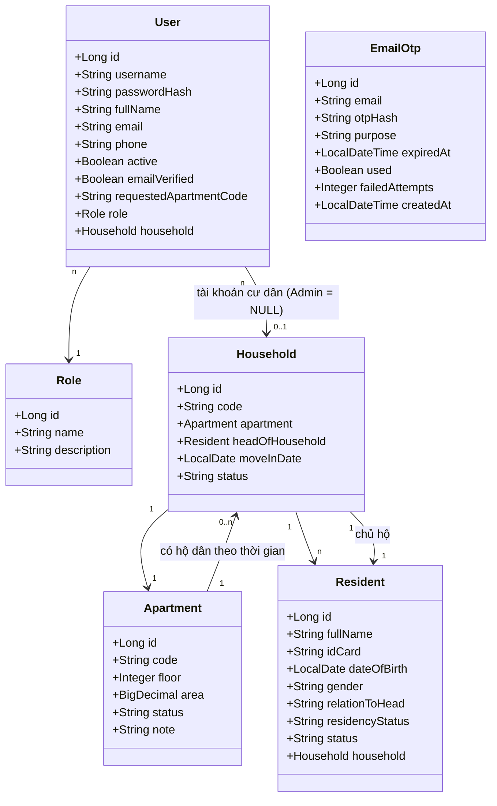
```mermaid
classDiagram
    class User {
        +Long id
        +String username
        +String passwordHash
        +String fullName
        +String email
        +String phone
        +Boolean active
        +Boolean emailVerified
        +String requestedApartmentCode
        +Role role
        +Household household
    }
    class Role {
        +Long id
        +String name
        +String description
    }
    class EmailOtp {
        +Long id
        +String email
        +String otpHash
        +String purpose
        +LocalDateTime expiredAt
        +Boolean used
        +Integer failedAttempts
        +LocalDateTime createdAt
    }
    class Apartment {
        +Long id
        +String code
        +Integer floor
        +BigDecimal area
        +String status
        +String note
    }
    class Household {
        +Long id
        +String code
        +Apartment apartment
        +Resident headOfHousehold
        +LocalDate moveInDate
        +String status
    }
    class Resident {
        +Long id
        +String fullName
        +String idCard
        +LocalDate dateOfBirth
        +String gender
        +String relationToHead
        +String residencyStatus
        +String status
        +Household household
    }

    User "n" --> "1" Role
    User "n" --> "0..1" Household : tài khoản cư dân (Admin = NULL)
    Apartment "1" --> "0..n" Household : có hộ dân theo thời gian
    Household "1" --> "1" Apartment
    Household "1" --> "n" Resident
    Household "1" --> "1" Resident : chủ hộ
```

**Ràng buộc nghiệp vụ Apartment ↔ Household:** Một căn hộ có thể từng có nhiều hộ dân theo thời gian, **nhưng tại một thời điểm chỉ có tối đa một hộ dân có trạng thái ACTIVE**. Khi hộ chuyển đi, đặt `Household.status = MOVED_OUT`; khi cần gán hộ mới, tạo bản ghi `Household` mới với cùng `apartment_id` và `status = ACTIVE`. Không cần bảng lịch sử riêng.

**Ghi chú serialize JSON và DTO:** Quan hệ `User → Household`, `Household → Resident (headOfHousehold)` và `Resident → Household` có thể tạo vòng tham chiếu khi serialize JSON nếu Controller trả trực tiếp Entity JPA. Vì vậy Controller **không trả trực tiếp Entity** cho frontend mà phải chuyển sang DTO (`UserDTO`, `HouseholdDTO`, `ResidentDTO`, ...). Nếu trong một số trường hợp vẫn cần serialize Entity, phải chặn một chiều quan hệ bằng `@JsonIgnore`, `@JsonBackReference/@JsonManagedReference` hoặc cấu hình tương đương để tránh lỗi vòng lặp JSON và tránh lộ dữ liệu nhạy cảm như `passwordHash`.

### 6.3 Sơ đồ lớp nhóm Thu phí và Giao dịch online

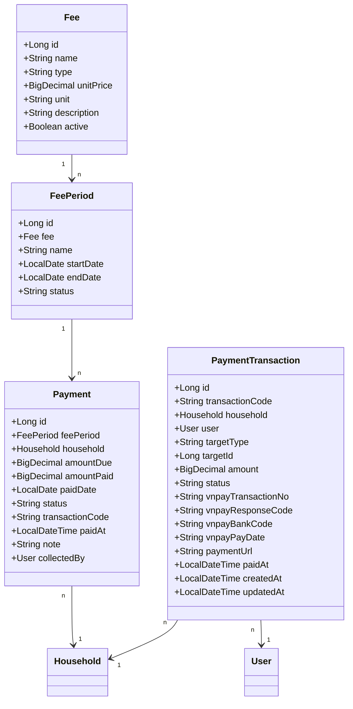
```mermaid
classDiagram
    class Fee {
        +Long id
        +String name
        +String type
        +BigDecimal unitPrice
        +String unit
        +String description
        +Boolean active
    }
    class FeePeriod {
        +Long id
        +Fee fee
        +String name
        +LocalDate startDate
        +LocalDate endDate
        +String status
    }
    class Payment {
        +Long id
        +FeePeriod feePeriod
        +Household household
        +BigDecimal amountDue
        +BigDecimal amountPaid
        +LocalDate paidDate
        +String status
        +String transactionCode
        +LocalDateTime paidAt
        +String note
        +User collectedBy
    }
    class PaymentTransaction {
        +Long id
        +String transactionCode
        +Household household
        +User user
        +String targetType
        +Long targetId
        +BigDecimal amount
        +String status
        +String vnpayTransactionNo
        +String vnpayResponseCode
        +String vnpayBankCode
        +String vnpayPayDate
        +String paymentUrl
        +LocalDateTime paidAt
        +LocalDateTime createdAt
        +LocalDateTime updatedAt
    }

    Fee "1" --> "n" FeePeriod
    FeePeriod "1" --> "n" Payment
    Payment "n" --> "1" Household
    PaymentTransaction "n" --> "1" Household
    PaymentTransaction "n" --> "1" User
```

### 6.4 Sơ đồ lớp nhóm Phương tiện và Tiện ích

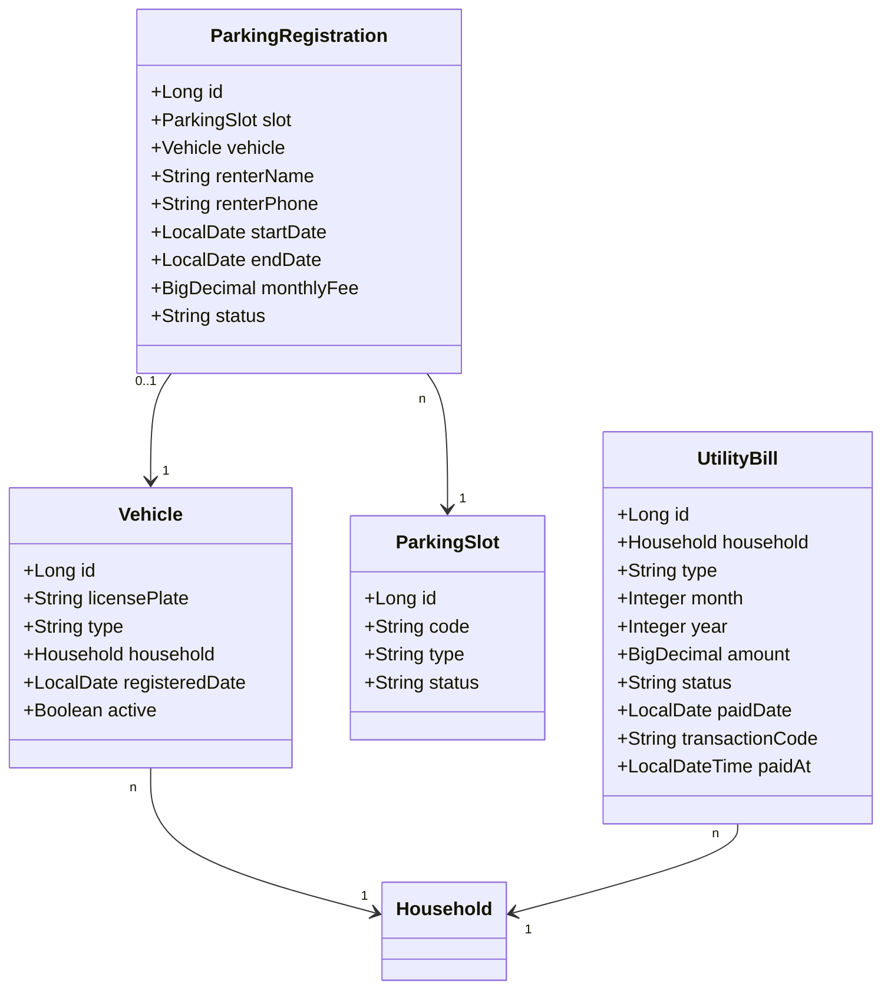
```mermaid
classDiagram
    class Vehicle {
        +Long id
        +String licensePlate
        +String type
        +Household household
        +LocalDate registeredDate
        +Boolean active
    }
    class ParkingSlot {
        +Long id
        +String code
        +String type
        +String status
    }
    class ParkingRegistration {
        +Long id
        +ParkingSlot slot
        +Vehicle vehicle
        +String renterName
        +String renterPhone
        +LocalDate startDate
        +LocalDate endDate
        +BigDecimal monthlyFee
        +String status
    }
    class UtilityBill {
        +Long id
        +Household household
        +String type
        +Integer month
        +Integer year
        +BigDecimal amount
        +String status
        +LocalDate paidDate
        +String transactionCode
        +LocalDateTime paidAt
    }

    Vehicle "n" --> "1" Household
    ParkingRegistration "n" --> "1" ParkingSlot
    ParkingRegistration "0..1" --> "1" Vehicle
    UtilityBill "n" --> "1" Household
```

### 6.5 Sơ đồ lớp nhóm Tương tác và Nhật ký hệ thống

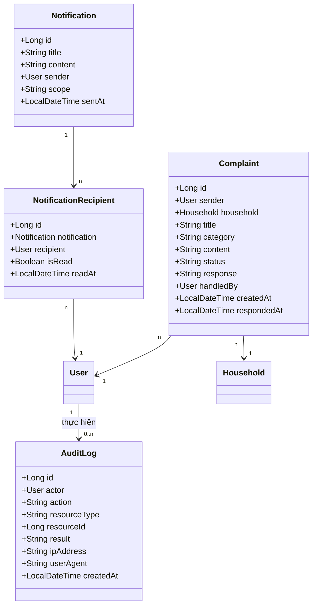
```mermaid
classDiagram
    class Complaint {
        +Long id
        +User sender
        +Household household
        +String title
        +String category
        +String content
        +String status
        +String response
        +User handledBy
        +LocalDateTime createdAt
        +LocalDateTime respondedAt
    }
    class Notification {
        +Long id
        +String title
        +String content
        +User sender
        +String scope
        +LocalDateTime sentAt
    }
    class AuditLog {
        +Long id
        +User actor
        +String action
        +String resourceType
        +Long resourceId
        +String result
        +String ipAddress
        +String userAgent
        +LocalDateTime createdAt
    }

    class NotificationRecipient {
        +Long id
        +Notification notification
        +User recipient
        +Boolean isRead
        +LocalDateTime readAt
    }

    Notification "1" --> "n" NotificationRecipient
    NotificationRecipient "n" --> "1" User
    Complaint "n" --> "1" User
    Complaint "n" --> "1" Household
    User "1" --> "0..n" AuditLog : thực hiện
```

### 6.6 Đặc tả chi tiết các lớp chính

**User** – Tài khoản người dùng

| Thuộc tính | Kiểu | Ý nghĩa |
|---|---|---|
| id | Long | Khoá chính |
| username | String | Tên đăng nhập (duy nhất) |
| passwordHash | String | Mật khẩu đã băm BCrypt |
| fullName | String | Họ tên |
| email | String | Email liên hệ |
| phone | String | Số điện thoại |
| active | Boolean | true: đang dùng, false: bị khoá hoặc chưa duyệt |
| emailVerified | Boolean | true nếu email đã xác thực qua OTP |
| requestedApartmentCode | String | Mã căn hộ cư dân khai khi tự đăng ký (chờ Admin duyệt). NULL với Admin và với tài khoản đã được duyệt |
| role | Role | Vai trò |
| household | Household | Hộ gắn với tài khoản; **NULL với role ADMIN** và NULL khi cư dân mới đăng ký chưa được duyệt |

Trách nhiệm: lưu thông tin định danh người dùng. **Logic xác thực (`login`) và đổi mật khẩu (`changePassword`) được đặt trong `AuthService`**, không đặt trong Entity.

**EmailOtp** – Mã OTP gửi qua email

| Thuộc tính | Kiểu | Ý nghĩa |
|---|---|---|
| id | Long | Khoá chính |
| email | String | Email nhận OTP |
| otpHash | String | OTP đã hash BCrypt (không bao giờ lưu plain) |
| purpose | String | `REGISTER`, `FORGOT_PASSWORD` |
| expiredAt | LocalDateTime | Thời điểm hết hạn (= createdAt + 5 phút) |
| used | Boolean | TRUE nếu OTP đã dùng |
| failedAttempts | Integer | Số lần nhập sai (tối đa 5) |
| createdAt | LocalDateTime | Thời điểm sinh OTP |

Trách nhiệm: lưu OTP đã hash. Mọi thao tác sinh/kiểm tra OTP thuộc về `OtpService`.

**Apartment** – Căn hộ

| Thuộc tính | Kiểu | Ý nghĩa |
|---|---|---|
| id | Long | Khoá chính |
| code | String | Số căn hộ (duy nhất) |
| floor | Integer | Tầng |
| area | BigDecimal | Diện tích (m²) |
| status | String | `AVAILABLE`, `OCCUPIED`, `MAINTENANCE` |
| note | String | Ghi chú |

Trách nhiệm: lưu thông tin **cố định** của căn hộ. Số căn hộ trong chung cư là cố định, không có thêm/xoá trong vận hành thông thường. **Một căn hộ có thể từng có nhiều Household theo thời gian, nhưng tại một thời điểm chỉ có tối đa một Household ở trạng thái ACTIVE.**

**Household** – Hộ dân/Hộ khẩu trong căn hộ

| Thuộc tính | Kiểu | Ý nghĩa |
|---|---|---|
| id | Long | Khoá chính |
| code | String | Mã hộ khẩu (vd: BM-1201) |
| apartment | Apartment | Căn hộ tương ứng |
| headOfHousehold | Resident | Chủ hộ |
| moveInDate | LocalDate | Ngày chuyển đến |
| status | String | `ACTIVE`, `MOVED_OUT` |

Trách nhiệm: lưu thông tin hộ dân. Tại một thời điểm, mỗi `Apartment` chỉ có tối đa một `Household` ở `status = ACTIVE`. **Logic thêm/chuyển nhân khẩu nằm trong `HouseholdService`.**

**Resident** – Nhân khẩu

| Thuộc tính | Kiểu | Ý nghĩa |
|---|---|---|
| id | Long | Khoá chính |
| fullName | String | Họ tên |
| idCard | String | CCCD/CMND |
| dateOfBirth | LocalDate | Ngày sinh |
| gender | String | MALE/FEMALE/OTHER |
| relationToHead | String | Vợ/chồng/con/bố/mẹ/khác |
| residencyStatus | String | `PERMANENT` (thường trú), `TEMPORARY` (tạm trú), `ABSENT` (tạm vắng) |
| status | String | `ACTIVE` (còn thuộc hộ), `MOVED_OUT` (đã chuyển khỏi hộ) |
| household | Household | Hộ khẩu |

Trách nhiệm: lưu thông tin nhân khẩu. **`residencyStatus`** biểu diễn tình trạng cư trú (thường trú/tạm trú/tạm vắng); **`status`** biểu diễn nhân khẩu còn thuộc hộ hay đã chuyển đi. Khi chuyển nhân khẩu khỏi hộ, **không xoá vật lý** mà cập nhật `status = MOVED_OUT`.

**Fee** – Khoản thu

| Thuộc tính | Kiểu | Ý nghĩa |
|---|---|---|
| id | Long | Khoá chính |
| name | String | Tên khoản thu |
| type | String | MANDATORY / DONATION |
| unitPrice | BigDecimal | Đơn giá (có thể null) |
| unit | String | PER_M2, PER_VEHICLE, FIXED, NONE |
| description | String | Mô tả |
| active | Boolean | Khoản thu còn dùng hay không. Nếu khoản thu đã phát sinh `FeePeriod`/`Payment`, không xoá vật lý mà đặt `active = false` để ngừng sử dụng |

Trách nhiệm: lưu danh mục khoản thu. **`FeeService.deleteOrDeactivateFee(...)`** chỉ xoá vật lý khi khoản thu chưa phát sinh dữ liệu liên quan; nếu đã có `FeePeriod` hoặc `Payment`, service chuyển sang `active = false` để giữ toàn vẹn dữ liệu và lịch sử thu phí.

**FeePeriod** – Đợt thu phí

| Thuộc tính | Kiểu | Ý nghĩa |
|---|---|---|
| id | Long | Khoá chính |
| fee | Fee | Khoản thu áp dụng |
| name | String | Tên đợt |
| startDate, endDate | LocalDate | Khoảng thời gian thu |
| status | String | OPEN, CLOSED |

Trách nhiệm: lưu thông tin đợt thu. **Việc sinh danh sách phiếu nộp cho các hộ thuộc về `FeePeriodService`**, không phải method của entity. Với khoản thu `MANDATORY`, hệ thống tự sinh `payments` cho các Household ACTIVE. Với khoản thu `DONATION`, hệ thống không tạo công nợ bắt buộc cho mọi hộ; chỉ tạo/cập nhật `payments` khi hộ thực sự đóng góp, nên không đưa các hộ chưa đóng góp vào danh sách “chưa nộp”.

**Payment** – Phiếu nộp

| Thuộc tính | Kiểu | Ý nghĩa |
|---|---|---|
| id | Long | Khoá chính |
| feePeriod | FeePeriod | Đợt thu phí |
| household | Household | Hộ nộp |
| amountDue | BigDecimal | Số tiền phải nộp |
| amountPaid | BigDecimal | Số tiền đã nộp |
| paidDate | LocalDate | Ngày nộp |
| status | String | UNPAID, PAID |
| paymentMethod | String | `CASH` (Admin ghi nhận tiền mặt) hoặc `ONLINE` (qua VNPay Sandbox) |
| transactionCode | String | Mã giao dịch online (NULL nếu nộp tiền mặt). Khi VNPay thành công, copy `transaction_code` từ `payment_transactions` |
| paidAt | LocalDateTime | Thời điểm thanh toán hoàn tất |
| note | String | Ghi chú |
| collectedBy | User | Admin ghi nhận (NULL nếu thanh toán online) |

Trách nhiệm: lưu phiếu nộp. **`PaymentService.confirmCashPayment(...)`** xử lý xác nhận đã nộp đủ tiền mặt bằng cách đặt `amount_paid = amount_due` và `status = PAID`; **`PaymentService.markPaidByVnpay(transactionCode, ...)`** cập nhật khi VNPay xác nhận thành công.

**PaymentTransaction** – Giao dịch thanh toán online

| Thuộc tính | Kiểu | Ý nghĩa |
|---|---|---|
| id | Long | Khoá chính |
| transactionCode | String | Mã giao dịch duy nhất do hệ thống sinh (vd: `BM-20260527-000123`) |
| household | Household | Hộ thanh toán |
| user | User | Người thực hiện thanh toán (cư dân đăng nhập) |
| targetType | String | `FEE_PAYMENT` (phiếu nộp), `UTILITY_BILL` (hoá đơn điện/nước/internet) |
| targetId | Long | ID của bản ghi khoản phí/hoá đơn tương ứng |
| amount | BigDecimal | Số tiền giao dịch |
| status | String | `PENDING`, `SUCCESS`, `FAILED`, `CANCELLED` |
| vnpayTransactionNo | String | `vnp_TransactionNo` do VNPay trả về |
| vnpayResponseCode | String | `vnp_ResponseCode` do VNPay trả về |
| vnpayBankCode | String | `vnp_BankCode` |
| vnpayPayDate | String | `vnp_PayDate` |
| paymentUrl | String | URL thanh toán VNPay đã sinh |
| paidAt | LocalDateTime | Thời điểm xác nhận thành công |
| createdAt | LocalDateTime | Thời điểm tạo giao dịch |
| updatedAt | LocalDateTime | Thời điểm cập nhật cuối |

Trách nhiệm: lưu thông tin giao dịch online. Bảng này chỉ dành cho giao dịch qua VNPay Sandbox nên không cần thuộc tính `paymentMethod`; phương thức được hiểu mặc định là ONLINE. `vnp_SecureHash` chỉ dùng để xác thực callback tại thời điểm nhận Return/IPN, không lưu lâu dài trong Entity. **Mọi thao tác tạo URL, kiểm tra chữ ký, cập nhật trạng thái thuộc về `PaymentService` và `VnpayService`.**

**Vehicle, ParkingSlot, ParkingRegistration** – như mô tả cũ, với `monthlyFee: BigDecimal` thay cho `Double`.

**Quy tắc tính phí gửi xe (`monthlyFee`):**
- Xe máy (MOTORBIKE): 70.000đ/xe/tháng – mặc định khi đăng ký cho hộ.
- Ô tô (CAR): 1.200.000đ/xe/tháng – mặc định khi đăng ký cho hộ.
- Cho thuê chỗ gửi xe thừa (`vehicle_id = NULL`, có `renter_name/renter_phone`): phí thuê nhập thủ công theo thoả thuận giữa BQT và người thuê.

**UtilityBill** – Hoá đơn điện/nước/internet, với `amount: BigDecimal`, `paymentMethod`, `transactionCode`, `paidAt` để khớp luồng thanh toán online.

**AuditLog** – Nhật ký audit lưu trong CSDL

| Thuộc tính | Kiểu | Ý nghĩa |
|---|---|---|
| id | Long | Khoá chính |
| actor | User | Người thực hiện thao tác; NULL nếu là thao tác hệ thống hoặc đăng nhập thất bại không xác định được user |
| action | String | Hành động: LOGIN_SUCCESS, LOGIN_FAILED, CREATE_FEE, UPDATE_FEE, DEACTIVATE_FEE, CONFIRM_CASH_PAYMENT, CREATE_VNPAY_TRANSACTION, UPDATE_VNPAY_TRANSACTION... |
| resourceType | String | Loại tài nguyên bị tác động: USER, FEE, PAYMENT, PAYMENT_TRANSACTION, UTILITY_BILL... |
| resourceId | Long | ID tài nguyên, có thể NULL nếu thao tác thất bại trước khi xác định được tài nguyên |
| result | String | SUCCESS / FAILED |
| ipAddress | String | IP nguồn của request |
| userAgent | String | Thông tin trình duyệt/client, có thể rút gọn |
| createdAt | LocalDateTime | Thời điểm ghi log |

Trách nhiệm: lưu vết thao tác nghiệp vụ quan trọng để Admin tra cứu, đối soát và kiểm tra trách nhiệm. Không lưu mật khẩu, OTP nguyên bản, `vnp_HashSecret`, nội dung `vnp_SecureHash` hoặc thông tin thẻ ngân hàng trong audit log.

**Complaint, Notification, NotificationRecipient** – giữ nguyên cấu trúc, không thay đổi.

---

## 7. THIẾT KẾ CƠ SỞ DỮ LIỆU

### 7.1 Sơ đồ thực thể quan hệ (ERD)

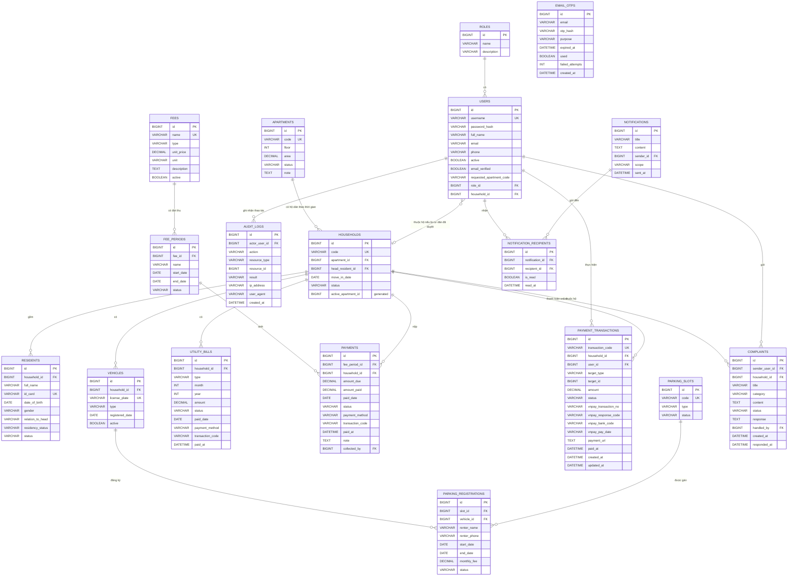
```mermaid
erDiagram
    ROLES ||--o{ USERS : "có"
    USERS }o--o| HOUSEHOLDS : "thuộc hộ nếu là cư dân đã duyệt"
    APARTMENTS ||--o{ HOUSEHOLDS : "có hộ dân theo thời gian"
    HOUSEHOLDS ||--o{ RESIDENTS : "gồm"
    HOUSEHOLDS ||--o{ VEHICLES : "có"
    HOUSEHOLDS ||--o{ UTILITY_BILLS : "có"
    HOUSEHOLDS ||--o{ PAYMENTS : "nộp"
    HOUSEHOLDS ||--o{ PAYMENT_TRANSACTIONS : "thanh toán online"
    USERS ||--o{ PAYMENT_TRANSACTIONS : "thực hiện"
    USERS ||--o{ AUDIT_LOGS : "ghi nhận thao tác"

    FEES ||--o{ FEE_PERIODS : "có đợt thu"
    FEE_PERIODS ||--o{ PAYMENTS : "sinh"

    PARKING_SLOTS ||--o{ PARKING_REGISTRATIONS : "được gán"
    VEHICLES ||--o{ PARKING_REGISTRATIONS : "đăng ký"

    USERS ||--o{ COMPLAINTS : "gửi"
    HOUSEHOLDS ||--o{ COMPLAINTS : "thuộc hộ"
    NOTIFICATIONS ||--o{ NOTIFICATION_RECIPIENTS : "gửi đến"
    USERS ||--o{ NOTIFICATION_RECIPIENTS : "nhận"

    ROLES {
        BIGINT id PK
        VARCHAR name
        VARCHAR description
    }
    USERS {
        BIGINT id PK
        VARCHAR username UK
        VARCHAR password_hash
        VARCHAR full_name
        VARCHAR email
        VARCHAR phone
        BOOLEAN active
        BOOLEAN email_verified
        VARCHAR requested_apartment_code
        BIGINT role_id FK
        BIGINT household_id FK
    }
    EMAIL_OTPS {
        BIGINT id PK
        VARCHAR email
        VARCHAR otp_hash
        VARCHAR purpose
        DATETIME expired_at
        BOOLEAN used
        INT failed_attempts
        DATETIME created_at
    }
    APARTMENTS {
        BIGINT id PK
        VARCHAR code UK
        INT floor
        DECIMAL area
        VARCHAR status
        TEXT note
    }
    HOUSEHOLDS {
        BIGINT id PK
        VARCHAR code UK
        BIGINT apartment_id FK
        BIGINT head_resident_id FK
        DATE move_in_date
        VARCHAR status
        BIGINT active_apartment_id "generated"
    }
    RESIDENTS {
        BIGINT id PK
        BIGINT household_id FK
        VARCHAR full_name
        VARCHAR id_card UK
        DATE date_of_birth
        VARCHAR gender
        VARCHAR relation_to_head
        VARCHAR residency_status
        VARCHAR status
    }
    FEES {
        BIGINT id PK
        VARCHAR name UK
        VARCHAR type
        DECIMAL unit_price
        VARCHAR unit
        TEXT description
        BOOLEAN active
    }
    FEE_PERIODS {
        BIGINT id PK
        BIGINT fee_id FK
        VARCHAR name
        DATE start_date
        DATE end_date
        VARCHAR status
    }
    PAYMENTS {
        BIGINT id PK
        BIGINT fee_period_id FK
        BIGINT household_id FK
        DECIMAL amount_due
        DECIMAL amount_paid
        DATE paid_date
        VARCHAR status
        VARCHAR payment_method
        VARCHAR transaction_code
        DATETIME paid_at
        TEXT note
        BIGINT collected_by FK
    }
    PAYMENT_TRANSACTIONS {
        BIGINT id PK
        VARCHAR transaction_code UK
        BIGINT household_id FK
        BIGINT user_id FK
        VARCHAR target_type
        BIGINT target_id
        DECIMAL amount
        VARCHAR status
        VARCHAR vnpay_transaction_no
        VARCHAR vnpay_response_code
        VARCHAR vnpay_bank_code
        VARCHAR vnpay_pay_date
        TEXT payment_url
        DATETIME paid_at
        DATETIME created_at
        DATETIME updated_at
    }
    AUDIT_LOGS {
        BIGINT id PK
        BIGINT actor_user_id FK
        VARCHAR action
        VARCHAR resource_type
        BIGINT resource_id
        VARCHAR result
        VARCHAR ip_address
        VARCHAR user_agent
        DATETIME created_at
    }
    VEHICLES {
        BIGINT id PK
        BIGINT household_id FK
        VARCHAR license_plate UK
        VARCHAR type
        DATE registered_date
        BOOLEAN active
    }
    PARKING_SLOTS {
        BIGINT id PK
        VARCHAR code UK
        VARCHAR type
        VARCHAR status
    }
    PARKING_REGISTRATIONS {
        BIGINT id PK
        BIGINT slot_id FK
        BIGINT vehicle_id FK
        VARCHAR renter_name
        VARCHAR renter_phone
        DATE start_date
        DATE end_date
        DECIMAL monthly_fee
        VARCHAR status
    }
    UTILITY_BILLS {
        BIGINT id PK
        BIGINT household_id FK
        VARCHAR type
        INT month
        INT year
        DECIMAL amount
        VARCHAR status
        DATE paid_date
        VARCHAR payment_method
        VARCHAR transaction_code
        DATETIME paid_at
    }
    COMPLAINTS {
        BIGINT id PK
        BIGINT sender_user_id FK
        BIGINT household_id FK
        VARCHAR title
        VARCHAR category
        TEXT content
        VARCHAR status
        TEXT response
        BIGINT handled_by FK
        DATETIME created_at
        DATETIME responded_at
    }
    NOTIFICATIONS {
        BIGINT id PK
        VARCHAR title
        TEXT content
        BIGINT sender_id FK
        VARCHAR scope
        DATETIME sent_at
    }
    NOTIFICATION_RECIPIENTS {
        BIGINT id PK
        BIGINT notification_id FK
        BIGINT recipient_id FK
        BOOLEAN is_read
        DATETIME read_at
    }
```

### 7.2 Danh sách bảng

Hệ thống gồm **18 bảng** trong MySQL:

| STT | Bảng | Mục đích |
|---|---|---|
| 1 | `roles` | Vai trò trong hệ thống |
| 2 | `users` | Tài khoản người dùng |
| 3 | `email_otps` | OTP gửi qua email (đăng ký, quên mật khẩu, xác nhận thao tác) |
| 4 | `apartments` | Danh mục căn hộ (cố định, không thêm/xoá khi vận hành) |
| 5 | `households` | Hộ dân/Hộ khẩu sống trong căn hộ theo thời gian |
| 6 | `residents` | Nhân khẩu |
| 7 | `fees` | Danh mục khoản thu |
| 8 | `fee_periods` | Đợt thu phí |
| 9 | `payments` | Phiếu nộp theo đợt thu |
| 10 | `payment_transactions` | Giao dịch thanh toán online qua VNPay Sandbox |
| 11 | `audit_logs` | Nhật ký audit nghiệp vụ lưu trong CSDL |
| 12 | `vehicles` | Xe đăng ký gửi |
| 13 | `parking_slots` | Chỗ gửi xe |
| 14 | `parking_registrations` | Đăng ký gửi xe / cho thuê chỗ |
| 15 | `utility_bills` | Hoá đơn điện/nước/internet |
| 16 | `complaints` | Khiếu nại của cư dân |
| 17 | `notifications` | Thông báo |
| 18 | `notification_recipients` | Người nhận thông báo |

Ghi chú: Sau chỉnh sửa về audit log, hệ thống có **18 bảng** và **18 Entity chính**. Không thêm bảng `parking_fee_bills`, không thêm bảng lịch sử biến động nhân khẩu, không thêm role mới và không thêm cổng thanh toán khác ngoài VNPay Sandbox.

### 7.3 Chi tiết các bảng quan trọng

**Bảng `users`**

| Cột | Kiểu | Ràng buộc | Mô tả |
|---|---|---|---|
| id | BIGINT | PK, AUTO_INCREMENT | Khoá chính |
| username | VARCHAR(50) | NOT NULL, UNIQUE | Tên đăng nhập |
| password_hash | VARCHAR(255) | NOT NULL | Mật khẩu đã băm BCrypt |
| full_name | VARCHAR(100) | NOT NULL | Họ tên |
| email | VARCHAR(100) | | Email liên hệ |
| phone | VARCHAR(20) | | |
| active | BOOLEAN | DEFAULT FALSE | Cư dân tự đăng ký mặc định `FALSE`, chờ Admin duyệt. Admin được tạo nội bộ với `TRUE` |
| email_verified | BOOLEAN | DEFAULT FALSE | TRUE sau khi OTP đăng ký được xác thực |
| requested_apartment_code | VARCHAR(20) | NULL | Mã căn hộ cư dân khai khi tự đăng ký, chờ Admin duyệt. NULL với Admin và với tài khoản đã được duyệt |
| role_id | BIGINT | FK → roles(id) | Vai trò |
| household_id | BIGINT | FK → households(id), NULL | Hộ gắn với tài khoản. NULL với Admin; NULL với cư dân chưa được duyệt; có giá trị với cư dân đã được Admin gán hộ |
| created_at | DATETIME | DEFAULT CURRENT_TIMESTAMP | |

Giải thích `requested_apartment_code`:
- Khi cư dân tự đăng ký, tài khoản có `role = RESIDENT`, `active = FALSE`, `household_id = NULL`, và `requested_apartment_code` chứa mã căn hộ cư dân khai báo.
- Sau khi Admin kiểm tra, Admin gán tài khoản vào household phù hợp (`household_id = …`) và kích hoạt (`active = TRUE`); `requested_apartment_code` có thể giữ nguyên hoặc đặt NULL tuỳ chính sách.
- **Không tạo bảng đăng ký riêng**.

**Bảng `email_otps`**

```sql
CREATE TABLE email_otps (
    id BIGINT PRIMARY KEY AUTO_INCREMENT,
    email VARCHAR(100) NOT NULL,
    otp_hash VARCHAR(255) NOT NULL,
    purpose ENUM('REGISTER', 'FORGOT_PASSWORD') NOT NULL,
    expired_at DATETIME NOT NULL,
    used BOOLEAN DEFAULT FALSE,
    failed_attempts INT DEFAULT 0,
    created_at DATETIME DEFAULT CURRENT_TIMESTAMP,
    INDEX idx_email_purpose (email, purpose),
    INDEX idx_created_at (created_at)
);
```

Quy ước:
- `otp_hash`: OTP đã hash BCrypt; **không bao giờ lưu OTP plain**.
- `purpose`: phân loại mục đích OTP để tránh dùng nhầm OTP đăng ký cho việc đặt lại mật khẩu.
- `expired_at = created_at + 5 phút`.
- `failed_attempts` tăng mỗi lần nhập sai; vượt 5 → khoá OTP, yêu cầu OTP mới.
- Rate limit: trong 15 phút, mỗi `email` chỉ được tạo tối đa 5 bản ghi (kiểm tra qua `COUNT(*) WHERE email = ? AND created_at > NOW() - INTERVAL 15 MINUTE`).

**Bảng `apartments`**

| Cột | Kiểu | Ràng buộc | Mô tả |
|---|---|---|---|
| id | BIGINT | PK, AUTO_INCREMENT | Khoá chính |
| code | VARCHAR(20) | UNIQUE, NOT NULL | Số căn hộ |
| floor | INT | NOT NULL | Tầng |
| area | DECIMAL(10,2) | NOT NULL | Diện tích (m²) |
| status | VARCHAR(20) | DEFAULT 'AVAILABLE' | `AVAILABLE` / `OCCUPIED` / `MAINTENANCE` |
| note | TEXT | | Ghi chú |

Lưu ý:
- Số căn hộ trong chung cư BlueMoon là **cố định**, không có API thêm/xoá căn hộ.
- **Một căn hộ có thể có nhiều Household theo thời gian, nhưng tại một thời điểm chỉ có tối đa một Household ở trạng thái ACTIVE.** Không cần bảng lịch sử riêng.
- Apartment ở trạng thái `AVAILABLE` không có Household ACTIVE nào.

**Bảng `households`**

| Cột | Kiểu | Ràng buộc | Mô tả |
|---|---|---|---|
| id | BIGINT | PK | Khoá chính |
| code | VARCHAR(20) | UNIQUE, NOT NULL | Mã hộ dân/hộ khẩu |
| apartment_id | BIGINT | FK → apartments(id) | Căn hộ mà hộ dân đang/đã ở |
| head_resident_id | BIGINT | FK → residents(id), NULL | Chủ hộ; cho phép NULL khi vừa tạo Household rồi mới thêm Resident đầu tiên |
| move_in_date | DATE | | Ngày chuyển vào |
| status | VARCHAR(20) | DEFAULT 'ACTIVE' (`ACTIVE` / `MOVED_OUT`) | Trạng thái hộ |
| active_apartment_id | BIGINT | GENERATED, UNIQUE INDEX | Cột sinh tự động để ràng buộc tối đa 1 Household ACTIVE cho mỗi Apartment |

Ràng buộc nghiệp vụ: với mỗi `apartment_id`, chỉ có tối đa một dòng có `status = 'ACTIVE'`. Ràng buộc này được kiểm tra ở cả tầng `HouseholdService` và tầng CSDL để tránh race condition khi hai Admin thao tác đồng thời.

MySQL 8 không hỗ trợ trực tiếp partial unique index kiểu `UNIQUE (apartment_id) WHERE status = 'ACTIVE'`, nên dùng generated column:

```sql
ALTER TABLE households
ADD active_apartment_id BIGINT
GENERATED ALWAYS AS (
    CASE WHEN status = 'ACTIVE' THEN apartment_id ELSE NULL END
) STORED;

CREATE UNIQUE INDEX uk_one_active_household_per_apartment
ON households(active_apartment_id);
```

Do MySQL cho phép nhiều giá trị `NULL` trong unique index, các Household `MOVED_OUT` sẽ có `active_apartment_id = NULL` và không bị chặn trùng; chỉ Household `ACTIVE` mới bị kiểm tra trùng theo `apartment_id`.

Quy trình tạo Household để tránh vòng phụ thuộc với chủ hộ:
1. Tạo `Household` với `head_resident_id = NULL`.
2. Thêm Resident đầu tiên vào Household.
3. Cập nhật `head_resident_id` bằng `id` của Resident được chọn làm chủ hộ.

**Bảng `residents`**

| Cột | Kiểu | Mô tả |
|---|---|---|
| id | BIGINT PK | |
| household_id | BIGINT FK | |
| full_name | VARCHAR(100) | |
| id_card | VARCHAR(20) UNIQUE | |
| date_of_birth | DATE | |
| gender | VARCHAR(10) | MALE/FEMALE/OTHER |
| relation_to_head | VARCHAR(30) | |
| residency_status | VARCHAR(20) | `PERMANENT` / `TEMPORARY` / `ABSENT` (tình trạng cư trú) |
| status | VARCHAR(20) DEFAULT 'ACTIVE' | `ACTIVE` (còn thuộc hộ) / `MOVED_OUT` (đã chuyển khỏi hộ) |

Giải thích:
- `residency_status`: thường trú / tạm trú / tạm vắng.
- `status`: còn thuộc hộ hay đã chuyển đi.
- Khi chuyển nhân khẩu khỏi hộ: **không xoá vật lý**, chỉ cập nhật `status = 'MOVED_OUT'`. Không cần bảng lịch sử biến động nhân khẩu.

**Bảng `fees`**

| Cột | Kiểu | Mô tả |
|---|---|---|
| id | BIGINT PK | |
| name | VARCHAR(100) UNIQUE | Tên khoản thu |
| type | VARCHAR(20) | MANDATORY / DONATION |
| unit_price | DECIMAL(15,2) | Đơn giá, có thể NULL |
| unit | VARCHAR(20) | PER_M2 / PER_VEHICLE / FIXED / NONE |
| description | TEXT | |
| active | BOOLEAN DEFAULT TRUE | TRUE: còn được dùng để lập đợt thu mới; FALSE: đã ngừng sử dụng, chỉ giữ để bảo toàn dữ liệu lịch sử |

Quy tắc xoá/ngừng sử dụng:
- Nếu khoản thu chưa phát sinh `fee_periods` và chưa có `payments` liên quan → cho phép xoá vật lý.
- Nếu khoản thu đã phát sinh dữ liệu liên quan → không xoá vật lý; chỉ cập nhật `active = FALSE` để ngừng sử dụng cho các đợt thu mới.
- `FeeService` phải kiểm tra ràng buộc này trước khi thực hiện `DELETE /api/fees/{id}`.

**Bảng `fee_periods`**

| Cột | Kiểu | Mô tả |
|---|---|---|
| id | BIGINT PK | |
| fee_id | BIGINT FK | |
| name | VARCHAR(100) | |
| start_date, end_date | DATE | |
| status | VARCHAR(20) | OPEN / CLOSED |

Quy tắc sinh phiếu nộp:
- Với `fees.type = MANDATORY`: khi lập đợt thu, hệ thống tự sinh `payments` cho các Household ACTIVE.
- Với `fees.type = DONATION`: không sinh công nợ bắt buộc cho mọi hộ. Hệ thống chỉ tạo `payments` khi Admin ghi nhận hộ có đóng góp hoặc khi cư dân chủ động thanh toán một khoản đóng góp được mở cho hộ; các hộ chưa đóng góp không bị tính là nợ/chưa nộp.
- Với phí gửi xe hằng tháng: có thể tạo một `FeePeriod` riêng cho phí gửi xe; `amount_due` được tính từ các `parking_registrations` ACTIVE của hộ tại tháng đó.

**Bảng `payments`**

| Cột | Kiểu | Mô tả |
|---|---|---|
| id | BIGINT PK | |
| fee_period_id | BIGINT FK | |
| household_id | BIGINT FK | |
| amount_due | DECIMAL(15,2) | Số phải nộp |
| amount_paid | DECIMAL(15,2) DEFAULT 0 | Số đã nộp |
| paid_date | DATE | |
| status | VARCHAR(20) | UNPAID / PAID |
| payment_method | ENUM('CASH','ONLINE') NULL | Phương thức thanh toán thực tế; NULL khi khoản chưa được thanh toán |
| transaction_code | VARCHAR(50) NULL | Mã giao dịch online (chỉ có giá trị khi `payment_method = ONLINE`) |
| paid_at | DATETIME NULL | Thời điểm thanh toán hoàn tất (đặc biệt với online) |
| note | TEXT | |
| collected_by | BIGINT FK → users(id) | NULL nếu thanh toán online |

Ràng buộc: UNIQUE (`fee_period_id`, `household_id`).

**Bảng `payment_transactions`**

```sql
CREATE TABLE payment_transactions (
    id BIGINT PRIMARY KEY AUTO_INCREMENT,
    transaction_code VARCHAR(50) NOT NULL UNIQUE,
    household_id BIGINT NOT NULL,
    user_id BIGINT NOT NULL,
    target_type ENUM('FEE_PAYMENT', 'UTILITY_BILL') NOT NULL,
    target_id BIGINT NOT NULL,
    amount DECIMAL(15,2) NOT NULL,
    status ENUM('PENDING', 'SUCCESS', 'FAILED', 'CANCELLED') DEFAULT 'PENDING',
    vnpay_transaction_no VARCHAR(100),
    vnpay_response_code VARCHAR(20),
    vnpay_bank_code VARCHAR(50),
    vnpay_pay_date VARCHAR(20),
    payment_url TEXT,
    paid_at DATETIME,
    created_at DATETIME DEFAULT CURRENT_TIMESTAMP,
    updated_at DATETIME DEFAULT CURRENT_TIMESTAMP,
    FOREIGN KEY (household_id) REFERENCES households(id),
    FOREIGN KEY (user_id) REFERENCES users(id),
    INDEX idx_household (household_id),
    INDEX idx_status (status),
    INDEX idx_target (target_type, target_id)
);
```

Giải thích vai trò hai bảng `payments` và `payment_transactions`:
- `payments` dùng để **ghi nhận khoản phải thu và khoản đã nộp** theo đợt thu phí (`fee_periods`). Khi mới sinh phiếu nộp, `status = UNPAID`, `amount_paid = 0`, `payment_method = NULL`. Chỉ khi hộ thực sự nộp tiền thì hệ thống mới cập nhật `payment_method = CASH` hoặc `ONLINE`; trường `transaction_code` liên kết sang `payment_transactions` nếu là online.
- `payment_transactions` dùng để **theo dõi giao dịch online qua VNPay Sandbox**. Vì bảng này chỉ ghi nhận giao dịch online nên không có cột `payment_method`; phương thức thanh toán được hiểu mặc định là ONLINE. Bảng cũng không lưu `vnpay_secure_hash`; chữ ký `vnp_SecureHash` chỉ được kiểm tra tại thời điểm nhận Return/IPN rồi bỏ, không cần lưu để đối soát. Bảng chỉ áp dụng cho 2 loại `target_type`:
    - `FEE_PAYMENT` → liên kết tới `payments.id` (khoản thu theo đợt).
    - `UTILITY_BILL` → liên kết tới `utility_bills.id` (hoá đơn điện/nước/internet).
- Vì `target_type + target_id` là liên kết đa hình, MySQL không thể tạo FK trực tiếp đến hai bảng khác nhau trên cùng một cột `target_id`. Ràng buộc này phải được kiểm tra ở tầng `PaymentService`: khi `target_type = FEE_PAYMENT` thì `target_id` bắt buộc tồn tại trong `payments`; khi `target_type = UTILITY_BILL` thì `target_id` bắt buộc tồn tại trong `utility_bills`; đồng thời `household_id` của target phải khớp với `household_id` của giao dịch.
- Khi giao dịch VNPay thành công (`vnp_ResponseCode = "00"`, chữ ký hợp lệ), hệ thống đặt `payment_transactions.status = SUCCESS` và **đồng thời cập nhật bản ghi khoản phí/hoá đơn tương ứng**:
    - Với `FEE_PAYMENT` → `payments`: `status = PAID`, `amount_paid = amount_due`, `payment_method = ONLINE`, `transaction_code = <transaction_code>`, `paid_at`, `paid_date`.
    - Với `UTILITY_BILL` → `utility_bills`: `status = PAID`, `payment_method = ONLINE`, `transaction_code = <transaction_code>`, `paid_at`, `paid_date`.
- Không tạo `target_type = PARKING_FEE` riêng. Phí gửi xe hằng tháng được thu như một khoản thu thông thường trong `fee_periods/payments`; số tiền lấy từ các `parking_registrations` đang ACTIVE của hộ. Vì vậy nếu thanh toán online, giao dịch phí gửi xe vẫn đi qua `target_type = FEE_PAYMENT`.
- Khi tạo giao dịch VNPay mới, `PaymentService` phải kiểm tra trạng thái target trước:
    - Nếu khoản phí/hoá đơn đã `PAID` → từ chối tạo giao dịch mới.
    - Nếu đã có giao dịch `PENDING` cho cùng `target_type + target_id` → trả lại `payment_url` cũ hoặc yêu cầu cư dân chờ/hủy giao dịch cũ; không tạo nhiều giao dịch `PENDING` song song.
    - Nếu giao dịch cũ là `FAILED` hoặc `CANCELLED` → cho phép tạo giao dịch mới.
    - Khi IPN về nhiều lần, chỉ cập nhật nếu transaction đang `PENDING`.
- **Hệ thống không lưu thông tin thẻ ngân hàng của cư dân**; chỉ lưu các trường `vnpay_*` do VNPay trả về để đối soát.

**Bảng `audit_logs`**

```sql
CREATE TABLE audit_logs (
    id BIGINT PRIMARY KEY AUTO_INCREMENT,
    actor_user_id BIGINT NULL,
    action VARCHAR(50) NOT NULL,
    resource_type VARCHAR(50),
    resource_id BIGINT,
    result ENUM('SUCCESS', 'FAILED') NOT NULL,
    ip_address VARCHAR(45),
    user_agent VARCHAR(255),
    created_at DATETIME DEFAULT CURRENT_TIMESTAMP,
    FOREIGN KEY (actor_user_id) REFERENCES users(id),
    INDEX idx_actor_created (actor_user_id, created_at),
    INDEX idx_action_created (action, created_at),
    INDEX idx_resource (resource_type, resource_id)
);
```

Quy ước:
- Ghi audit log cho các thao tác nhạy cảm: đăng nhập thành công/thất bại, tạo/sửa/xoá hoặc ngừng sử dụng khoản thu, xác nhận nộp tiền mặt, tạo giao dịch VNPay, cập nhật trạng thái giao dịch VNPay, cập nhật trạng thái hoá đơn/khoản phí.
- `actor_user_id` cho phép NULL để ghi các trường hợp đăng nhập thất bại chưa xác định được user hoặc thao tác hệ thống.
- `resource_type + resource_id` giúp truy vết thao tác trên từng tài nguyên cụ thể.
- Không lưu mật khẩu, OTP nguyên bản, `vnp_HashSecret`, nội dung `vnp_SecureHash`, thông tin thẻ ngân hàng hoặc dữ liệu nhạy cảm không cần thiết.
- File log Spring Boot vẫn có thể dùng để debug kỹ thuật, nhưng audit nghiệp vụ chính phải lưu ở bảng này để tra cứu và đối soát.

**Bảng `vehicles`**

| Cột | Kiểu | Mô tả |
|---|---|---|
| id | BIGINT PK | |
| household_id | BIGINT FK | |
| license_plate | VARCHAR(20) UNIQUE | |
| type | VARCHAR(20) | MOTORBIKE / CAR |
| registered_date | DATE | |
| active | BOOLEAN DEFAULT TRUE | |

**Bảng `parking_slots`**

| Cột | Kiểu | Mô tả |
|---|---|---|
| id | BIGINT PK | |
| code | VARCHAR(20) UNIQUE | |
| type | VARCHAR(20) | MOTORBIKE / CAR |
| status | VARCHAR(20) | EMPTY / USED / RENTED |

**Bảng `parking_registrations`**

| Cột | Kiểu | Mô tả |
|---|---|---|
| id | BIGINT PK | |
| slot_id | BIGINT FK | |
| vehicle_id | BIGINT FK NULL | NULL nếu cho thuê ngoài |
| renter_name | VARCHAR(100) | |
| renter_phone | VARCHAR(20) | |
| start_date, end_date | DATE | |
| monthly_fee | DECIMAL(15,2) | |
| status | VARCHAR(20) | ACTIVE / ENDED |

**Bảng `utility_bills`**

| Cột | Kiểu | Mô tả |
|---|---|---|
| id | BIGINT PK | Khoá chính |
| household_id | BIGINT FK | Hộ sử dụng dịch vụ |
| type | VARCHAR(20) | ELECTRICITY / WATER / INTERNET |
| month | INT | 1-12 |
| year | INT | Năm lập hoá đơn |
| amount | DECIMAL(15,2) | Số tiền hoá đơn |
| status | VARCHAR(20) | UNPAID / PAID |
| paid_date | DATE | Ngày thanh toán |
| payment_method | VARCHAR(20) NULL | CASH hoặc ONLINE; NULL khi hoá đơn chưa thanh toán |
| transaction_code | VARCHAR(50) NULL | Mã giao dịch online nếu thanh toán qua VNPay |
| paid_at | DATETIME NULL | Thời điểm thanh toán hoàn tất |

Ràng buộc UNIQUE (`household_id`, `type`, `month`, `year`).

**Bảng `complaints`**

| Cột | Kiểu | Mô tả |
|---|---|---|
| id | BIGINT PK | |
| sender_user_id | BIGINT FK → users(id), NOT NULL | Tài khoản đã gửi |
| household_id | BIGINT FK → households(id) | Hộ của người gửi |
| title | VARCHAR(200) | |
| category | VARCHAR(30) | FEE / SECURITY / CLEANING / OTHER |
| content | TEXT | |
| status | VARCHAR(20) DEFAULT 'NEW' | NEW / IN_PROGRESS / RESOLVED / REJECTED |
| response | TEXT | |
| handled_by | BIGINT FK → users(id) | |
| created_at | DATETIME DEFAULT CURRENT_TIMESTAMP | |
| responded_at | DATETIME | |

**Bảng `notifications`**

| Cột | Kiểu | Mô tả |
|---|---|---|
| id | BIGINT PK | |
| title | VARCHAR(200) | |
| content | TEXT | |
| sender_id | BIGINT FK → users(id) | |
| scope | VARCHAR(20) | ALL / BY_FLOOR / BY_HOUSEHOLD |
| sent_at | DATETIME DEFAULT CURRENT_TIMESTAMP | |

**Bảng `notification_recipients`**

| Cột | Kiểu | Mô tả |
|---|---|---|
| id | BIGINT PK | |
| notification_id | BIGINT FK | |
| recipient_id | BIGINT FK → users(id) | |
| is_read | BOOLEAN DEFAULT FALSE | |
| read_at | DATETIME | |

### 7.4 Một số quan hệ và quy tắc quan trọng

- **Apartments ↔ Households:** 1 - 0..n theo thời gian; tại một thời điểm chỉ có tối đa 1 Household ACTIVE/Apartment. Khi hộ chuyển đi → `Household.status = MOVED_OUT`; gán hộ mới → tạo Household mới với cùng `apartment_id` và `status = ACTIVE`. Ràng buộc này được kiểm tra trong `HouseholdService` và được bảo vệ thêm ở MySQL bằng generated column `active_apartment_id` + unique index `uk_one_active_household_per_apartment`.
- **Households ↔ Residents:** 1 - n; chuyển nhân khẩu khỏi hộ → đặt `Resident.status = MOVED_OUT`, không xoá vật lý.
- **Fee_periods ↔ Payments:** 1 - n. Với khoản bắt buộc, mỗi Household ACTIVE có 1 phiếu nộp/đợt. Với khoản đóng góp tự nguyện, chỉ tạo phiếu nộp khi hộ phát sinh đóng góp thực tế.
- **Fees:** khoản thu chưa phát sinh dữ liệu có thể xoá vật lý; khoản thu đã có `fee_periods` hoặc `payments` thì không xoá vật lý, chỉ đặt `active = FALSE` để ngừng sử dụng.
- **Payments ↔ Payment_transactions:** liên kết qua `transaction_code` khi `payment_method = ONLINE`. Một phiếu nộp có thể có 0 hoặc 1 giao dịch online thành công (vì khi SUCCESS thì khoản đã thanh toán hết, các giao dịch sau cho cùng `target_id` sẽ bị từ chối). `payment_method` để NULL khi chưa thanh toán, tránh hiểu nhầm khoản chưa nộp là tiền mặt.
- **Tiền tệ:** mọi trường tiền (`unit_price`, `amount_due`, `amount_paid`, `amount`, `monthly_fee`) dùng `DECIMAL(15,2)` trong CSDL và `BigDecimal` trong Java để tránh sai số dấu phẩy động.
- **Cư dân chỉ thanh toán cho khoản phí của hộ mình:** kiểm tra `household_id` của khoản phí khớp với `household_id` trong JWT của cư dân; vi phạm → 403 Forbidden.
- **Audit log:** các thao tác tài chính và thao tác thay đổi danh mục khoản thu phải ghi vào `audit_logs` để truy vấn lại; file log chỉ dùng bổ trợ cho debug kỹ thuật.

---

## 8. THIẾT KẾ GIAO DIỆN

### 8.1 Danh sách màn hình

| Mã | Tên màn hình | Người dùng |
|---|---|---|
| SC-01 | Đăng nhập | Tất cả |
| SC-02 | Dashboard | Tất cả (theo role) |
| SC-03 | Quản lý tài khoản | Admin |
| SC-04 | Quản lý căn hộ | Admin |
| SC-05 | Quản lý nhân khẩu | Admin |
| SC-06 | Quản lý khoản thu | Admin |
| SC-07 | Lập đợt thu / Thu phí | Admin |
| SC-08 | Quản lý phí gửi xe | Admin |
| SC-09 | Quản lý phí điện/nước/internet | Admin |
| SC-10 | Thống kê và xuất file | Admin |
| SC-11 | Gửi/Xử lý khiếu nại | Cư dân (gửi), Admin (xử lý) |
| SC-12 | Gửi/Xem thông báo | Admin (gửi), Cư dân (xem), Admin (xem) |
| SC-13 | Hồ sơ cá nhân + đổi mật khẩu | Tất cả |
| SC-14 | Trang chính của cư dân (khoản phí, hoá đơn của hộ) | Cư dân |
| SC-15 | Đăng ký tài khoản + xác thực OTP email | Khách (chưa đăng nhập) |
| SC-16 | Quên mật khẩu + đặt lại mật khẩu qua OTP | Khách (chưa đăng nhập) |
| SC-17 | Thanh toán phí của hộ (chọn khoản, khởi tạo VNPay) | Cư dân |
| SC-18 | Trang trả về sau khi thanh toán VNPay (Return URL) | Cư dân |
| SC-19 | Lịch sử thanh toán của cư dân | Cư dân |
| SC-20 | Tra cứu giao dịch thanh toán | Admin |

### 8.2 Quy ước chung

- Font: Inter / Roboto, cỡ 14 cho nội dung, 16-20 cho tiêu đề.
- Bố cục: thanh menu bên trái + thanh trên cùng + nội dung chính.
- Thanh menu hiển thị theo role; mục nào không có quyền sẽ ẩn.
- Bảng dữ liệu có phân trang, tìm kiếm, sắp xếp.
- Form: trường bắt buộc đánh dấu *, có thông báo lỗi ngay dưới trường.
- Thông báo thao tác (thành công/lỗi) dạng toast ở góc phải.
- Trường nhập OTP gồm 6 ô số riêng biệt; có nút "Gửi lại OTP" bị vô hiệu hoá 60 giây sau mỗi lần gửi.
- Số tiền trên giao diện luôn hiển thị có dấu phân cách hàng nghìn và đơn vị "đ" (ví dụ: 1.500.000 đ).

### 8.3 Đặc tả màn hình chính

**SC-01 – Đăng nhập**

| Mục | Nội dung |
|---|---|
| Người dùng | Tất cả |
| Chức năng | Nhập username, mật khẩu để vào hệ thống; link "Quên mật khẩu" sang SC-16; link "Đăng ký tài khoản" sang SC-15 |
| Dữ liệu nhập | Username (text), Mật khẩu (password) |
| Kết quả | Vào dashboard tương ứng role hoặc hiển thị lỗi |

**SC-02 – Dashboard**

| Mục | Nội dung |
|---|---|
| Người dùng | Tất cả (nội dung khác nhau theo role) |
| Chức năng | Hiển thị tổng quan: số hộ, số đợt thu mở, số khiếu nại mới, số thông báo chưa đọc |
| Dữ liệu nhập | Không có |
| Kết quả | Các thẻ thống kê và link nhanh sang các trang chức năng |

**SC-03 – Quản lý tài khoản**

| Mục | Nội dung |
|---|---|
| Người dùng | Admin |
| Chức năng | Xem danh sách tài khoản, tạo mới, sửa, khoá/mở khoá, đặt lại mật khẩu; duyệt tài khoản cư dân đăng ký (gán đúng `household_id` theo `requested_apartment_code`) |
| Dữ liệu nhập | Username, họ tên, email, SĐT, role, hộ gắn (nếu là cư dân) |
| Kết quả | Bảng danh sách tài khoản; thông báo thao tác |

**SC-04 – Quản lý căn hộ**

| Mục | Nội dung |
|---|---|
| Người dùng | Admin |
| Chức năng | - Xem danh sách căn hộ<br>- Tìm kiếm/lọc căn hộ theo số căn hộ, tầng, trạng thái, tên chủ hộ<br>- Xem chi tiết căn hộ<br>- Chỉnh sửa thông tin căn hộ như diện tích, trạng thái, ghi chú<br>- Xem hộ dân/hộ khẩu đang ở trong căn hộ (Household ACTIVE)<br>- Cập nhật thông tin hộ dân trong căn hộ (gán hộ vào căn hộ trống, chuyển hộ ra khỏi căn hộ ⇒ đặt `Household.status = MOVED_OUT`)<br>- **Không có** chức năng thêm/xoá căn hộ vì số căn hộ trong chung cư là cố định |
| Dữ liệu nhập | - Số căn hộ, tầng, diện tích, trạng thái, ghi chú (khi chỉnh sửa thông tin căn hộ)<br>- Thông tin hộ dân/chủ hộ (khi cập nhật hộ trong căn hộ) |
| Kết quả | - Bảng danh sách căn hộ (có lọc, phân trang)<br>- Trang chi tiết căn hộ gồm: thông tin căn hộ, hộ dân đang ở, danh sách nhân khẩu |

**SC-05 – Quản lý nhân khẩu**

| Mục | Nội dung |
|---|---|
| Người dùng | Admin |
| Chức năng | Thêm/sửa nhân khẩu, đăng ký tạm trú, tạm vắng; chuyển nhân khẩu khỏi hộ bằng cách đặt `Resident.status = MOVED_OUT` (không xoá vật lý) |
| Dữ liệu nhập | Họ tên, CCCD, ngày sinh, giới tính, quan hệ với chủ hộ, hộ thuộc về, trạng thái cư trú |
| Kết quả | Bảng nhân khẩu, có thể lọc theo hộ, trạng thái cư trú và `status` (ACTIVE/MOVED_OUT) |

**SC-06 – Quản lý khoản thu**

| Mục | Nội dung |
|---|---|
| Người dùng | Admin |
| Chức năng | Tạo, sửa, xoá/ngừng sử dụng khoản thu (bắt buộc / đóng góp tự nguyện) |
| Dữ liệu nhập | Tên, loại, đơn giá, đơn vị tính, mô tả |
| Kết quả | Bảng khoản thu kèm nút "Lập đợt thu"; khoản thu đã phát sinh dữ liệu chỉ được ngừng sử dụng (`active = FALSE`), không xoá vật lý |

**SC-07 – Lập đợt thu / Thu phí**

| Mục | Nội dung |
|---|---|
| Người dùng | Admin |
| Chức năng | Lập đợt thu mới; xem danh sách hộ trong đợt; xác nhận từng hộ đã nộp đủ tiền mặt bằng thao tác tích/nút "Đã nộp tiền mặt"; xem hộ chưa nộp |
| Dữ liệu nhập | Khoản thu, tên đợt, ngày bắt đầu/kết thúc; với từng hộ: tích/nút "Đã nộp tiền mặt" và có thể nhập ghi chú. Admin không  nộp; hệ thống tự lấy `amount_due` làm số tiền đã nộp. |
| Kết quả | Bảng tình trạng nộp của từng hộ trong đợt; nếu Admin xác nhận tiền mặt thì cột "Phương thức" hiển thị "CASH"; nếu hộ thanh toán online thì hiển thị "ONLINE" kèm mã giao dịch |

**SC-08 – Quản lý phí gửi xe**

| Mục | Nội dung |
|---|---|
| Người dùng | Admin |
| Chức năng | Đăng ký xe cho hộ, huỷ đăng ký, quản lý chỗ gửi (trống/đã dùng/cho thuê), cho thuê chỗ thừa |
| Dữ liệu nhập | Biển số, loại xe, hộ; với cho thuê: tên người thuê, SĐT, thời gian, giá |
| Kết quả | Bảng danh sách xe và bảng tình trạng chỗ gửi |

**SC-09 – Quản lý phí điện/nước/internet**

| Mục | Nội dung |
|---|---|
| Người dùng | Admin |
| Chức năng | Nhập hoá đơn theo từng hộ và từng tháng; xác nhận hoá đơn đã nộp đủ tiền mặt bằng thao tác "Đã nộp tiền mặt"; tra cứu hoá đơn; xem trạng thái hoá đơn đã được thanh toán online qua VNPay nếu có |
| Dữ liệu nhập | Hộ, loại hoá đơn, tháng/năm, số tiền |
| Kết quả | Bảng hoá đơn lọc theo hộ/tháng; có cột "Trạng thái" PAID/UNPAID, "Phương thức" CASH/ONLINE, mã giao dịch online nếu thanh toán qua VNPay |

**SC-10 – Thống kê và xuất file**

| Mục | Nội dung |
|---|---|
| Người dùng | Admin |
| Chức năng | Chọn loại báo cáo và phạm vi, xem kết quả thống kê, xuất Excel/PDF |
| Dữ liệu nhập | Loại báo cáo, khoảng thời gian, định dạng (Excel/PDF) |
| Kết quả | Bảng thống kê hiển thị trên màn hình + nút tải file |

**SC-11 – Gửi/Xử lý khiếu nại**

| Mục | Nội dung |
|---|---|
| Người dùng | Cư dân (gửi), Admin (xử lý) |
| Chức năng | Cư dân: gửi khiếu nại, xem trạng thái và chi tiết khiếu nại của mình; Admin: xem danh sách, phản hồi, đổi trạng thái |
| Dữ liệu nhập | Tiêu đề, loại, nội dung; với Admin: nội dung phản hồi, trạng thái mới |
| Kết quả | Bảng khiếu nại + cửa sổ chi tiết hội thoại |

**SC-12 – Gửi/Xem thông báo**

| Mục | Nội dung |
|---|---|
| Người dùng | Admin (gửi), Cư dân (xem), Admin (xem) |
| Chức năng | Soạn thông báo, chọn phạm vi; xem danh sách thông báo nhận được, đánh dấu đã đọc |
| Dữ liệu nhập | Tiêu đề, nội dung, phạm vi (toàn chung cư / tầng / hộ) |
| Kết quả | Danh sách thông báo theo thời gian, thông báo mới hiển thị nổi bật |

**SC-13 – Hồ sơ cá nhân + đổi mật khẩu**

| Mục | Nội dung |
|---|---|
| Người dùng | Tất cả |
| Chức năng | Xem/sửa thông tin cá nhân (email, SĐT), đổi mật khẩu |
| Dữ liệu nhập | Email, SĐT, mật khẩu cũ, mật khẩu mới, xác nhận mật khẩu mới |
| Kết quả | Thông báo cập nhật thành công |

**SC-14 – Trang chính của cư dân**

| Mục | Nội dung |
|---|---|
| Người dùng | Cư dân |
| Chức năng | Xem khoản phí phải nộp/đã nộp của hộ; xem hoá đơn điện/nước/internet; xem thông báo; có nút "Thanh toán online" cho mỗi khoản chưa nộp ⇒ sang SC-17 |
| Dữ liệu nhập | Không có |
| Kết quả | Bảng các khoản phí + bảng hoá đơn + danh sách thông báo gần đây |

**SC-15 – Đăng ký tài khoản + xác thực OTP email**

| Mục | Nội dung |
|---|---|
| Người dùng | Khách (chưa đăng nhập) |
| Chức năng | Nhập thông tin đăng ký, gửi OTP về email, nhập OTP để xác thực; tài khoản tạo ra có `email_verified = true` và trạng thái chờ Admin duyệt (gán `household_id` theo `requested_apartment_code`) |
| Dữ liệu nhập | Username, mật khẩu, họ tên, email, SĐT, mã căn hộ yêu cầu (`requested_apartment_code`), OTP 6 số |
| Kết quả | Thông báo "Đăng ký thành công, chờ Admin duyệt" và chuyển về SC-01 |

**SC-16 – Quên mật khẩu + đặt lại mật khẩu qua OTP**

| Mục | Nội dung |
|---|---|
| Người dùng | Khách (chưa đăng nhập) |
| Chức năng | Nhập email đã đăng ký → nhận OTP qua email → nhập OTP + mật khẩu mới để đặt lại |
| Dữ liệu nhập | Email, OTP 6 số, mật khẩu mới, xác nhận mật khẩu mới |
| Kết quả | Thông báo đặt lại mật khẩu thành công và chuyển về SC-01. Nếu email không tồn tại, hệ thống vẫn hiển thị "OTP đã được gửi nếu email tồn tại" để tránh dò email. |

**SC-17 – Thanh toán phí của hộ (khởi tạo VNPay)**

| Mục | Nội dung |
|---|---|
| Người dùng | Cư dân |
| Chức năng | Hiển thị danh sách khoản phí/hoá đơn chưa thanh toán của hộ (lấy theo `household_id` trong JWT); chọn một khoản → nhấn "Thanh toán qua VNPay" → backend tạo `payment_transactions` (PENDING) và URL chuyển hướng → cư dân được redirect sang trang VNPay Sandbox |
| Dữ liệu nhập | Chọn khoản phí/hoá đơn cần thanh toán |
| Kết quả | Redirect sang VNPay Sandbox để hoàn tất thanh toán |

**SC-18 – Trang trả về sau khi thanh toán VNPay (Return URL)**

| Mục | Nội dung |
|---|---|
| Người dùng | Cư dân |
| Chức năng | Hiển thị kết quả thanh toán dựa trên tham số VNPay trả về và trạng thái giao dịch trong CSDL (đã được cập nhật bởi IPN URL); chỉ dùng để hiển thị, không phải nguồn xác nhận cuối cùng |
| Dữ liệu nhập | Tham số truy vấn từ VNPay (`vnp_TxnRef`, `vnp_ResponseCode`, `vnp_SecureHash`, …) |
| Kết quả | Thông báo SUCCESS / FAILED / CANCELLED kèm mã giao dịch; nút "Xem lịch sử thanh toán" sang SC-19 |

**SC-19 – Lịch sử thanh toán của cư dân**

| Mục | Nội dung |
|---|---|
| Người dùng | Cư dân |
| Chức năng | Xem danh sách giao dịch thanh toán online của hộ mình; lọc theo trạng thái, khoảng thời gian; xem chi tiết một giao dịch |
| Dữ liệu nhập | Bộ lọc trạng thái (PENDING/SUCCESS/FAILED/CANCELLED), thời gian |
| Kết quả | Bảng giao dịch gồm: mã giao dịch, loại khoản phí, số tiền, trạng thái, thời gian; chi tiết hiển thị thêm `paid_at`, phương thức |

**SC-20 – Tra cứu giao dịch thanh toán (Admin)**

| Mục | Nội dung |
|---|---|
| Người dùng | Admin |
| Chức năng | Tra cứu tất cả giao dịch thanh toán online theo nhiều tiêu chí; đối soát với khoản phí/hoá đơn thực tế |
| Dữ liệu nhập | Mã giao dịch, mã căn hộ/hộ, trạng thái, khoảng thời gian |
| Kết quả | Bảng giao dịch + tổng số tiền theo trạng thái; nút "Xem chi tiết" mở dialog hiển thị toàn bộ trường của `payment_transactions` (trừ chữ ký) |

---

## 9. ACTIVITY DIAGRAM

Phần này mô tả luồng hoạt động (activity) của các chức năng chính bằng Mermaid.

### 9.1 Đăng nhập

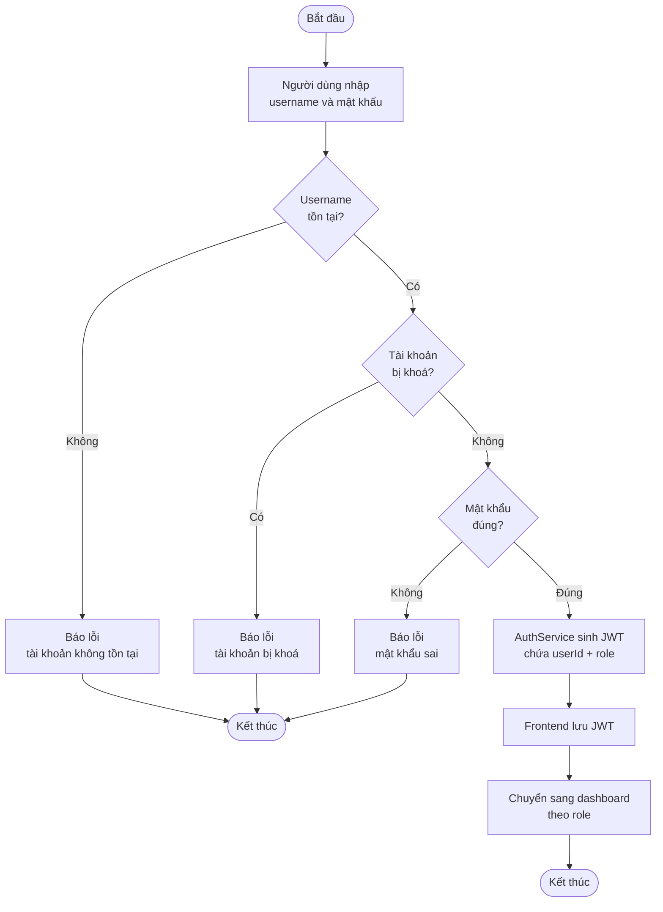
```mermaid
flowchart TD
    Start([Bắt đầu]) --> Input[Người dùng nhập<br/>username và mật khẩu]
    Input --> Check{Username<br/>tồn tại?}
    Check -- Không --> Err1[Báo lỗi<br/>tài khoản không tồn tại]
    Err1 --> End1([Kết thúc])
    Check -- Có --> Locked{Tài khoản<br/>bị khoá?}
    Locked -- Có --> Err2[Báo lỗi<br/>tài khoản bị khoá]
    Err2 --> End1
    Locked -- Không --> Verify{Mật khẩu<br/>đúng?}
    Verify -- Không --> Err3[Báo lỗi<br/>mật khẩu sai]
    Err3 --> End1
    Verify -- Đúng --> GenJWT[AuthService sinh JWT<br/>chứa userId + role]
    GenJWT --> Save[Frontend lưu JWT]
    Save --> Redirect[Chuyển sang dashboard<br/>theo role]
    Redirect --> End2([Kết thúc])
```

### 9.1b Cư dân đăng ký tài khoản (kèm xác thực OTP email)

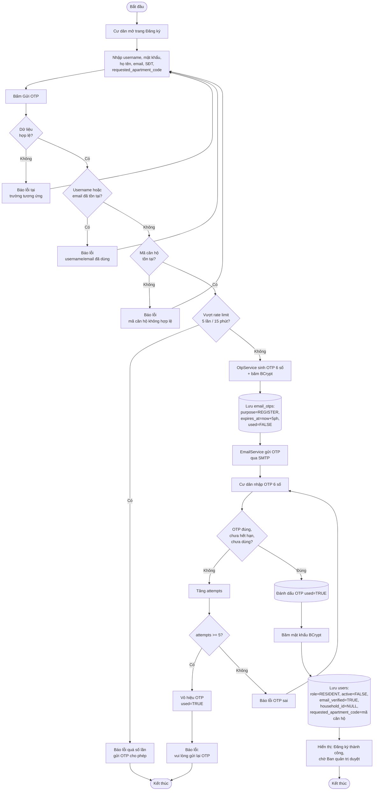
```mermaid
flowchart TD
    Start([Bắt đầu]) --> Open[Cư dân mở trang Đăng ký]
    Open --> Fill[Nhập username, mật khẩu,<br/>họ tên, email, SĐT,<br/>requested_apartment_code]
    Fill --> Submit[Bấm Gửi OTP]
    Submit --> Valid{Dữ liệu<br/>hợp lệ?}
    Valid -- Không --> ShowErr[Báo lỗi tại<br/>trường tương ứng]
    ShowErr --> Fill
    Valid -- Có --> DupUser{Username hoặc<br/>email đã tồn tại?}
    DupUser -- Có --> ErrDup[Báo lỗi<br/>username/email đã dùng]
    ErrDup --> Fill
    DupUser -- Không --> CheckApt{Mã căn hộ<br/>tồn tại?}
    CheckApt -- Không --> ErrApt[Báo lỗi<br/>mã căn hộ không hợp lệ]
    ErrApt --> Fill
    CheckApt -- Có --> Rate{Vượt rate limit<br/>5 lần / 15 phút?}
    Rate -- Có --> ErrRate[Báo lỗi quá số lần<br/>gửi OTP cho phép]
    ErrRate --> End1([Kết thúc])
    Rate -- Không --> GenOTP[OtpService sinh OTP 6 số<br/>+ băm BCrypt]
    GenOTP --> SaveOTP[(Lưu email_otps:<br/>purpose=REGISTER,<br/>expires_at=now+5ph,<br/>used=FALSE)]
    SaveOTP --> SendMail[EmailService gửi OTP<br/>qua SMTP]
    SendMail --> InputOTP[Cư dân nhập OTP 6 số]
    InputOTP --> Verify{OTP đúng,<br/>chưa hết hạn,<br/>chưa dùng?}
    Verify -- Không --> AttemptInc[Tăng attempts]
    AttemptInc --> AttemptCheck{attempts >= 5?}
    AttemptCheck -- Có --> Lock[Vô hiệu OTP<br/>used=TRUE]
    Lock --> ErrAtt[Báo lỗi:<br/>vui lòng gửi lại OTP]
    ErrAtt --> End1
    AttemptCheck -- Không --> ErrOtp[Báo lỗi OTP sai]
    ErrOtp --> InputOTP
    Verify -- Đúng --> MarkUsed[(Đánh dấu OTP used=TRUE)]
    MarkUsed --> Hash[Băm mật khẩu BCrypt]
    Hash --> Save[(Lưu users:<br/>role=RESIDENT, active=FALSE,<br/>email_verified=TRUE,<br/>household_id=NULL,<br/>requested_apartment_code=mã căn hộ)]
    Save --> Notify[Hiển thị: Đăng ký thành công,<br/>chờ Ban quản trị duyệt]
    Notify --> End([Kết thúc])
```

### 9.2 Tạo khoản thu

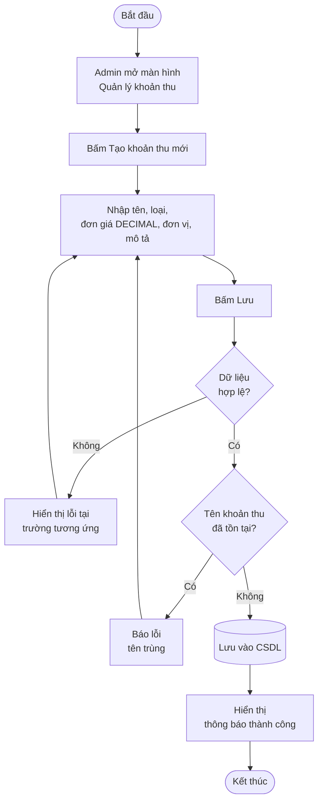
```mermaid
flowchart TD
    Start([Bắt đầu]) --> Open[Admin mở màn hình<br/>Quản lý khoản thu]
    Open --> Click[Bấm Tạo khoản thu mới]
    Click --> Fill[Nhập tên, loại,<br/>đơn giá DECIMAL, đơn vị, mô tả]
    Fill --> Submit[Bấm Lưu]
    Submit --> Valid{Dữ liệu<br/>hợp lệ?}
    Valid -- Không --> ShowErr[Hiển thị lỗi tại<br/>trường tương ứng]
    ShowErr --> Fill
    Valid -- Có --> Dup{Tên khoản thu<br/>đã tồn tại?}
    Dup -- Có --> ErrDup[Báo lỗi<br/>tên trùng]
    ErrDup --> Fill
    Dup -- Không --> SaveDB[(Lưu vào CSDL)]
    SaveDB --> Notify[Hiển thị<br/>thông báo thành công]
    Notify --> End([Kết thúc])
```

### 9.3 Xác nhận hộ đã nộp đủ tiền mặt

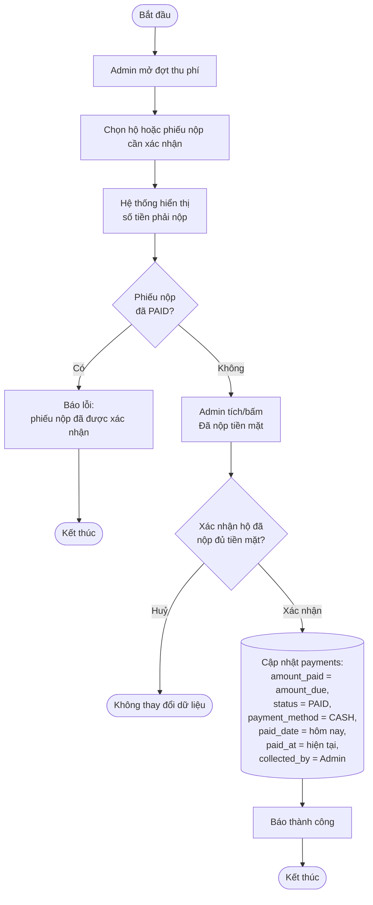
```mermaid
flowchart TD
    Start([Bắt đầu]) --> Open[Admin mở đợt thu phí]
    Open --> Pick[Chọn hộ hoặc phiếu nộp cần xác nhận]
    Pick --> Show[Hệ thống hiển thị<br/>số tiền phải nộp]
    Show --> Check{Phiếu nộp<br/>đã PAID?}
    Check -- Có --> Err1[Báo lỗi:<br/>phiếu nộp đã được xác nhận]
    Err1 --> End1([Kết thúc])
    Check -- Không --> Click[Admin tích/bấm<br/>Đã nộp tiền mặt]
    Click --> Confirm{Xác nhận hộ đã<br/>nộp đủ tiền mặt?}
    Confirm -- Huỷ --> End2([Không thay đổi dữ liệu])
    Confirm -- Xác nhận --> Update[(Cập nhật payments:<br/>amount_paid = amount_due,<br/>status = PAID,<br/>payment_method = CASH,<br/>paid_date = hôm nay,<br/>paid_at = hiện tại,<br/>collected_by = Admin)]
    Update --> NotifyOK[Báo thành công]
    NotifyOK --> End([Kết thúc])
```

Ghi chú: Luồng tiền mặt không có nhánh nộp thiếu. Hệ thống mặc định cư dân đã nộp đúng và đủ số tiền phải nộp khi Admin xác nhận.


### 9.4 Cư dân gửi khiếu nại

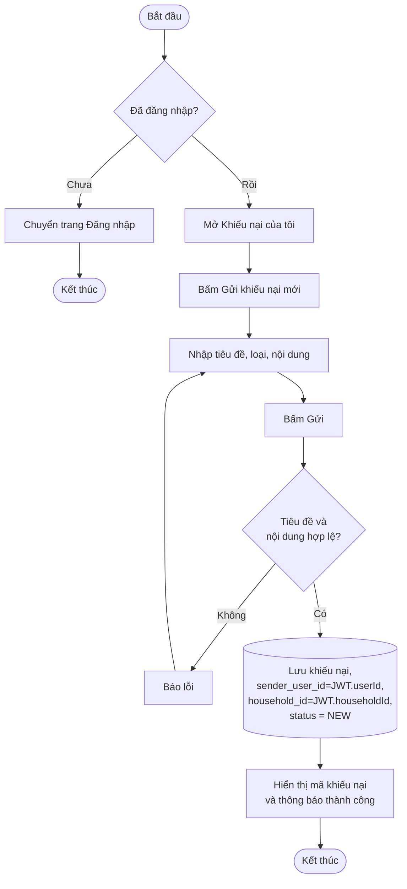
```mermaid
flowchart TD
    Start([Bắt đầu]) --> Login{Đã đăng nhập?}
    Login -- Chưa --> ToLogin[Chuyển trang Đăng nhập]
    ToLogin --> End1([Kết thúc])
    Login -- Rồi --> Open[Mở Khiếu nại của tôi]
    Open --> New[Bấm Gửi khiếu nại mới]
    New --> Fill[Nhập tiêu đề, loại, nội dung]
    Fill --> Submit[Bấm Gửi]
    Submit --> Valid{Tiêu đề và<br/>nội dung hợp lệ?}
    Valid -- Không --> Err[Báo lỗi]
    Err --> Fill
    Valid -- Có --> Save[(Lưu khiếu nại,<br/>sender_user_id=JWT.userId,<br/>household_id=JWT.householdId,<br/>status = NEW)]
    Save --> Notify[Hiển thị mã khiếu nại<br/>và thông báo thành công]
    Notify --> End([Kết thúc])
```

### 9.5 Admin gửi thông báo

```mermaid
flowchart TD
    Start([Bắt đầu]) --> Open[Admin vào màn hình<br/>Thông báo]
    Open --> New[Bấm Soạn thông báo]
    New --> Fill[Nhập tiêu đề, nội dung]
    Fill --> Scope[Chọn phạm vi:<br/>ALL / BY_FLOOR / BY_HOUSEHOLD]
    Scope --> Pick{Đã chọn<br/>người nhận?}
    Pick -- Chưa --> Err[Báo lỗi: chọn người nhận]
    Err --> Scope
    Pick -- Rồi --> Send[Bấm Gửi]
    Send --> SaveNoti[(Lưu Notification)]
    SaveNoti --> GenRec[(Sinh các<br/>NotificationRecipient<br/>cho từng người nhận)]
    GenRec --> Done[Hiển thị thành công]
    Done --> End([Kết thúc])
```

### 9.6 Xuất báo cáo

```mermaid
flowchart TD
    Start([Bắt đầu]) --> Open[Mở Thống kê và xuất file]
    Open --> Pick[Chọn loại báo cáo<br/>và phạm vi thời gian]
    Pick --> Format[Chọn định dạng<br/>Excel hoặc PDF]
    Format --> Click[Bấm Xuất file]
    Click --> Query[(Backend truy vấn dữ liệu)]
    Query --> Gen{Định dạng?}
    Gen -- Excel --> POI[Dùng Apache POI<br/>sinh file .xlsx]
    Gen -- PDF --> PDF[Dùng OpenPDF<br/>sinh file .pdf]
    POI --> Return[Trả file về frontend]
    PDF --> Return
    Return --> Download[Trình duyệt tải file]
    Download --> End([Kết thúc])
```

### 9.7 Quên mật khẩu – gửi và xác thực OTP email

```mermaid
flowchart TD
    Start([Bắt đầu]) --> Open[Cư dân mở trang Quên mật khẩu]
    Open --> InEmail[Nhập email đã đăng ký]
    InEmail --> Submit[Bấm Gửi OTP]
    Submit --> Rate{Vượt rate limit<br/>5 lần / 15 phút<br/>cho email?}
    Rate -- Có --> ErrRate[Báo lỗi quá số lần<br/>gửi OTP cho phép]
    ErrRate --> End1([Kết thúc])
    Rate -- Không --> Find{Email tồn tại<br/>trong users?}
    Find -- Không --> Pretend[Trả response giống<br/>trường hợp tồn tại<br/>tránh dò email]
    Pretend --> End1
    Find -- Có --> GenOTP[OtpService sinh OTP 6 số<br/>+ băm BCrypt]
    GenOTP --> SaveOTP[(Lưu email_otps:<br/>purpose=FORGOT_PASSWORD,<br/>expires_at=now+5ph,<br/>used=FALSE)]
    SaveOTP --> SendMail[EmailService gửi OTP<br/>qua SMTP]
    SendMail --> InOTP[Cư dân nhập OTP +<br/>mật khẩu mới]
    InOTP --> Verify{OTP đúng,<br/>chưa hết hạn,<br/>chưa dùng?}
    Verify -- Không --> Inc[Tăng attempts]
    Inc --> AC{attempts >= 5?}
    AC -- Có --> Lock[Vô hiệu OTP<br/>used=TRUE]
    Lock --> ErrLock[Báo lỗi:<br/>vui lòng gửi lại OTP]
    ErrLock --> End1
    AC -- Không --> ErrOtp[Báo lỗi OTP sai]
    ErrOtp --> InOTP
    Verify -- Đúng --> MarkUsed[(Đánh dấu OTP used=TRUE)]
    MarkUsed --> Hash[Băm mật khẩu mới<br/>bằng BCrypt]
    Hash --> Update[(Cập nhật users.password_hash)]
    Update --> Notify[Hiển thị: Đặt lại mật khẩu<br/>thành công]
    Notify --> End([Kết thúc])
```

### 9.8 Thanh toán phí của hộ qua VNPay Sandbox

```mermaid
flowchart TD
    Start([Bắt đầu]) --> Open[Cư dân mở trang<br/>Thanh toán của hộ]
    Open --> Pick[Chọn khoản phí/hoá đơn<br/>cần thanh toán]
    Pick --> Submit[Bấm Thanh toán qua VNPay]
    Submit --> Own{household_id của khoản phí<br/>= JWT.household_id?}
    Own -- Không --> Err403[403 Forbidden]
    Err403 --> End1([Kết thúc])
    Own -- Có --> Paid{Khoản phí đã<br/>thanh toán hết?}
    Paid -- Có --> ErrPaid[Báo lỗi: khoản đã thanh toán]
    ErrPaid --> End1
    Paid -- Chưa --> GenRef[PaymentService sinh<br/>transaction_code duy nhất]
    GenRef --> SaveTx[(Lưu payment_transactions:<br/>status=PENDING,<br/>target_type, target_id,<br/>amount DECIMAL15_2)]
    SaveTx --> BuildURL[VnpayService dựng URL<br/>+ vnp_SecureHash HMAC-SHA512]
    BuildURL --> Redirect[Backend trả URL,<br/>FE redirect cư dân sang VNPay]
    Redirect --> Pay[Cư dân thanh toán<br/>trên VNPay Sandbox]
    Pay --> IPN[VNPay gọi IPN URL<br/>GET /api/payments/vnpay/ipn]
    IPN --> VerifySig{vnp_SecureHash<br/>hợp lệ?}
    VerifySig -- Không --> RejIPN[Trả vnp_ResponseCode=97<br/>không cập nhật]
    RejIPN --> End2([Kết thúc IPN])
    VerifySig -- Có --> FindTx[(Tìm payment_transactions<br/>theo transaction_code)]
    FindTx --> CheckIdem{Đã ở trạng thái<br/>cuối SUCCESS/FAILED/CANCELLED?}
    CheckIdem -- Có --> AckOk[Trả vnp_ResponseCode=00<br/>không cập nhật lại]
    AckOk --> End2
    CheckIdem -- Không --> CheckResp{vnp_ResponseCode}
    CheckResp -- 00 --> UpdSucc[(payment_transactions.status=SUCCESS,<br/>paid_at=now)]
    UpdSucc --> TargetType{target_type?}
    TargetType -- FEE_PAYMENT --> UpdatePayment[(Cập nhật payments:<br/>payment_method=ONLINE,<br/>transaction_code,<br/>paid_at,<br/>paid_date,<br/>status=PAID)]
    TargetType -- UTILITY_BILL --> UpdateUtility[(Cập nhật utility_bills:<br/>payment_method=ONLINE,<br/>transaction_code,<br/>paid_at,<br/>paid_date,<br/>status=PAID)]
    UpdatePayment --> AckOk
    UpdateUtility --> AckOk
    CheckResp -- 24 --> UpdCancel[(payment_transactions.status=CANCELLED)]
    UpdCancel --> AckOk
    CheckResp -- khác --> UpdFail[(payment_transactions.status=FAILED)]
    UpdFail --> AckOk
    Redirect -.song song.-> Return[VNPay redirect trình duyệt về<br/>Return URL của backend]
    Return --> VerifyReturn{Return URL<br/>chữ ký hợp lệ?}
    VerifyReturn -- Không --> ShowErr[Redirect FE kết quả lỗi]
    VerifyReturn -- Có --> ReadTx[(Backend đọc trạng thái<br/>payment_transactions)]
    ReadTx --> ShowResult[Backend redirect FE<br/>SC-18 hiển thị kết quả]
    ShowErr --> End3([Kết thúc])
    ShowResult --> End3
```

---

## 10. SEQUENCE DIAGRAM

Phần này mô tả thứ tự gọi giữa các thành phần cho các luồng quan trọng.

### 10.1 Đăng nhập

```mermaid
sequenceDiagram
    actor User as Người dùng
    participant FE as React FE
    participant Ctrl as AuthController
    participant Svc as AuthService
    participant Repo as UserRepository
    participant DB as MySQL
    participant JWT as JwtUtil

    User->>FE: Nhập username + mật khẩu
    FE->>Ctrl: POST /api/auth/login
    Ctrl->>Svc: login(username, password)
    Svc->>Repo: findByUsername(username)
    Repo->>DB: SELECT * FROM users
    DB-->>Repo: User
    Repo-->>Svc: User
    Svc->>Svc: BCrypt.matches(password)
    alt Mật khẩu đúng và tài khoản active
        Svc->>JWT: generateToken(userId, role)
        JWT-->>Svc: token
        Svc-->>Ctrl: LoginResponse(token, user)
        Ctrl-->>FE: 200 OK + JWT
        FE-->>User: Vào dashboard
    else Sai
        Svc-->>Ctrl: Lỗi
        Ctrl-->>FE: 401 Unauthorized
        FE-->>User: Hiển thị lỗi
    end
```

### 10.2 Tạo khoản thu

```mermaid
sequenceDiagram
    actor Adm as Admin
    participant FE as React FE
    participant Ctrl as FeeController
    participant Svc as FeeService
    participant Repo as FeeRepository
    participant DB as MySQL

    Adm->>FE: Điền form + bấm Lưu
    FE->>Ctrl: POST /api/fees (JWT, FeeDTO)
    Ctrl->>Ctrl: Kiểm tra JWT + role ADMIN
    Ctrl->>Svc: createFee(dto)
    Svc->>Repo: existsByName(name)
    Repo->>DB: SELECT COUNT
    DB-->>Repo: 0 hoặc 1
    Repo-->>Svc: false/true
    alt Tên chưa tồn tại
        Svc->>Repo: save(fee)
        Repo->>DB: INSERT INTO fees
        DB-->>Repo: id
        Repo-->>Svc: Fee
        Svc-->>Ctrl: FeeDTO
        Ctrl-->>FE: 201 Created
        FE-->>Adm: Báo thành công
    else Tên trùng
        Svc-->>Ctrl: Lỗi
        Ctrl-->>FE: 400 Bad Request
        FE-->>Adm: Báo lỗi
    end
```

### 10.3 Xác nhận đã nộp tiền mặt

```mermaid
sequenceDiagram
    actor Adm as Admin
    participant FE as React FE
    participant Ctrl as PaymentController
    participant Svc as PaymentService
    participant Repo as PaymentRepository
    participant DB as MySQL

    Adm->>FE: Chọn phiếu nộp + bấm "Đã nộp tiền mặt"
    FE->>Adm: Hiển thị hộp xác nhận đã nộp đủ
    Adm->>FE: Bấm "Xác nhận"
    FE->>Ctrl: PUT /api/admin/payments/{id}/confirm-cash (JWT)
    Ctrl->>Ctrl: Kiểm tra role ADMIN
    Ctrl->>Svc: confirmCashPayment(paymentId, currentAdmin)
    Svc->>Repo: findById(id)
    Repo->>DB: SELECT
    DB-->>Repo: Payment
    Repo-->>Svc: Payment
    alt Payment đã PAID
        Svc-->>Ctrl: Lỗi: phiếu nộp đã được xác nhận
        Ctrl-->>FE: 400 Bad Request
        FE-->>Adm: Hiển thị lỗi
    else Payment đang UNPAID
        Svc->>Svc: amount_paid = amount_due<br/>status = PAID<br/>payment_method = CASH<br/>paid_date = hôm nay<br/>paid_at = hiện tại<br/>collected_by = currentAdmin
        Svc->>Repo: save(payment)
        Repo->>DB: UPDATE payments
        DB-->>Repo: OK
        Repo-->>Svc: Payment
        Svc-->>Ctrl: PaymentDTO
        Ctrl-->>FE: 200 OK
        FE-->>Adm: Cập nhật trạng thái PAID
    end
```


### 10.4 Cư dân gửi khiếu nại

```mermaid
sequenceDiagram
    actor Res as Cư dân
    participant FE as React FE
    participant Ctrl as ComplaintController
    participant Svc as ComplaintService
    participant Repo as ComplaintRepository
    participant DB as MySQL

    Res->>FE: Điền form khiếu nại
    FE->>Ctrl: POST /api/complaints (JWT, ComplaintDTO)
    Ctrl->>Ctrl: Kiểm tra JWT + role RESIDENT
    Ctrl->>Svc: createComplaint(dto, currentUser)
    Svc->>Svc: Lấy currentUser từ JWT
    Svc->>Svc: Lấy householdId của currentUser
    Svc->>Repo: save(complaint, sender_user_id=currentUser.id, household_id=currentUser.householdId, status=NEW)
    Repo->>DB: INSERT INTO complaints
    DB-->>Repo: id
    Repo-->>Svc: Complaint
    Svc-->>Ctrl: ComplaintDTO
    Ctrl-->>FE: 201 Created
    FE-->>Res: Hiển thị mã khiếu nại
```

### 10.5 Admin gửi thông báo

```mermaid
sequenceDiagram
    actor Adm as Admin
    participant FE as React FE
    participant Ctrl as NotificationController
    participant Svc as NotificationService
    participant URepo as UserRepository
    participant NRepo as NotificationRepository
    participant DB as MySQL

    Adm->>FE: Soạn nội dung + chọn phạm vi
    FE->>Ctrl: POST /api/notifications (JWT, dto)
    Ctrl->>Svc: sendNotification(dto)
    Svc->>NRepo: save(notification)
    NRepo->>DB: INSERT INTO notifications
    DB-->>NRepo: id
    Svc->>URepo: findRecipients(scope, params)
    URepo->>DB: SELECT users
    DB-->>URepo: List<User>
    URepo-->>Svc: recipients
    Svc->>NRepo: saveAllRecipients(notiId, recipients)
    NRepo->>DB: INSERT INTO notification_recipients
    DB-->>NRepo: OK
    Svc-->>Ctrl: NotificationDTO
    Ctrl-->>FE: 201 Created
    FE-->>Adm: Báo thành công
```

### 10.6 Xuất báo cáo Excel

```mermaid
sequenceDiagram
    actor User as Người dùng
    participant FE as React FE
    participant Ctrl as StatisticsController
    participant Svc as ReportService
    participant Repo as PaymentRepository
    participant DB as MySQL

    User->>FE: Chọn báo cáo + Excel + bấm Xuất
    FE->>Ctrl: GET /api/reports/payments?period=...&format=xlsx
    Ctrl->>Svc: exportPaymentsToExcel(params)
    Svc->>Repo: findPaymentsByPeriod(...)
    Repo->>DB: SELECT
    DB-->>Repo: List<Payment>
    Repo-->>Svc: data
    Svc->>Svc: Dùng Apache POI tạo Workbook
    Svc-->>Ctrl: byte[] file
    Ctrl-->>FE: 200 OK<br/>Content-Disposition: attachment
    FE-->>User: Trình duyệt tải file .xlsx
```

### 10.7 Cư dân đăng ký tài khoản với OTP email

```mermaid
sequenceDiagram
    actor Res as Cư dân (Guest)
    participant FE as React FE
    participant ACtrl as AuthController
    participant ASvc as AuthService
    participant OSvc as OtpService
    participant ESvc as EmailService
    participant ORepo as EmailOtpRepository
    participant URepo as UserRepository
    participant SMTP as SMTP Server
    participant DB as MySQL

    Res->>FE: Nhập username, mật khẩu, email,<br/>requested_apartment_code, ...
    FE->>ACtrl: POST /api/auth/send-otp<br/>{email, purpose=REGISTER}
    ACtrl->>OSvc: sendOtp(email, REGISTER)
    OSvc->>ORepo: countByEmailAndCreatedAtAfter(email, now-15ph)
    ORepo->>DB: SELECT COUNT
    DB-->>ORepo: n
    ORepo-->>OSvc: n
    alt n >= 5
        OSvc-->>ACtrl: Quá rate limit
        ACtrl-->>FE: 429 Too Many Requests
    else n < 5
        OSvc->>OSvc: Sinh OTP 6 số ngẫu nhiên
        OSvc->>OSvc: BCrypt(OTP) → otp_hash
        OSvc->>ORepo: save(email_otps:<br/>email, otp_hash, purpose=REGISTER,<br/>expires_at=now+5ph, used=FALSE)
        ORepo->>DB: INSERT INTO email_otps
        DB-->>ORepo: id
        OSvc->>ESvc: sendOtpMail(email, otp)
        ESvc->>SMTP: SEND mail
        SMTP-->>ESvc: ACK
        OSvc-->>ACtrl: OK
        ACtrl-->>FE: 200 OK
    end

    Res->>FE: Nhập OTP 6 số + xác nhận
    FE->>ACtrl: POST /api/auth/register<br/>{username, password, email, otp,<br/>requested_apartment_code, ...}
    ACtrl->>OSvc: verifyOtp(email, otp, REGISTER)
    OSvc->>ORepo: findLatestValid(email, REGISTER)
    ORepo->>DB: SELECT
    DB-->>ORepo: EmailOtp
    ORepo-->>OSvc: EmailOtp
    OSvc->>OSvc: BCrypt.matches(otp, otp_hash)<br/>và expires_at > now và used = FALSE
    alt OTP hợp lệ
        OSvc->>ORepo: markUsed(otpId)
        ORepo->>DB: UPDATE email_otps SET used=TRUE
        OSvc-->>ACtrl: OK
        ACtrl->>ASvc: register(dto, email_verified=TRUE)
        ASvc->>URepo: save(user: role=RESIDENT,<br/>active=FALSE, email_verified=TRUE,<br/>requested_apartment_code)
        URepo->>DB: INSERT INTO users
        DB-->>URepo: id
        ASvc-->>ACtrl: User
        ACtrl-->>FE: 201 Created
        FE-->>Res: Hiển thị "chờ Admin duyệt"
    else OTP sai/hết hạn
        OSvc->>ORepo: increment(attempts)
        OSvc-->>ACtrl: Lỗi
        ACtrl-->>FE: 400 Bad Request
        FE-->>Res: Báo lỗi OTP
    end
```

### 10.8 Thanh toán phí qua VNPay Sandbox (gồm Return URL và IPN URL)

```mermaid
sequenceDiagram
    actor Res as Cư dân
    participant FE as React FE
    participant PCtrl as PaymentController
    participant PSvc as PaymentService
    participant VSvc as VnpayService
    participant TxRepo as PaymentTransactionRepository
    participant PRepo as PaymentRepository
    participant UBRepo as UtilityBillRepository
    participant DB as MySQL
    participant VNPay as VNPay Sandbox

    Note over Res,VNPay: 1) Khởi tạo giao dịch

    Res->>FE: Chọn khoản phí/hoá đơn<br/>+ bấm Thanh toán VNPay
    FE->>PCtrl: POST /api/payments/vnpay/create<br/>(JWT, {target_type, target_id})
    PCtrl->>PCtrl: Kiểm tra JWT + role RESIDENT
    PCtrl->>PSvc: createVnpayTransaction(currentUser, dto)
    PSvc->>PSvc: Kiểm tra target.household_id<br/>== currentUser.householdId
    alt Không khớp
        PSvc-->>PCtrl: Forbidden
        PCtrl-->>FE: 403
    else Khớp
        PSvc->>PSvc: Lấy số tiền BigDecimal từ target
        PSvc->>PSvc: Sinh transaction_code duy nhất
        PSvc->>TxRepo: save(payment_transactions:<br/>status=PENDING, amount,<br/>target_type, target_id,<br/>user_id, household_id)
        TxRepo->>DB: INSERT
        DB-->>TxRepo: id
        PSvc->>VSvc: buildPaymentUrl(transaction_code, amount, ipAddr)
        VSvc->>VSvc: Dựng query params<br/>+ HMAC-SHA512(vnp_HashSecret)
        VSvc-->>PSvc: paymentUrl
        PSvc-->>PCtrl: paymentUrl
        PCtrl-->>FE: 200 OK + paymentUrl
        FE->>Res: window.location = paymentUrl
        Res->>VNPay: Thanh toán trên Sandbox
    end

    Note over Res,VNPay: 2) IPN URL (nguồn xác nhận chính)

    VNPay->>PCtrl: GET /api/payments/vnpay/ipn<br/>(vnp_TxnRef, vnp_ResponseCode,<br/>vnp_SecureHash, ...)
    PCtrl->>VSvc: verifySignature(params)
    VSvc->>VSvc: Tính lại HMAC-SHA512<br/>so sánh với vnp_SecureHash
    alt Chữ ký không hợp lệ
        VSvc-->>PCtrl: false
        PCtrl-->>VNPay: vnp_ResponseCode=97<br/>Invalid signature
    else Hợp lệ
        PCtrl->>PSvc: handleVnpayIpn(params)
        PSvc->>TxRepo: findByTransactionCode(vnp_TxnRef)
        TxRepo->>DB: SELECT
        DB-->>TxRepo: PaymentTransaction
        TxRepo-->>PSvc: tx
        alt tx.status đã là SUCCESS/FAILED/CANCELLED
            PSvc-->>PCtrl: idempotent ack
            PCtrl-->>VNPay: vnp_ResponseCode=00
        else tx.status = PENDING
            alt vnp_ResponseCode = "00"
                PSvc->>TxRepo: update(status=SUCCESS,<br/>paid_at=now,<br/>response_code, response_message)
                TxRepo->>DB: UPDATE
                alt target_type = FEE_PAYMENT
                    PSvc->>PRepo: findById(target_id)
                    PRepo->>DB: SELECT
                    PSvc->>PRepo: update(amount_paid=amount_due,<br/>payment_method=ONLINE,<br/>transaction_code=vnp_TxnRef,<br/>paid_at, paid_date, status=PAID)
                    PRepo->>DB: UPDATE
                else target_type = UTILITY_BILL
                    PSvc->>UBRepo: findById(target_id)
                    UBRepo->>DB: SELECT
                    PSvc->>UBRepo: update(payment_method=ONLINE,<br/>transaction_code=vnp_TxnRef,<br/>paid_at, paid_date, status=PAID)
                    UBRepo->>DB: UPDATE
                end
            else vnp_ResponseCode = "24"
                PSvc->>TxRepo: update(status=CANCELLED,<br/>response_code, response_message)
                TxRepo->>DB: UPDATE
            else các mã khác
                PSvc->>TxRepo: update(status=FAILED,<br/>response_code, response_message)
                TxRepo->>DB: UPDATE
            end
            PSvc-->>PCtrl: OK
            PCtrl-->>VNPay: vnp_ResponseCode=00
        end
    end

    Note over Res,VNPay: 3) Return URL (chỉ để hiển thị)

    VNPay->>PCtrl: Redirect trình duyệt tới<br/>GET /api/payments/vnpay/return<br/>?vnp_TxnRef=...
    PCtrl->>VSvc: verifySignature(params)
    VSvc-->>PCtrl: true/false
    alt Chữ ký Return không hợp lệ
        PCtrl-->>FE: 302 Redirect /payment-result?status=INVALID
        FE-->>Res: SC-18 hiển thị lỗi xác thực
    else Chữ ký Return hợp lệ
        PCtrl->>TxRepo: findByTransactionCode(vnp_TxnRef)
        TxRepo->>DB: SELECT
        DB-->>TxRepo: tx (trạng thái do IPN cập nhật; nếu IPN chưa tới thì vẫn có thể là PENDING)
        TxRepo-->>PCtrl: tx
        PCtrl-->>FE: 302 Redirect /payment-result?transactionCode=...&status=...
        FE-->>Res: SC-18 hiển thị kết quả theo trạng thái giao dịch
    end
```

---

## 11. THIẾT KẾ BẢO MẬT

### 11.1 Tổng quan

Hệ thống áp dụng các biện pháp bảo mật cơ bản:

- **Mã hoá mật khẩu:** dùng **BCrypt** khi lưu mật khẩu vào CSDL. Không bao giờ lưu mật khẩu dạng plain text.
- **Xác thực:** dùng **JWT (JSON Web Token)** – sau khi đăng nhập thành công, backend cấp một token. Frontend đính kèm token này trong header `Authorization: Bearer <token>` của mọi request tiếp theo.
- **Phân quyền:** dùng **Role-Based Access Control (RBAC)** – mỗi tài khoản có một role (ADMIN / RESIDENT), mỗi API chỉ chấp nhận một số role nhất định.
- **API kiểm tra token trước khi xử lý:** sử dụng filter của Spring Security để chặn request không hợp lệ.
- **Cư dân chỉ xem dữ liệu của hộ mình:** kiểm tra ở tầng Service – mọi truy vấn của role RESIDENT đều thêm điều kiện `household_id = currentUser.householdId`.
- **Admin có toàn quyền:** không bị giới hạn theo `household_id`.
- **Xác thực OTP qua email:** dùng cho đăng ký, quên mật khẩu; OTP luôn lưu dạng băm, có thời gian sống ngắn và rate limit theo email.
- **Cổng thanh toán VNPay Sandbox:** ký HMAC-SHA512 mọi yêu cầu, xác thực chữ ký mọi callback (Return URL + IPN URL); không lưu thẻ.

### 11.2 Luồng xác thực JWT

```mermaid
sequenceDiagram
    participant FE as React FE
    participant Filter as JwtFilter
    participant Ctrl as Controller
    participant Svc as Service

    FE->>Filter: HTTP Request + JWT
    Filter->>Filter: Kiểm tra JWT có hợp lệ?<br/>(chữ ký, hạn dùng)
    alt JWT hợp lệ
        Filter->>Filter: Đặt SecurityContext<br/>(userId, role)
        Filter->>Ctrl: Cho qua
        Ctrl->>Ctrl: Kiểm tra role có quyền API này?
        alt Có quyền
            Ctrl->>Svc: Xử lý nghiệp vụ
            Svc-->>Ctrl: Kết quả
            Ctrl-->>FE: 200 OK
        else Không quyền
            Ctrl-->>FE: 403 Forbidden
        end
    else JWT sai hoặc hết hạn
        Filter-->>FE: 401 Unauthorized
    end
```

### 11.3 Cấu hình mật khẩu

- Hàm băm: `BCryptPasswordEncoder` của Spring Security.
- Khi tạo tài khoản: `password = bcrypt(plainPassword)`.
- Khi đăng nhập: `bcrypt.matches(plainPassword, hashedFromDB)`.
- Quy ước mật khẩu mới: tối thiểu 8 ký tự (kiểm tra ở frontend trước khi gửi).

### 11.4 Cấu hình JWT

- Thuật toán: HMAC-SHA256.
- Khoá ký: lưu trong file `application.properties` của backend (không commit lên Git).
- Thời gian sống: 24 giờ.
- Payload chứa: `userId`, `username`, `role`, `householdId` (nếu là cư dân), `iat`, `exp`.

### 11.5 Cấu hình phân quyền API

Spring Security cấu hình ở mức URL:

```
POST   /api/auth/register                       -> PUBLIC
POST   /api/auth/login                          -> PUBLIC
POST   /api/auth/send-otp                       -> PUBLIC
POST   /api/auth/verify-otp                     -> PUBLIC
POST   /api/auth/forgot-password/send-otp       -> PUBLIC
POST   /api/auth/reset-password                 -> PUBLIC

POST   /api/users                               -> ADMIN
PUT    /api/users/{id}                          -> ADMIN
PUT    /api/users/{id}/lock                     -> ADMIN
PUT    /api/users/{id}/unlock                   -> ADMIN
PUT    /api/users/{id}/approve                  -> ADMIN
GET    /api/users/pending                       -> ADMIN

GET    /api/apartments                          -> ADMIN
GET    /api/apartments/{id}                     -> ADMIN
GET    /api/apartments/search                   -> ADMIN
PUT    /api/apartments/{id}                     -> ADMIN
GET    /api/apartments/{id}/household           -> ADMIN
PUT    /api/apartments/{id}/household           -> ADMIN
POST   /api/apartments/{id}/household           -> ADMIN

GET    /api/households                         -> ADMIN
GET    /api/households/{id}                    -> ADMIN
GET    /api/households/search                  -> ADMIN
PUT    /api/households/{id}                    -> ADMIN
GET    /api/households/{id}/residents          -> ADMIN

GET    /api/residents                           -> ADMIN
POST   /api/residents                           -> ADMIN
GET    /api/residents/{id}                      -> ADMIN
PUT    /api/residents/{id}                      -> ADMIN
PUT    /api/residents/{id}/move-out             -> ADMIN
PUT    /api/residents/{id}/temporary-residence  -> ADMIN
PUT    /api/residents/{id}/temporary-absence    -> ADMIN

GET    /api/fees                                -> ADMIN
GET    /api/fees/{id}                           -> ADMIN
GET    /api/fees/search                         -> ADMIN
POST   /api/fees                                -> ADMIN
PUT    /api/fees/{id}                           -> ADMIN
DELETE /api/fees/{id}                           -> ADMIN
GET    /api/fee-periods                         -> ADMIN
GET    /api/fee-periods/{id}                    -> ADMIN
POST   /api/fee-periods                         -> ADMIN
PUT    /api/fee-periods/{id}                    -> ADMIN
PUT    /api/fee-periods/{id}/close              -> ADMIN
GET    /api/fee-periods/{id}/payments           -> ADMIN
PUT    /api/admin/payments/{id}/confirm-cash    -> ADMIN

GET    /api/payments/my-household               -> RESIDENT

POST   /api/vehicles                            -> ADMIN
POST   /api/parking-registrations               -> ADMIN
POST   /api/utility-bills                       -> ADMIN
PUT    /api/admin/utility-bills/{id}/confirm-cash -> ADMIN
GET    /api/utility-bills/my-household          -> RESIDENT

POST   /api/complaints                          -> RESIDENT
GET    /api/complaints/my                       -> RESIDENT
GET    /api/complaints                          -> ADMIN
GET    /api/complaints/{id}                     -> ADMIN hoặc RESIDENT là chủ khiếu nại
PUT    /api/complaints/{id}/response            -> ADMIN

POST   /api/notifications                       -> ADMIN
GET    /api/notifications/my                    -> ADMIN, RESIDENT
PUT    /api/notifications/{id}/read             -> ADMIN, RESIDENT

POST   /api/payments/vnpay/create               -> RESIDENT
GET    /api/payments/vnpay/return               -> PUBLIC (xác thực bằng vnp_SecureHash)
GET    /api/payments/vnpay/ipn                  -> PUBLIC (xác thực bằng vnp_SecureHash)
GET    /api/payments/vnpay/my-history           -> RESIDENT
GET    /api/admin/payment-transactions          -> ADMIN
GET    /api/admin/payment-transactions/{id}     -> ADMIN

GET    /api/reports/fee-periods/{id}/excel      -> ADMIN
GET    /api/reports/fee-periods/{id}/pdf        -> ADMIN
GET    /api/reports/donations/{feePeriodId}/excel -> ADMIN
GET    /api/reports/donations/{feePeriodId}/pdf -> ADMIN
GET    /api/reports/residents/statistics        -> ADMIN
GET    /api/reports/payment-transactions/excel  -> ADMIN
GET    /api/reports/payment-transactions/pdf    -> ADMIN
```

Giải thích các endpoint quản lý tài khoản:
- `/api/auth/register`: cư dân tự đăng ký tài khoản (PUBLIC), bắt buộc đã xác thực OTP email trước. Tài khoản tạo ra có `role = RESIDENT`, `active = FALSE`, `household_id = NULL`, `email_verified = TRUE`, kèm `requested_apartment_code` để chờ Admin duyệt.
- `/api/auth/login`: đăng nhập (PUBLIC). Tài khoản `active = FALSE` không đăng nhập được.
- `/api/auth/send-otp`, `/api/auth/verify-otp`: gửi và kiểm OTP cho mục đích `REGISTER`; luồng quên mật khẩu dùng cặp endpoint riêng `/api/auth/forgot-password/send-otp` và `/api/auth/reset-password`.
- `/api/auth/forgot-password/send-otp`, `/api/auth/reset-password`: gửi OTP và đặt lại mật khẩu khi quên (PUBLIC, có rate limit chặt).
- `/api/users`: Admin tạo tài khoản nội bộ.
- `/api/users/{id}`: Admin sửa thông tin tài khoản.
- `/api/users/{id}/lock`: Admin khoá tài khoản.
- `/api/users/{id}/unlock`: Admin mở khoá tài khoản.
- `/api/users/pending`: Admin lấy danh sách tài khoản cư dân vừa đăng ký, đang chờ duyệt.
- `/api/users/{id}/approve`: Admin duyệt tài khoản cư dân — đối chiếu `requested_apartment_code` với danh sách căn hộ, gán `household_id` của Household ACTIVE thuộc căn hộ tương ứng và bật `active = TRUE`.

Giải thích các endpoint quản lý căn hộ và hộ dân trong căn hộ:
- `GET /api/apartments`: Admin lấy danh sách căn hộ (gồm cả căn hộ trống – chưa có Household ACTIVE).
- `GET /api/apartments/{id}`: Admin lấy chi tiết một căn hộ.
- `GET /api/apartments/search`: Admin tìm kiếm căn hộ theo số căn hộ, tầng, trạng thái (kể cả `AVAILABLE`), tên chủ hộ.
- `PUT /api/apartments/{id}`: Admin chỉnh sửa thông tin căn hộ (diện tích, trạng thái, ghi chú).
- `GET /api/apartments/{id}/household`: Admin xem Household ACTIVE đang ở trong căn hộ; trả 404/null nếu căn hộ trống.
- `POST /api/apartments/{id}/household`: Admin tạo Household mới cho căn hộ đang trống (gán hộ mới chuyển vào, `status = ACTIVE`).
- `PUT /api/apartments/{id}/household`: Admin cập nhật Household của căn hộ; khi chuyển hộ ra ⇒ đặt `Household.status = MOVED_OUT` (không xoá vật lý).
- **Không có** `POST /api/apartments` và **không có** `DELETE /api/apartments/{id}`: vì số căn hộ trong chung cư BlueMoon là cố định, dữ liệu căn hộ được nạp sẵn ban đầu.

Giải thích các endpoint nhân khẩu:
- `GET /api/residents`: Admin tra cứu nhân khẩu theo họ tên, CCCD, căn hộ, hộ dân, trạng thái cư trú.
- `POST /api/residents`: Admin thêm nhân khẩu vào Household ACTIVE của một căn hộ.
- `PUT /api/residents/{id}`: Admin chỉnh sửa thông tin cá nhân và quan hệ với chủ hộ.
- `PUT /api/residents/{id}/move-out`: chuyển nhân khẩu khỏi hộ bằng cách cập nhật `status = MOVED_OUT`; không xoá vật lý.
- `PUT /api/residents/{id}/temporary-residence` và `/temporary-absence`: cập nhật `residency_status`, phục vụ quản lý tạm trú/tạm vắng.

Giải thích các endpoint thanh toán online:
- `POST /api/payments/vnpay/create`: cư dân khởi tạo một giao dịch VNPay cho khoản phí/hoá đơn của hộ mình. Backend kiểm tra `target.household_id == JWT.household_id`; vi phạm → 403. Endpoint này chỉ cho role `RESIDENT`, không cho Admin thanh toán hộ cư dân. Khi cần kiểm thử/hỗ trợ, Admin dùng tài khoản Resident test đã gán Household test hoặc tra cứu giao dịch qua endpoint Admin.
- `GET /api/payments/vnpay/return`: Return URL là đường VNPay redirect trình duyệt quay về backend sau thanh toán. Return URL thường không có JWT trong header nên để PUBLIC, nhưng backend vẫn phải kiểm tra `vnp_SecureHash`. Endpoint này không phải nguồn cập nhật chính; sau khi đọc trạng thái giao dịch đã lưu, backend redirect cư dân về trang kết quả của frontend.
- `GET /api/payments/vnpay/ipn`: VNPay gọi server-to-server. Đây là **nguồn xác nhận chính** cho trạng thái thanh toán. Backend xác thực `vnp_SecureHash`, kiểm tra idempotency, rồi cập nhật `payment_transactions` cùng với `payments` hoặc `utility_bills` tương ứng.
- `GET /api/payments/vnpay/my-history`: cư dân xem lịch sử giao dịch online của hộ mình.
- `GET /api/admin/payment-transactions`: Admin tra cứu mọi giao dịch online, lọc theo mã giao dịch, hộ, trạng thái, thời gian.

### 11.6 Bảo vệ dữ liệu cá nhân (cư dân)

Ở tầng Service, mỗi khi cư dân (role RESIDENT) gọi API đọc dữ liệu, code phải:

1. Lấy `householdId` từ JWT (đã được Spring Security gắn vào SecurityContext).
2. Thêm điều kiện `WHERE household_id = ?` vào truy vấn.

Ví dụ:

```java
// PaymentService.java
public List<PaymentDTO> getPaymentsForCurrentResident(User currentUser) {
    return paymentRepository
            .findByHouseholdId(currentUser.getHousehold().getId())
            .stream().map(this::toDto).toList();
}
```

Tương tự, `UtilityBillService.getMyHouseholdBills(currentUser)` và `ComplaintService.getById(id, currentUser)` đều kiểm tra `household_id` (với hoá đơn) hoặc `sender_user_id` (với khiếu nại) khớp với cư dân hiện tại; nếu không khớp và cư dân không phải Admin → 403 Forbidden.

### 11.7 Các biện pháp khác

- **CORS:** chỉ cho phép frontend chạy ở domain đã đăng ký (cấu hình trong `CorsConfig`).
- **HTTPS:** khi triển khai thực tế dùng HTTPS để mã hoá đường truyền.
- **Bean Validation:** kiểm tra dữ liệu DTO ở tầng Controller (`@Valid`, `@NotBlank`, `@Email`…).
- **Audit log nghiệp vụ:** ghi vào bảng `audit_logs` các thao tác nhạy cảm: đăng nhập (thành công/thất bại), tạo/sửa/xoá/ngừng sử dụng khoản thu, thu phí, khởi tạo và cập nhật giao dịch VNPay, cập nhật trạng thái hoá đơn/khoản phí. File log Spring Boot chỉ dùng bổ trợ cho debug kỹ thuật, không thay thế audit log trong CSDL.
- **Không log dữ liệu nhạy cảm:** không bao giờ ghi OTP nguyên bản, mật khẩu, `vnp_HashSecret`, nội dung chữ ký `vnp_SecureHash`, thông tin thẻ ngân hàng hoặc dữ liệu nhạy cảm không cần thiết vào file log hay `audit_logs`.

### 11.8 Bảo mật OTP email

- **Lưu băm OTP:** mã OTP 6 số không lưu nguyên bản trong CSDL. Bảng `email_otps` chỉ lưu `otp_hash = BCrypt(otp)`. Khi xác thực, backend dùng `BCrypt.matches(inputOtp, otpHashFromDB)` để kiểm tra OTP người dùng nhập.
- **Thời gian sống:** mỗi OTP có `expires_at = created_at + 5 phút`. OTP quá hạn không được chấp nhận.
- **Một lần dùng:** OTP đã xác thực thành công được đánh dấu `used = TRUE`; không dùng lại được.
- **Giới hạn số lần thử:** mỗi OTP có cột `attempts`; khi `attempts >= 5` (mặc định 5) → OTP bị vô hiệu hoá, người dùng phải gửi lại OTP mới.
- **Rate limit gửi OTP:** tối đa **5 yêu cầu gửi OTP** cho cùng một email trong **15 phút**. Vượt ngưỡng trả `429 Too Many Requests`.
- **Chống dò email:** API quên mật khẩu luôn trả response trung lập kiểu "OTP đã được gửi nếu email tồn tại", dù email có trong CSDL hay không.
- **Tách bạch theo `purpose`:** OTP gắn với `purpose` (`REGISTER` hoặc `FORGOT_PASSWORD`); OTP đăng ký không được dùng cho đặt lại mật khẩu và ngược lại.
- **Kênh gửi:** dùng Spring Mail (`JavaMailSender`) qua tài khoản SMTP cấu hình trong `application.properties` (host, port, username, mật khẩu app); không commit credential lên Git.
- **Không log OTP:** OTP nguyên bản không xuất hiện trong bất kỳ log nào của backend.

### 11.9 Bảo mật cổng thanh toán VNPay Sandbox

- **Không lưu thẻ:** hệ thống không nhận, không lưu, không hiển thị thông tin thẻ ngân hàng hoặc thông tin xác thực ngân hàng của cư dân. Toàn bộ thao tác thanh toán diễn ra trên trang VNPay; backend chỉ lưu metadata giao dịch trong `payment_transactions`.
- **Ký yêu cầu (vnp_SecureHash):** mọi URL gửi sang VNPay được ký HMAC-SHA512 bằng `vnp_HashSecret` cấu hình trong `application.properties`. `vnp_HashSecret` không bao giờ commit lên Git, không gửi cho frontend, không ghi vào log.
- **Xác thực chữ ký callback:** mọi tham số nhận về tại Return URL và IPN URL đều được tính lại HMAC-SHA512 và so sánh với `vnp_SecureHash` gửi kèm. Sai chữ ký → IPN trả `vnp_ResponseCode = 97 (Invalid signature)` và **không cập nhật CSDL**. Sau khi verify, hệ thống không lưu `vnp_SecureHash`/`vnpay_secure_hash` vào CSDL vì giá trị này không phục vụ đối soát về sau.
- **`transaction_code` duy nhất:** mỗi lần khởi tạo giao dịch sinh một `transaction_code` duy nhất (UUID rút gọn hoặc timestamp + random) và lưu vào `payment_transactions.transaction_code` (UNIQUE). Đây cũng là `vnp_TxnRef` gửi cho VNPay.
- **Idempotency:** khi nhận IPN, nếu `payment_transactions.status` đã ở trạng thái cuối (SUCCESS/FAILED/CANCELLED) → backend trả ack `vnp_ResponseCode = 00` nhưng không cập nhật lại CSDL, tránh ghi đè trạng thái và không tạo Payment trùng.
- **Nguồn xác nhận chính là IPN URL:** trạng thái cuối cùng của giao dịch chỉ được cập nhật trong tay IPN URL (server-to-server). Return URL chỉ dùng để hiển thị kết quả cho cư dân và không được tin cậy như một xác nhận thanh toán độc lập.
- **Kiểm tra quyền sở hữu:** khi cư dân khởi tạo `POST /api/payments/vnpay/create`, backend luôn kiểm tra `target.household_id == JWT.household_id`. Vi phạm → 403 Forbidden, không tạo giao dịch.
- **Khớp số tiền:** số tiền trong `payment_transactions` lấy từ khoản phí/hoá đơn ở backend, không tin số tiền do client gửi lên. Khi xử lý IPN, backend so sánh `vnp_Amount` (chia 100) với `payment_transactions.amount`; lệch → cập nhật `status = FAILED` và ghi log cảnh báo.
- **Không hoàn tiền tự động:** hệ thống chỉ ghi nhận trạng thái thanh toán; mọi việc đối soát, hoàn tiền hoặc xử lý lỗi tài chính được thực hiện thủ công ngoài hệ thống dựa trên dữ liệu trong `payment_transactions`.

---

## 12. KẾT LUẬN

### 12.1 Tóm tắt

Tài liệu SDD trên mô tả thiết kế của phần mềm quản lý thu phí chung cư BlueMoon ở mức đủ để chuyển sang giai đoạn lập trình, gồm:

- **2 actor:** Admin và Cư dân (Khách – chưa đăng nhập – chỉ truy cập một số endpoint công khai như đăng ký, đăng nhập, gửi/xác thực OTP, quên mật khẩu).
- **10 module chức năng:** quản lý tài khoản, căn hộ và hộ dân/hộ khẩu trong căn hộ, nhân khẩu, khoản thu, thu phí + thanh toán online qua VNPay, phí gửi xe, phí điện/nước/internet, khiếu nại, thông báo, thống kê + xuất file.
- **24 use case chính** được phân rã chi tiết (UC1–UC24), bao gồm 5 use case mới: xác thực OTP, quên mật khẩu, thanh toán VNPay, xem lịch sử thanh toán của cư dân, tra cứu giao dịch của Admin.
- **Kiến trúc 3 tầng** web client-server: React + Spring Boot + REST API + MySQL, có tích hợp **SMTP** (Spring Mail) cho OTP email và **VNPay Sandbox** cho thanh toán online.
- **18 lớp Entity chính** với sơ đồ lớp Mermaid (đã tách logic nghiệp vụ khỏi Entity sang Service).
- **18 bảng CSDL** với ERD đầy đủ, trong đó:
    - Quan hệ `APARTMENTS ||--o{ HOUSEHOLDS` (1 căn hộ — nhiều Household theo thời gian, tối đa 1 ACTIVE/căn hộ).
    - Bảng `residents` có `status` ACTIVE/MOVED_OUT, không xoá vật lý khi chuyển hộ.
    - Mọi trường tiền dùng `DECIMAL(15,2)` ở CSDL và `BigDecimal` ở Java.
    - Bảng `email_otps` lưu OTP đã băm BCrypt.
    - Bảng `payment_transactions` theo dõi giao dịch VNPay Sandbox, thống nhất cho 2 loại `target_type`: `FEE_PAYMENT` và `UTILITY_BILL`; không chứa `payment_method = CASH` và không lưu `vnpay_secure_hash`.
    - Bảng `audit_logs` lưu nhật ký nghiệp vụ quan trọng trong CSDL để truy vấn, đối soát và kiểm tra trách nhiệm.
- **20 màn hình giao diện** (SC-01 đến SC-20) với đặc tả người dùng / chức năng / dữ liệu nhập / kết quả; thêm 6 màn hình mới cho OTP, quên mật khẩu, thanh toán VNPay, lịch sử thanh toán, tra cứu giao dịch Admin.
- **8 activity diagram** và **8 sequence diagram** cho các luồng quan trọng, bao gồm luồng gửi/xác thực OTP và luồng VNPay (Return + IPN).
- **Thiết kế bảo mật:** BCrypt + JWT + RBAC + giới hạn dữ liệu cho cư dân (kiểm tra `household_id`); OTP băm BCrypt, hạn 5 phút, rate limit 5/15ph/email; VNPay ký HMAC-SHA512, xác thực chữ ký callback, idempotency, không lưu thẻ.

### 12.2 Đối chiếu với yêu cầu đề bài

| Yêu cầu trong đề bài (chương 1) | Phần đáp ứng trong SDD |
|---|---|
| Đăng ký, đăng nhập | M1 – SC-01, SC-03, SC-15 (đăng ký có OTP email) |
| Xác thực OTP email khi đăng ký, quên mật khẩu | M1 – SC-15, SC-16, UC-VERIFY-OTP, UC-FORGOT-PASSWORD |
| Quản lý thông tin cá nhân + đổi mật khẩu | M1 – SC-13 |
| Quản lý khoản thu | M4 – SC-06 |
| Tạo khoản thu | UC-CREATE-FEE |
| Xác nhận đã nộp tiền mặt | M5 – SC-07, UC-COLLECT-FEE (xác nhận đã nộp đủ tiền mặt) |
| Thanh toán online qua VNPay Sandbox | M5 – SC-17, SC-18, UC-VNPAY-PAYMENT |
| Lịch sử thanh toán của cư dân và tra cứu của Admin | SC-19, SC-20, UC-VIEW-MY-PAYMENT-HISTORY, UC-ADMIN-PAYMENT-LOOKUP |
| Tra cứu, thống kê | M10 – SC-10 |
| Quản lý căn hộ và hộ dân/hộ khẩu trong căn hộ | M2 – SC-04 (quan hệ 1 — n theo thời gian, max 1 ACTIVE) |
| Quản lý nhân khẩu và cập nhật trạng thái cư trú | M3 – SC-05 (`status` ACTIVE/MOVED_OUT, không xoá vật lý; `residency_status` quản lý thường trú/tạm trú/tạm vắng) |
| Tạm trú/tạm vắng | Trường `residency_status` trong bảng `residents` |
| Phí xe (v2.0) | M6 – SC-08. Phí gửi xe hiện do Admin ghi nhận hoặc được tổng hợp vào khoản thu/hoá đơn riêng trong phiên bản sau; chưa đưa vào luồng VNPay ở phiên bản hiện tại |
| Phí điện, nước, internet (v2.0) | M7 – SC-09 (có thể thanh toán online qua VNPay) |
| Đóng góp tự nguyện | Loại `DONATION` trong bảng `fees` |

Các chức năng mở rộng theo yêu cầu Ban quản trị: **khiếu nại, thông báo, cho thuê chỗ gửi xe thừa, xuất báo cáo Excel/PDF, thanh toán online qua VNPay Sandbox, xác thực OTP email**.

### 12.3 Hạn chế của thiết kế

- Chỉ tích hợp VNPay Sandbox; chưa tích hợp các cổng thanh toán khác (Momo, ZaloPay, thẻ quốc tế).
- Không xử lý hoàn tiền tự động qua API VNPay — mọi việc đối soát, hoàn tiền được làm thủ công dựa trên `payment_transactions`.
- Không lưu trữ thông tin thẻ ngân hàng của cư dân; mỗi lần thanh toán cư dân phải nhập lại trên trang VNPay.
- Thông báo hệ thống chưa gửi qua email/SMS; email chỉ dùng cho OTP (đăng ký, quên mật khẩu, xác nhận thanh toán).
- Báo cáo Excel/PDF dùng mẫu cố định, chưa cho phép tuỳ chỉnh mẫu báo cáo.
- Khiếu nại chưa hỗ trợ đính kèm hình ảnh.
- Chưa hỗ trợ chuyển đổi đa ngôn ngữ – chỉ tiếng Việt.

### 12.4 Hướng phát triển

- Nâng cấp cấu hình từ VNPay Sandbox sang môi trường VNPay thật khi triển khai thực tế.
- Gửi thông báo nghiệp vụ (đợt thu mới, sắp đến hạn, đã thanh toán thành công) qua email song song với thông báo trong hệ thống.
- Cho phép cư dân đính kèm ảnh vào khiếu nại.
- Bổ sung thống kê biểu đồ trên dashboard, gồm cả tỉ lệ thanh toán online / tiền mặt.
- Bổ sung tính năng nhắc nộp phí tự động (định kỳ) qua email và thông báo trong hệ thống.
- Bổ sung đối soát tự động giữa `payment_transactions` và sao kê từ VNPay.

---

**HẾT TÀI LIỆU**